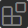

# Практическая работа №1. Часть 1. Задание 1. Установка и настройка VS Code

В этой части практической работы, в качестве IDE будет использоваться Visual Studio Code от Microsoft. Как указано на [официальном сайте](https://code.visualstudio.com/) VS Code - это не совсем IDE, а легковесный редактор исходного кода, который обладает богатой экосистемой плагинов для разных языков программирования. С одной стороны модель основанная на плагинах позволяет настраивать VS Code полностью по своему вкусу, но с другой, мы получаем свалку из функционала и настроек. Так же нужно учитывать, что за развитие и проверку совместимости плагинов отвечают сторонние разработчики, которые могут забросить это дело в любой момент.


Изучать встроенные возможности и плагины VS Code мы будем по мере необходимости как в этой, так и в последующих работах.

> [!WARNING]
>
> Все дальнейшие инструкции и команды будут исходить из того, что у вас созданы две папки: `"tools"` и `"projects"`. В моём случае это: `"C:\tools"` и `"C:\projects"` для Windows и `"~/tools"` и `"~/projects"` для Linux.
> Вы можете разместить `"tools"` и `"projects"` в удобное для вас место, но учитывайте это внося соответствующие изменения в команды.

> [!WARNING]
>
> Выбирая пути к каталогам `"tools"` и `"projects"` избегайте промежуточных каталогов с русскими (и вообще не латинскими) символами, т.к. некоторые инструменты могут начать вести себя непредсказуемым образом.
> Если название промежуточного каталога будет содержать пробел, то в командах весь путь обязательно нужно заключить в кавычки.

## Установка

VS Code можно установить в двух вариантах: обычная установка и переносимая (portable). Мы будем рассматривать portable установку, т.к. в этом случае, файлы относящиеся к VS Code будут находиться полностью в одной папке, что очень удобно, особенно на этапе изучения среды. Т.к. всё храниться в одном месте, то достаточно легко можно: откатить среду к начальному состоянию, перенести на другую машину, полностью удалить или даже сделать резервную копию. Кроме того, можно иметь на одной машине несколько копий VS Code, разных версий или по разному настроенных.

1. Перейдите на страницу [документации](https://code.visualstudio.com/docs/editor/portable) и следуя инструкции скачайте архив с файлами под свою операционную систему;

2. Распакуйте архив в папку `"tools"`. Я распакую файлы в каталог `"C:\tools\vscode"`;

3. Чтобы VS Code [понял](https://code.visualstudio.com/docs/editor/portable#_enable-portable-mode), что он должен работать в portable mode создайте каталог `"data"` (для macOS `"code-portable-data"`) в каталоге VS Code. Туда VS Code будет складывать настройки, плагины и прочее. Таким образом, если удалить содержимое каталога `data`, то VS Code сбросится к начальному состоянию.

   Если не создавать каталог `"data"`, то VS Code разместит свои файлы по стандартным путям. Их можно найти в документации, в разделе [Migrate to Portable mode](https://code.visualstudio.com/docs/editor/portable#_migrate-to-portable-mode).

## Переменные среды (окружения) - PATH

Переменные среды - это список пар «ключ - значение», которые передаются **любой** выполняемой программе во время её запуска. Например, их можно посмотреть при помощи [командной оболочки](https://en.wikipedia.org/wiki/Comparison_of_command_shells) (это такая же программа как и все остальные): cmd, PowerShell, bash, zsh и др:

4. Откройте терминал и наберите:
   ```cmd
   set        # для Windows cmd
   gci env:*  # для Windows PowerShell
   env        # для Linux bash
   ```

   В результате вы получите список переменных окружения переданных оболочке и некоторые дополнительные, которые были установлены самой оболочкой.

   Любая программа запущенная из терминала является его дочерним процессом. Дочерние процессы получают копию переменных среды **родительского процесса** и могут менять их по своему усмотрению;

5. Наберите команду:

   ```cmd
   where ping        # Для Windows cmd
   get-command ping  # для Windows PowerShell
   whereis ping      # Для Linux
   ```

   В результате вы получите путь к исполняемому файлу. Т.е. `ping` - это не просто команда, это отдельная программа, которая лежит где-то на диске. Каким же образом оболочка узнала где искать исполняемый файл? Для этих целей существует специальная переменная среды - `PATH`;

6. Наберите команду:

   ```cmd
   echo %PATH%     # для Windows cmd
   echo $env:PATH  # для Windows PowerShell
   echo $PATH      # для Linux bash
   ```

   > В отличие от Windows, имена переменных среды в macOS и Linux чувствительны к регистру. Например, `Path` и `PATH` одинаковые для Windows, но разные для macOS и Linux.

   Как видно, значение переменной - это набор путей. Оболочка (или другая программа) последовательно просматривает содержимое перечисленных каталогов в поисках требуемой программы. Например, тот же `ping` был найден именно благодаря тому, что каталог в котором он лежит находится в списке путей `PATH`.

   К теме переменных среды мы ещё вернёмся, когда будем обсуждать вопрос конфигурирования программ, но сейчас для нас важна только переменная `PATH`. В ходе работы мы установим различные инструменты, и чтобы другие программы могли их найти, необходимо будет добавить пути к ним в `PATH`;

7. Добавьте путь к каталогу VS Code в переменную `PATH`:

   > Если у вас уже установлен VS Code, то переименуйте новый исполняемый файл `"code.exe"` расположенный в каталоге `"C:\tools\vscode"` например в `"code2.exe"`, чтобы вы могли запускать и старый и новый экземпляр VS Code из терминала по команде `code` и `code2` соответственно.

   - Windows:
     - Нажмите правой кнопкой мыши на значок "Этот компьютер" или "Мой компьютер" на рабочем столе или в проводнике;
     - Выберите "Свойства";
     - Нажмите на пункт "Дополнительные параметры системы";
     - В открывшемся окне нажмите на кнопку "Переменные среды";
     - Как альтернатива, пунктам описанным выше, можно набрать в поиске слово *переменные* и выбрать пункт "Изменение системных переменных среды";
     - В разделе "Переменные среды пользователя ..." найдите переменную с именем `Path` и выберите её.
     - Нажмите кнопку "Изменить";
     - В открывшемся окне нажмите "Создать" и введите путь к папке, где установлен VS Code. В моём случае это `"C:\tools\vscode"`;
     - Закройте все окна, нажав "ОК", чтобы сохранить изменения.

   - Для Linux и macOS:
     - Перейдите в каталог `"~/tools/vscode"` и запустите файл `"code"`, чтобы VS Code запустился;
     - Откройте палитру команд (<kbd>Shift</kbd>+<kbd>Command</kbd>+<kbd>P</kbd> на Mac, <kbd>Shift</kbd>+<kbd>Ctrl</kbd>+<kbd>P</kbd> на Linux);
     - В палитре команд найдите и выберите опцию *Shell Command:  Install 'code' command in PATH*.


Обратите внимание, что чтение переменных среды происходит в момент **запуска** программы и если вы обновили значение переменных среды, то и программу которая хочет их использовать тоже нужно перезапустить. Если программа запускается из терминала, то нужно перезапустить и сам терминал.

## Установка плагина русификации

Если вы плохо владеете английским, то на начальном этапе будет полезно иметь возможность переключить язык интерфейса на русский. Перевод интерфейса на разные языки доступен в виде плагинов.

8. Запустите VS Code через терминал:
   - Откройте любую командную оболочку;
   - Введите: `code` и нажмите <kbd>Enter</kbd>;

9. Установите плагин для русификации интерфейса:
   - С левой стороны окна расположена Панель действий (*Activity Bar*) на которой есть иконка в виде квадрата собранного из квадратов поменьше  - это менеджер плагинов (*extensions*). Нажмите на эту иконку и в поле поиска плагинов введите "Russian Language Pack for Visual Studio Code" (иконка с глобусом от Microsoft);

   - Установите плагин и затем подтвердите изменение языка и перезапуск VS Code;

10. Переключите язык интерфейса обратно на английский:

    - Откройте палитру команд (command palette): <kbd>Ctrl</kbd>+<kbd>Shift</kbd>+<kbd>P</kbd>;

    - Начините вводить display пока не появится пункт "Настройка языка интерфейса" (Configure Dispaly Language);

    - Выберите этот пункт и затем английский язык.
