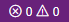
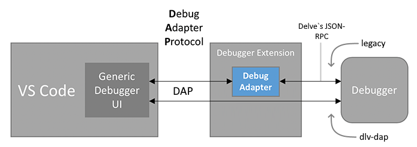

# Практическая работа №1. Часть 1. Задание 2. VS Code разработка на удалённом сервере

На текущий момент VS Code установлен и готов к работе.

VS Code предлагает множество настроек, плагинов и возможностей для персонализации интерфейса, что позволяет настроить редактор под свои предпочтения и задачи. Но с течением времени количество настроек, значков и пунктов меню будет увеличиваться. Механизм **[профилей](https://code.visualstudio.com/docs/editor/profiles)** позволяет разделить сценарии использования VS Code и, при необходимости, переключаться в требуемый режим. Например, у вас может быть профиль для разработки веб-приложений, для анализа данных, для обучения и т.д.

1. Создайте профиль `"Remote"`:
   - Нажмите на значок шестерёнки  и выберете *Profiles* (или *File* > *Preferences* > *Profiles*);
   - Нажмите кнопку *NewProfile* и назовите профиль `"Remote"`;
   - Выберете примечательную иконку (она будет отображаться вместо шестерёнки, когда профиль будет активен);
   - Нажмите Create, чтобы завершить создание профиля.
   
2. Переключитесь на профиль `"Remote"`:
   - В списке профилей, наведите мышь на `"Remote"` и нажмите на кнопку с изображением галочки.  
     Теперь рядом с ним должно быть указано: *In use* или *Active*. При этом значок шестерёнки должен измениться на вашу иконку.
   
3. Установите набор расширений (плагинов) "Remote Development";
   
4. Подключитесь к серверу:
   - Нажмите на значок в левом нижнем углу  (если тема тёмная, то значок синего цвета); 
   - В появившемся списке выберите *Connect to Host...*; 
   - Затем *+ Add New SSH Host...*;
   - Введите строку подключения в формате: `ssh логин@ip-адрес`. В моём случае: `ssh boss@192.168.1.35`.
     Конкретные данные для подключения смотрите в [moodle](https://moodle.cfuv.ru/mod/assign/view.php?id=744093);
   - Затем выберите файл в котором будет сохранены данные. В моём случае: `"C:\Users\Professional\.ssh\config"`;
   - Cнова дойдите до *Connect to Host...*;
   - Теперь в списке будет ip-адрес сервера. Выберите его;
   - Откроется новое окно VS Code и начнётся подключение. Если VS Code сможет определить ОС на сервере, то вверху сразу появится запрос пароля. Если не сможет, то сначала спросит тип ОС (*Windows*, *Linux*, *macOS*). В этом случае выберите *Linux*;
   - Введите пароль и нажмите Enter.
     Если не вводить пароль некоторое время, то подключение завершится ошибкой;
   - В результате, значок в левом углу заменится на  и строка состояния тоже поменяет цвет.
   
5. Откройте список установленных плагинов.  
   Теперь секция *Installed* разделена на две: *Local - Installed* и *SSH:192.168.1.35 - Installed*. Как видно, на сервере пока нет установленных плагинов.

## C++

6. Откройте окно терминала в VS Code:
   - Нажмите на значок крестик и треугольник на строке состояния и выберите вкладку *Terminal*. Или пункт главного меню *Terminal* > *New Terminal* (пункт меню *Terminal* может быть скрыт за троеточием, если окно маленькое);
   
7. Сейчас вы находитесь в домашнем каталоге пользователя. Создайте тут каталог `"projects"` и внутри каталог `"cpp"`, затем перейдите в него:
   ```bash
   mkdir projects
   cd projects
   mkdir cpp
   cd cpp
   ```
   
8. Откройте каталог `"cpp"` в VS Code как рабочее пространство (workspace):
   - Пункт меню *File* > *Open Folder...*;
   - Затем, в появившееся списке выберите (или допишите) `"projects"` и `"cpp"` и нажмите *ОК*; 
   - Введите пароль для подтверждения действия;
   - Как альтернативный вариант описанным выше действиям можно просто набрать в терминале `code .`. В этом случае откроется новое окно сразу в текущем каталоге;
   - Открыв каталог, VS Code может спросить [доверяем](https://code.visualstudio.com/docs/editor/workspace-trust) ли мы файлам в этом каталоге. Выберите: *Yes, I trust the authors*. Если бы мы выбрали *No*, то VS Code работал бы в режиме безопасности и не позволял запускать код и некоторые плагины.
   
9. Создайте файл `"main.cpp"` содержащий:
   ```cpp
   #include <iostream>
   
   int main(){
       std::cout << "Hello, World!" << std::endl;
   }
   ```
   
   VS Code определит, что это язык С++ и предложит установить соответствующие расширения. Игнорируйте или закройте окно;
   
10. Добавьте конфигурацию Dev Container:
    - Нажмите на значок и в выпадающем списке выберите *Add Dev Container Configuration Files...*.
      VS Code покажет существующие шаблоны контейнеров на основании файлов в текущем каталоге. Чтобы посмотреть все доступные нужно выбрать *Show All Templates...*;
    
    - В поле поиска шаблона введите *C++* и выберите одноимённый шаблон;
    - Шаблон *С++* доступен на основе нескольких ОС. Выберите контейнер на основе *ubuntu-24.04*;
    - Затем будет несколько вопросов касающихся установки в контейнер дополнительного софта. Нажмите: *none*, *ОК* и *ОК*;
    
    В папке проекта появится каталог `".devcontainer"` с файлом `"devcontainer.json"` и некоторыми другими. Сейчас не будем с ними разбираться. Главное то, что этот каталог содержит настройки нашего будущего контейнера и при необходимости их можно дополнить вручную.
    
11. Откройте каталог с проектом в контейнере:
    - Обычно среда автоматически распознаёт наличие в каталоге проекта файла `"devcontainer.json"` и сама предлагает открыть проект в контейнере. Если этого не произошло нажмите на значок и в выпадающем выберите *Reopen in Container*;
    
    - Подтвердите действие паролем.
      При успешном подключении значок в левом углу изменится на ;
    
      > Во время первого запуска выполняется не только создание контейнера, но и скачивание базового образа для него, поэтому процесс может затянуться. Наблюдать за тем, что происходит можно нажав на *Connecting to Dev Container (show log)*.
    
12. Нажмите на кнопку менеджера расширений и изучите список.
    Как видно, теперь вместо *SSH - Installed* у нас раздел *Dev Container - Installed*. При этом в разделе *Dev Container - Installed* уже есть несколько расширения для С++. На самом деле в контейнере есть ещё много чего, в том числе компилятор, дебагер и т.д;

13. Переключитесь в раздел *Explorer*  и выберите `"main.cpp"`.
    Среда может предложить установить дополнительные расширения. Можно их тоже установить. Они попадут в список расширений контейнера и в дальнейшем будут доступны для текущего проекта. Новые проекты будут открываться в отдельных контейнерах и там этих расширений не будет;

14. Нажмите <kbd>F5</kbd> или *Run* > *Start Debugging* или значок треугольника (play) вверху, справой стороны.
    Вам будет предложено выбрать один из найденных компиляторов. Можно выбрать любой, т.к. это один и тот же компилятор, просто доступный под разными именами.
    В результате запустится сборка проекта и на вкладке *Terminal* можно посмотреть вывод программы;
    
15. Переключитесь обратно в раздел *Exproler* и изучите список файлов.
    Теперь тут появился новый файл с именем `"main"`. Это исполняемый файл, который был собран из исходного кода;

16. Перейдите в терминал и проверьте работоспособность программы командой:
    ```bash
    ./main
    ```
    `./` показывает, что мы хотим запустить именно файл из текущего каталога, иначе будет попытка найти команду или файл `main` который доступен по путям перечисленным в `PATH`;
    
17. Отключитесь от контейнера:
    - Нажмите на значок  и в выпадающем списке выберите *Reopen Folder in SSH*;
    - Подтвердите действие паролем.
    
    В результате вы выйдите из контейнера обратно на сервер.
    
18. Как видно исполняемый файл `"main"` никуда не исчез. Убедитесь в его работоспособности запустив в терминале как и ранее;

19. Проверьте список расширений сервера.  
    Он по прежнему пуст, т.к. все расширения и другие инструменты сборки С++ проектов были установлены только в контейнере, при этом сам сервер остался в чистом состоянии;

20. Отключитесь от сервера:
    - Нажмите на значок  выберите *Close Remote Connection*. Или можно просто закрыть окно.

### Отладка программы на C++

Ни одна программа не обходится без ошибок. Хотелось бы иметь возможность заглянуть внутрь работающей программы и по шагам посмотреть как она исполняется. Такую возможность даёт специальная программа - дебагер (отладчик). Основной дебагер для *С++* - [gdb](https://ru.wikipedia.org/wiki/GNU_Debugger), но есть и другие (например отладчик от Microsoft).

Для полноценной работы дебагера в программу должна быть добавлена дополнительная отладочная информация, отключена оптимизация кода и т.д. (для этого есть специальные ключи компилятора). Это всё негативно сказывается на скорости работы программы, поэтому, как правило программу можно собрать как в режиме дебагинга (Debug mode), таки и в режиме выпуска (Release mode). Нужно понимать, что нет каких-то *специальных* режимов, просто компилятору передаётся разный набор ключей.

21. Повторно подключитесь к серверу через VS Code, откройте в редакторе каталог `"~/projects/cpp"` и откройте проект в контейнере.  
    Как видно, запуск происходит намного быстрее, чем в первый раз.

22. Модифицируйте `"main.cpp"` следующим образом:

    ```cpp
    #include <iostream>
    
    int main(){
        double a = 0.1, b = 0.2;
        double c = a + b;
        if (c == 0.3) std::cout << "+++\n";
        else std::cout << "---\n";
    }
    ```

23. Запустите, код и убедитесь, что в терминале отображаются минусы (хотя кто-то мог ожидать плюсы), что означает: `0.1 + 0.2` не равно `0.3`.

24. Поставьте курсор на сроку №4 (`double a = 0.1, b = 0.2;`) и нажмите <kbd>F9</kbd>. Повторите для следующих двух строк.  
    В результате на полях перед цифрами появятся красные кружки - точки останова (*breakpoints*). Так же их можно добавлять или удалять щелчком мыши;

25. Нажмите <kbd>F5</kbd>, чтобы начать отладку.  
    В результате программа запустится и остановится на 4й строке;

26. Наведите курсор на переменные `a`, `b`, `c` и посмотрите их текущие значения. Эти же значения можно увидеть слева в окне *Variables (Переменные)* в разделе *Locals (Локальные)*.  
    Сейчас переменные хранят мусорные значения, т.к. программа остановилась **до** первой точки останова, т.е. код в строке №4 ещё не был выполнен;

27. Снова нажмите <kbd>F5</kbd>, чтобы продолжить выполнение программы, затем изучите значения переменных.  
    В результате программа продолжит выполнение, пока не дойдёт до следующей точки останова (у нас - это строка №5);

28. Нажмите <kbd>F5</kbd> ещё раз и посмотрите, чему на самом деле равно `0.1 + 0.2` (значение переменной `c`).  
    Эта ситуация встречается во многих языках, и ей даже посвящён отдельный [сайт](https://0.30000000000000004.com/);

29. Остановите отладку и измените код `"main.cpp"` на следующий:

    ```cpp
    #include <iostream>
    
    int main(){
        for (int i=0; i<10; i++){
            for (int j=0; j<10; j++){
                std::cerr << "x ";
            }
            std::cerr << std::endl;
        }
    }
    ```

    > Здесь мы используем `cerr` (поток ошибок) для вывода текста. В целом он идентичен `cout`, за исключением того, что он НЕ содержит внутреннего буфера и сразу выводит текст на экран. Поток вывода `cout` сначала накапливает символы во внутреннем массиве и передаёт его содержимое на экран только при необходимости (заполнение буфера, переход в режим ввода, конец программы и т.п.). В среднем `cout` работает быстрее `cerr` за счёт буферизации, но в случае падения программы часть текста может застрять в буфере `cout` и не попасть на экран.
    >
    > Кроме того, `cout`, `cerr` и `cin` связаны с соответствующими системными [стандартными потоками](https://ru.wikipedia.org/wiki/Стандартные_потоки).

30. Поставьте точку останова только на строку №6. Щёлкните по ней правой кнопкой мыши и выберите *Edit Breakpoint...* и в выпадающем списке *Expression*.  
    Это условная точка останова. Она будет останавливать программу каждый раз, когда условие будет истинным;

31. В поле ввода напишите `i + j == 9` и нажмите <kbd>Enter</kbd>.  
    В результате программа будет останавливаться только на элементах обратной диагонали отображаемой матрицы;

32. Запустите отладку и убедитесь, что остановки происходят там где нужно;

33. Кроме break-поинтов можно установить log-поинты. Они удобны когда нет возможности остановить работу программы и добавлять отладочные принты руками не хочется.  
    Щелкните правой кнопкой мыши про точке останова на строке №6 и выберите *Edit Breakpoint...* и в выпадающем списке выберите *Log Message...*, затем введите текст в поле ввода: "Индексы: i={i} j={j}" и нажмите <kbd>Enter</kbd>;

34. Запустите отладку.  
    Как видно, в этот раз программа завершилась без остановок. Переключитесь с вкладки терминала на вкладку *Debug console* и вы увидите сообщения выводимые отладчиком;

35. Модифицируйте код `"main.cpp"`:

    ```cpp
    #include <iostream>
    
    void swap(int& a, int& b){
        int t = a;
        a = b;
        b = t;
    }
    
    int middle(int x, int y, int z){
        if (x < y) swap(x, y);
        if (x < z) swap(x, z);
        if (y < z) swap(y, z);
        return y;
    }
    
    int main(){
        int a = 10;
        int b = 20;
        int c = 5;
        std::cout << middle(a, b, c) << std::endl;
    }
    ```

36. Уберите все точки останова и поставьте новую на 17 строку. Запустите отладку;

37. Нажимайте клавишу <kbd>F10</kbd> (*step ower*) до тех пор, пока на экране не появится число.  
    Как видно, программа останавливается на каждой строке даже без точек останова.

38. Перезапустите отладку, но теперь нажимайте <kbd>F11</kbd> (*step into*) пока не окажитесь в функции `swap`.  
    Как видно, дойдя до 20й строки мы перепрыгнули в функцию `middle`, а затем в функцию `swap` автоматически заходя во все функции по ходу исполнения программы;

39. С левой стороны изучите раздел *Call stack* (стек вызовов).  
    На данный момент там должны присутствовать функции `main`, `middle` и `swap`. Они сложены в стопку, в том порядке, в котором мы в них попадали. Рядом указано имя файла в котором находится функция и номер строки на которой функция была приостановлена. Таким образом можно понять не только где мы сейчас находимся, но и проследить путь (*trace*) как мы туда попали. Локальные переменные всех перечисленных функций тоже доступны для изучения, если выбрать её в окне стека вызовов;

40. Нажмите сочетание клавиш <kbd>Shift</kbd> + <kbd>F11</kbd> (*step out*) два раза и остановите отладку.  
    Как видно, мы сразу вышли из функции `swap` обратно в `middle`, а затем и в `main`;

41. Модифицируйте код `"main.cpp"` следующим образом:

    ```cpp
    #include <iostream>
    
    int main(){
        int a, b;
        do{
            a = rand();
            b = rand();
        }while(a + b != 1137);
        std::cout << "Happy End" << std::endl;
    }
    ```

    И установите точку останова на строку №6;

42. Запустите процесс отладки и, когда он остановится на 6й строке, в разделе *Watch* (слева) при помощи кнопки `+` добавьте выражения:

    ```cpp
    a
    b
    a + b
    a + b == 1137
    ```

43. Нажмите несколько раз <kbd>F5</kbd>, чтобы продолжить отладку и наблюдайте за изменениями значений в окне *Watch*.  
    Как видно, при каждом изменении отслеживаемых переменных их значение изменяется и в окне *Watch*;

44. Поставьте точку останова на строку №8 и нажмите <kbd>F5</kbd>, чтобы переключиться на неё. Затем добавьте в *Watch* следующие выражения:

    ```cpp
    a = 1000
    b = 137
    ```

    и нажмите <kbd>F5</kbd> ещё раз.
    Как видно, программа завершилась и вывела сообщение *"Happy End"*. Т.е. при помощи *Watch* мы можем не только получать значения переменных, но и устанавливать их.

Кроме рассмотренных сценариев работы отладчика есть ещё и другие, некоторые из них не доступны из графического интерфейса VS Code, но ими можно воспользоваться непосредственно отдавая команды отладчику в консоли отладки.

45. Отключитесь от контейнера через *Close Remote Connection*;

## Go

46. Снова подключитесь к серверу. 

47. Откройте окно терминала;

48. Вы снова находитесь в домашнем каталоге пользователя. Каталог `"projects"` мы создали в прошлый раз (можно проверить его наличие командой `ls`), поэтому просто перейдите в него и создайте каталог `"go"` и перейдите в него:
    ```bash
    cd projects
    mkdir go
    cd go
    ```

49. Откройте каталог `"go"` в VS Code как рабочее пространство;

50. Добавьте конфигурацию Dev Container:

    - Нажмите на значок  и выберите *Add Dev Container Configuration Files...*;
    - В поле поиска шаблона введите *Go* и выберите одноимённый шаблон;
    - Шаблон контейнера для *Go* доступен с разными версиями компилятора и на основе нескольких версий дистрибутива Debian (версия задана не номером, а кодовым именем). Выберите версию отмеченную как *default*;
    - Затем будет несколько вопросов касающихся установки в контейнер дополнительного софта. Нажмите: *ОК* и *ОК*;

    В папке проекта появится каталог `".devcontainer"` с файлом `"devcontainer.json"`.

51. Откройте каталог с проектом в контейнере:

    - Обычно среда автоматически распознаёт наличие в каталоге проекта файла `"devcontainer.json"` и сама предлагает открыть проект в контейнере. Если этого не произошло нажмите на значок и в выпадающем выберите *Reopen in Container*;
    - Подтвердите действие паролем.
      При успешном подключении значок в левом углу изменится на ;

52. Нажмите на кнопку менеджера расширений и изучите список.  
    Как видно, теперь в разделе *Dev Container - Installed* установлены только плагины для *Go*.

53. Откройте терминал и команду, затем переключитесь на вкладку *Explorer*:
    ```bash
    go mod init hello
    ```
    В текущем каталоге появится файл `"go.mod"`. Это говорит о том, что компилятор *Go* тоже присутствует к контейнере;

54. Создайте файл `"main.go"` содержащий:
    ```go
    package main
    
    import "fmt"
    
    func main(){
        fmt.Println("Hello, World!")
    }
    ```

55. Нажмите <kbd>F5</kbd> или *Run* > *Start Debugging*.  
    В результате запустится сборка проекта и отобразится вывод программы;

56. В терминале наберите команду:
    ```bash
    go build .
    ```

    Это команда соберёт и сохранит в текущем каталоге исполняемый файл без запуска;

57. Переключитесь обратно в раздел *Exproler* и изучите список файлов.  
    Теперь тут появился новый файл с именем `"hello"`;

58. Перейдите в терминал и проверьте работоспособность программы командой:
    ```bash
    ./hello
    ```

59. Отключитесь от контейнера:

    - Нажмите на значок  и в выпадающем списке выберите *Reopen Folder in SSH*;
    - Подтвердите действие паролем.

    В результате вы выйдите из контейнера обратно на сервер.

60. Как видно исполняемый файл `"hello"` никуда не исчез. Убедитесь в его работоспособности запустив в терминале как и ранее;

61. Проверьте список расширений сервера.  
    Он по прежнему пуст, т.к. все расширения и другие инструменты сборки Go проектов были установлены только в контейнере, при этом сам сервер остался в чистом состоянии;

62. Отключитесь от сервера:

    - Нажмите на значок  выберите *Close Remote Connection*. Или можно просто закрыть окно.

63. Проверьте список локальных расширений. Как видно тут присутствуют только расширения из набора "Remote Development", расширений для C++ и Go нет.

Таким образом можно вести разработку с абсолютно любого устройства, без какой либо предварительной подготовки и настройки рабочего окружения и при этом получать одинаковый пользовательский опыт не зависимо от операционной системы. При этом устройство разработчика останется "чистым" и ему не требуется быть очень мощным или обладать большими объёмами дискового пространства. Дополнительно, вся кодовая база и артефакты сборки остаются на сервере (который может быть внутри защищённого контура компании) и не сохраняются на локальной машине разработчика.

### Отладка программы на Go

Основной отладчик для *Go* - [delve](https://github.com/go-delve/delve). С точки зрения пользователя VS Code, процесс отладки *Go* и *C++* проектов ничем не отличается, т.к. соответствующий плагин обеспечивает преобразование действий пользователя в графическом интерфейсе в команды понятные дебагеру и обратно.



В связи с выше сказанным, не будем отдельно рассматривать отладку для *Go*, т.к. то, что мы делали ранее для *С++* кода будет работать для *Go* кода точно также. Единственное отличие, которое было замечено - это невозможность изменять значение переменных в процессе отладки. Хотя *delve* умеет это делать, но через VS Code значение переменной не изменяется (возможно функция не реализована в расширении).
