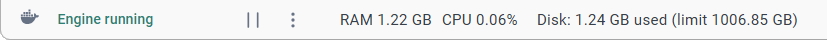

# Практическая работа №1. Часть 1. Задание 3. Разработка в локальном контейнере

Когда вы работаете в одиночку, в стартапе или маленькой компании, держать отдельный производительный сервер для разработки может быть слишком затратно, но отказываться от удобств, которые дают контейнеры не хочется, тогда можно установить средства контейнеризации на локальную машину.

## Docker Desktop

1. Установите Docker Desktop:
   - Перейдите на сайт https://www.docker.com/products/docker-desktop/;
   - Скачайте дистрибутив под свою операционную систему;
   - Установите Docker Desktop следуя инструкции соответствующей ваше операционной системе: https://docs.docker.com/desktop/;
   - Для работы программы не требуется заводить учётную запись. В процессе установки просто выбирайте *skip* в тех местах, где предлагают войти.

2. Запустите Docker Desktop и убедитесь, что он запустился нормально и внизу окна есть зелёная панель с текстом *Engine running* (в последних версиях панель серая) .  
   Пока здесь больше нет ничего интересного. Сверните или закройте окно.

### C++

3. Откройте/создайте каталог `"projects"` на **локальной** машине и создайте в нём каталог `"cpp"`;

4. В каталоге `"cpp"` запустите окно терминала и наберите команду:

   ```bash
   code .
   ```

   Откроется окно VS Code и спросит [доверяем](https://code.visualstudio.com/docs/editor/workspace-trust) ли мы файлам в этом каталоге. Выберите: *Yes, I trust the authors*;

5. Активируйте профиль "Remote", если активен другой;

6. Создайте файл `"main.cpp"` содержащий:

   ```cpp
   #include <iostream>
   
   int main(){
       std::cout << "Hello, World!" << std::endl;
   }
   ```

   VS Code определит, что это язык С++ и предложит установить соответствующие расширения. Игнорируйте или закройте окно;

7. Добавьте конфигурацию Dev Container:

   - Нажмите на значок в левом нижнем углу  и выберите *Add Dev Container Configuration Files...*;
   - На вопрос, где сохранить конфигурацию контейнера выберите *Add configuration to workspace*.
     В этом случае, конфигурация контейнера будет храниться в папке проекта. Альтернативный вариант создаст конфигурацию в другом месте, но она тоже будет действовать только на этот проект. Разница в том, хотите ли вы, чтобы конфигурация контейнера могла отслеживаться системой контроля версий или нет;
   - В поле поиска шаблона введите *C++* и выберите одноимённый шаблон;
   - Шаблон *С++* доступен на основе нескольких ОС. Выберите контейнер на основе *ubuntu-24.04*;
   - Затем будет несколько вопросов касающихся установки в контейнер дополнительного софта. Нажмите: *none*, *ОК* и *ОК*;

   В папке проекта появится каталог `".devcontainer"` с файлом `"devcontainer.json"` и другими.

8. Откройте каталог с проектом в контейнере:

   - Обычно среда автоматически распознаёт наличие в каталоге проекта файла `"devcontainer.json"` и сама предлагает открыть проект в контейнере. Если этого не произошло нажмите на значок и в выпадающем выберите *Reopen in Container*;

   - Среда автоматически определит присутствие Docker Desktop на машине и начнёт процесс создания контейнера;

     > Во время первого запуска выполняется не только создание контейнера, но и скачивание базового образа для него (~2.9 GB) , поэтому процесс может затянуться. Наблюдать за тем, что происходит можно нажав на *Connecting to Dev Container (show log)*.

   - При успешном подключении значок в левом углу изменится на ;

9. Откройте окно Docker Desktop и проверьте разделы *Images (Образы)* и *Containers (Контейнеры)*.  
   В списке контейнеров должен присутствовать один со статусом *Running*;

10. Вернитесь в VS Code и нажмите на кнопку менеджера расширений и изучите список.  
    Как и ранее раздел *Installed* разделён на два: *Local - Installed* и *Dev Container - Installed* и во втором уже есть расширения для С++;

11. Переключитесь в раздел *Exproler* и выберите `"main.cpp"`.  
    Установите расширения, которые рекомендует среда;

12. Нажмите <kbd>F5</kbd> или *Run* > *Start Debugging* или значок треугольника (play) вверху, справой стороны.  
    Вам будет предложено выбрать один из найденных компиляторов. Можно выбрать любой, т.к. это один и тот же компилятор, просто доступный под разными именами.  
    В результате запустится сборка проекта и на вкладке *Terminal* можно посмотреть вывод программы;

13. Переключитесь обратно в раздел *Exproler* и изучите список файлов.  
    Теперь тут появился новый файл с именем `"main"`. Это исполняемый файл, который был собран из исходного кода;

14. Перейдите в терминал и проверьте работоспособность программы командой:

    ```bash
    ./main
    ```

15. Отключитесь от контейнера:

    - Нажмите на значок  и в выпадающем списке выберите *Close Remote Connection* или просто закройте окно;

16. Откройте локальный каталог `"cpp"`. Как видно, все изменения произошедшие в контейнере также присутствуют и в локальном каталоге.  
    Работоспособность файла `"main"` будет завесить от вашей операционной системы. Он был собран в контейнере с Linux, поэтому будет работать только под Linux.

17. Откройте окно Docker Desktop и проверьте раздел *Containers (Контейнеры)*.  
    В норме, у контейнера теперь должен быть статус *Exited*. Это значит, что на данный момент, контейнер не работает и не потребляет никаких ресурсов, кроме места на жёстком диске.

#### Отладка программы на C++

Процесс отладки в локальной контейнере ничем не отличается от отладки в удалённом контейнере, поэтому нет необходимости повторять его ещё раз.

### Go

18. Откройте каталог `"projects"` на локальной машине и создайте в нём каталог `"go"`;

19. В каталоге `"go"` запустите окно терминала и наберите команду:

    ```bash
    code .
    ```

20. Активируйте профиль "Remote", если активен другой;

21. Создайте файл `"main.go"` содержащий:

    ```go
    package main
    
    import "fmt"
    
    func main(){
        fmt.Println("Hello, World!")
    }
    ```

    VS Code определит, что это язык Go и предложит установить соответствующие расширения. Игнорируйте или закройте окно;

22. Добавьте конфигурацию Dev Container:

    - Нажмите на значок в левом нижнем углу  и выберите *Add Dev Container Configuration Files...*;
    - На вопрос, где сохранить конфигурацию контейнера выберите *Add configuration to workspace*.
    - В поле поиска шаблона введите *Go* и выберите одноимённый шаблон;
    - Выберите шаблон контейнера отмеченный как *default*;
    - Затем будет несколько вопросов касающихся установки в контейнер дополнительного софта. Нажмите: *ОК* и *ОК*;

    В папке проекта появится каталог `".devcontainer"` с файлом `"devcontainer.json"` и другими.

23. Откройте каталог с проектом в контейнере:

    - Обычно среда автоматически распознаёт наличие в каталоге проекта файла `"devcontainer.json"` и сама предлагает открыть проект в контейнере. Если этого не произошло нажмите на значок и в выпадающем выберите *Reopen in Container*;

    - Среда автоматически определит присутствие Docker Desktop на машине и начнёт процесс создания контейнера.  
      Процесс первого запуска снова будет долгий, т.к. мы удалили всё, что Docker Desktop скачивал. Но даже если бы мы ничего не удаляли, процесс был бы не быстрее, т.к. ранее Docker Desktop качал образ для разработки под С++, а теперь ему нужен образ для Go (~1.6 GB);

    - При успешном подключении значок в левом углу изменится на ;

24. Откройте окно Docker Desktop и проверьте разделы *Images (Образы)* и *Containers (Контейнеры)*.  
    В списке контейнеров должен присутствовать один со статусом *Running*;

25. Вернитесь в VS Code и нажмите на кнопку менеджера расширений и изучите список.  
    Как и ранее раздел *Installed* разделён на два: *Local - Installed* и *Dev Container - Installed* и во втором уже есть расширения для Go;

26. Откройте терминал и наберите:

    ```bash
    go mod init hello
    ```

    В текущем каталоге появится файл `"go.mod"`. Это говорит о том, что компилятор *Go* тоже присутствует к контейнере;

27. Переключитесь в раздел *Exproler* и выберите `"main.go"`;

28. Нажмите <kbd>F5</kbd> или *Run* > *Start Debugging*.  
    В результате запустится сборка проекта и отобразится вывод программы;

29. В терминале наберите команду:

    ```bash
    go build .
    ```

    Это команда соберёт и сохранит в текущем каталоге исполняемый файл без запуска;

30. Переключитесь обратно в раздел *Exproler* и изучите список файлов.  
    Теперь тут появился новый файл с именем `"hello"`;

31. Перейдите в терминал и проверьте работоспособность программы командой:

    ```bash
    ./hello
    ```

32. Отключитесь от контейнера:

    - Нажмите на значок  и в выпадающем списке выберите *Close Remote Connection* или просто закройте окно;

33. Откройте локальный каталог `"go"`. Как видно, все изменения произошедшие в контейнере также присутствуют и в локальном каталоге.  
    Работоспособность файла `"hello"` будет завесить от вашей операционной системы. Он был собран в контейнере с Linux, поэтому будет работать только под Linux.  
    На самом деле *Go* из коробки поддерживает возможность кросскомпиляции, т.е. мы можем собрать исполняемый файл для *Windows* или *macOS* даже работая в контейнере *Linux*; 

34. Откройте окно Docker Desktop и проверьте раздел *Containers (Контейнеры)*. В норме, у контейнера теперь должен быть статус *Exited*.  
    Можете снова сбросить Docker Desktop до чистого состояния, т.к. ближайшее время контейнеры и образы нам не понадобятся.

#### Отладка программы на Go

Процесс отладки в локальной контейнере ничем не отличается от отладки в удалённом контейнере, поэтому нет необходимости повторять его ещё раз.

### Очистка диска

В результате использования контейнеров Docker Desktop мог занять 5-6 ГБ места на диске под сами контейнеры (*Containers*), под образы (*Images*) и тома (*Volumes*). Информацию о использованном объёме диска можно найти на нижней панели окна Docker Desktop:



Чтобы освободить место, можно вручную удалить то, что вам больше не нужно, но ручное удаление контейнеров, образов и т.д. может не приводить к освобождению дискового пространства (есть такой баг). Чтобы гарантировано освободить место выполним сброс Docker Desktop к начальным настройкам.

35. На нижней панели окна Docker Desktop нажмите на три вертикальные точки и выберите пункт меню *Troubleshoot*. То же самое можно получить нажав на символ вопросительного знака на верхней панели (раньше был символ жука).
36. В открывшемся окне нажмите на кнопку *Reset to factory defaults* и подождите некоторое время.  
    В результате Docker Desktop перезапуститься и покажет такое же окно как и сразу после установки.

> [!Note]
>
> Если вы не хотите выполнять полный сброс Docker Desktop и затем заново скачивать необходимые образы, можно попробовать удалить ненужные элементы выборочно и затем в меню *Troubleshoot* нажать на кнопку *Clean/Purge data*. В этом случае вероятность, что место на диске освободится выше.