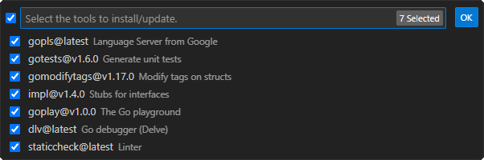

# Практическая работа №1. Часть 1. Задание 4. Разработка в локальном окружении

В качестве последнего этапа рассмотрим процесс подготовки полностью локального окружения для разработки.

## C++

1. Запустите VS Code и создайте профиль `"C++"`:

   - Нажмите на значок шестерёнки  и выберете *Profiles* (или *File* > *Preferences* > *Profiles*);
   - Нажмите кнопку *NewProfile* и назовите профиль `"C++"`;
   - Выберете примечательную иконку;
   - Нажмите Create, чтобы завершить создание профиля.
2. Переключитесь на профиль `"C++"`:

   - В списке профилей, наведите мышь на `"C++"` и нажмите на кнопку с изображением галочки.  
     Теперь рядом с ним должно быть указано: *In use* или *Active*. При этом значок шестерёнки должен измениться на вашу иконку.
3. Установите набор расширений *С++* для Visual Studio Code:
   - Откройте менеджер расширений и введите в строку поиска: *C/C++ Extension Pack*;
   - Установите набор расширений;

Набор инструментов (*toolchain*) для *C++* проектов сильно зависит от платформы на которой ведётся разработка и целевой платформы. В зависимости от вашей операционной системы выполните соответствующий блок:

### Windows

Для разработки приложении под Windows чаще всего применяют компилятор от Microsoft, поэтому установим его.

4. Установите компилятор от Microsoft следуя [инструкции](https://code.visualstudio.com/docs/cpp/config-msvc#_prerequisites) (начиная с пункта 3);
5. Откройте *Developer Command Prompt for Visual Studio* как указано [здесь](https://code.visualstudio.com/docs/cpp/config-msvc#_check-your-microsoft-visual-c-installation) и запустите VS Code из этой оболочки при помощи команды: `code`;
   Если запустить VS Code по другому, то он не сможет найти инструменты разработки.
6. Проверьте, что всё установлено правильно:

   - Откройте каталог `"projects/cpp"` в VS Code;
   - Убедитесь, что профиль по прежнему `"C++"` и, при необходимости, переключитесь на него;
   - Выберите файл `"main.cpp"`;
   - Запустите процесс сборки клавишей <kbd>F5</kbd>;
   - Вам будет предложено выбрать инструменты сборки.  
     Выберите *C++ (Windows)* и затем конфигурацию *C/C++: cl.exe build and debug active file*. Здесь cl.exe - это компилятор от Microsoft.  
     В результате, в текущем каталоге появится новый каталог `.vscode` с файлом `tasks.json`. В этом файле описана задача сборки проекта в соответствии с теми настройками которые мы выбрали. Про `tasks.json` мы будем подробнее говорить в следующих работах;
   - Проверьте, что сборка прошла успешно и в окне терминала присутствует сообщение: "Hello, World!".

Теперь установим другой компилятор (*g++*), который как правило используется на Linux системах. Часто бывают случаи, что популярные библиотеки могут быть собраны из исходников только этим компиляторам, т.к. скрипты сборки используют специфические для Linux инструменты, а переписывать скрипты сборки под Windows не очень хочется или не представляется возможным.

7. Установите компилятор g++ следуя [инструкции](https://code.visualstudio.com/docs/cpp/config-mingw#_installing-the-mingww64-toolchain);

8. Проверьте, что компилятор и дебагер установлены и доступны из терминала как указано [здесь](https://code.visualstudio.com/docs/cpp/config-mingw#_check-your-mingw-installation);

9. Проверьте, что всё установлено правильно:

   - Создайте в каталоге `"projects"` новый каталог `"cpp2"` и откройте его в VS Code;
   - Убедитесь, что профиль по прежнему `"C++"` и, при необходимости, переключитесь на него;
   - Создайте файл `"main.cpp"` содержащий:

     ```cpp
     #include <iostream>
     
     int main(){
         std::cout << "Hello, World!" << std::endl;
     }
     ```

   - Запустите процесс сборки клавишей <kbd>F5</kbd>;
   - Вам будет предложено выбрать инструменты сборки.  
     Выберите *C++ (GDB/LLDB)* и затем конфигурацию *C/C++: g++.exe build and debug active file*. Здесь g++.exe - это компилятор из коллекции *gcc*.  
     В результате, в текущем каталоге тоже появится новый каталог `.vscode` с файлом `tasks.json`;
   - Проверьте, что сборка прошла успешно и в окне терминала присутствует сообщение: "Hello, World!".

### Linux

10. Установите компилятор *g++* следуя [инструкции](https://code.visualstudio.com/docs/cpp/config-linux#_ensure-gcc-is-installed);
11. Проверьте, что всё установлено правильно:

    - Откройте каталог `"projects/cpp"` в VS Code;
    - Выберите файл `"main.cpp"`;
    - Запустите процесс сборки клавишей <kbd>F5</kbd>;
    - Вам будет предложено выбрать инструменты сборки.  
      Выберите конфигурацию *C/C++: g++ build and debug active file*. Здесь g++ - это компилятор из коллекции *gcc*.  
      В результате, в текущем каталоге появится новый каталог `.vscode` с файлом `tasks.json`. В этом файле описана задача сборки проекта в соответствии с теми настройками которые мы выбрали. Про `tasks.json` мы будем подробнее говорить в следующих работах;
    - Проверьте, что сборка прошла успешно и в окне терминала присутствует сообщение: "Hello, World!".

### macOS

12. Установите компилятор *Clang* следуя [инструкции](https://code.visualstudio.com/docs/cpp/config-clang-mac#_ensure-clang-is-installed);
13. Проверьте, что всё установлено правильно:

    - Откройте каталог `"projects/cpp"` в VS Code;
    - Выберите файл `"main.cpp"`;
    - Запустите процесс сборки клавишей <kbd>F5</kbd>;
    - Вам будет предложено выбрать инструменты сборки. Выберите конфигурацию *C/C++: clang++ build and debug active file*.  
      В результате, в текущем каталоге появится новый каталог `.vscode` с файлом `tasks.json`. В этом файле описана задача сборки проекта в соответствии с теми настройками которые мы выбрали. Про `tasks.json` мы будем подробнее говорить в следующих работах;
    - Проверьте, что сборка прошла успешно и в окне терминала присутствует сообщение: "Hello, World!".

## Go

В случае с *Go* процесс установки тулчейна одинаков для всех основных платформ.

14. Установите *Go* с официальной страницы. В результате будут остановлены: компилятор, стандартная библиотек и средства для выполнения различных распространенных задач во время разработки на *Go*:

    - Перейдите на оф. сайт [go.dev/doc/install](https://go.dev/doc/install);
    - Следуйте инструкциям для своей платформы установите компилятор *Go* (возможно понадобится VPN, если вы получаете ошибку 404);
     - Откройте терминал и выполните команду `go version` , чтобы подтвердить правильность установки *Go*.

15. Запустите VS Code и создайте профиль `"Go"`:

    - Нажмите на значок шестерёнки  и выберете *Profiles* (или *File* > *Preferences* > *Profiles*);
    - Нажмите кнопку *NewProfile* и назовите профиль `"Go"`;
    - Выберете примечательную иконку;
    - Нажмите Create, чтобы завершить создание профиля.

16. Переключитесь на профиль `"Go"`:

    - В списке профилей, наведите мышь на `"Go"` и нажмите на кнопку с изображением галочки.  
      Теперь рядом с ним должно быть указано: *In use* или *Active*. При этом значок шестерёнки должен измениться на вашу иконку.

17. Установите расширение *Go* для Visual Studio Code:

    - Откройте менеджер расширений и введите в строку поиска: *Go*;
    - Установите расширение;

18. Установите дополнительные инструменты для Go:

    - VS Code открыть палитру команд <kbd>Shift</kbd>+<kbd>Ctrl</kbd>+<kbd>P</kbd>;
    - Наберите `Go: Install/Update tool`;
    - В выпадающем писке выберите все инструменты:

      

    - Дождитесь завершения установки инструментов *Go*.  
      Процесс может быть довольно долгим и потребовать VPN (для *staticcheck*).

19. Проверьте, что всё установлено правильно:

    - Откройте каталог `"projects/go"` в VS Code;
    - Выберите файл `"main.go"`;
    - Запустите процесс сборки клавишей <kbd>F5</kbd>;
    - Проверьте, что сборка прошла успешно и на вкладке *Debug console*: "Hello, World!".