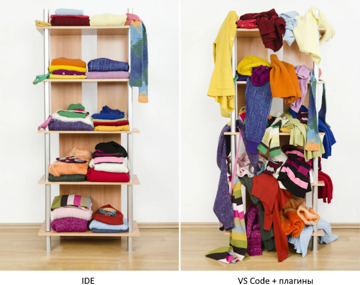

# Практическая работа №1. Часть 1. Visual Studio Code

В этой части практической работы, в качестве IDE будет использоваться Visual Studio Code от Microsoft. Как указано на [официальном сайте](https://code.visualstudio.com/) VS Code - это не совсем IDE, а легковесный редактор исходного кода, который обладает богатой экосистемой плагинов для разных языков программирования. С одной стороны модель основанная на плагинах позволяет настраивать VS Code полностью по своему вкусу, но с другой, мы получаем свалку из функционала и настроек. Так же нужно учитывать, что за развитие и проверку совместимости плагинов отвечают сторонние разработчики, которые могут забросить это дело в любой момент.

Изучать встроенные возможности и плагины VS Code мы будем по мере необходимости как в этой, так и в последующих работах.

> [!WARNING]
>
> Все дальнейшие инструкции и команды будут исходить из того, что у вас созданы две папки: `"tools"` и `"projects"`. В моём случае это: `"C:\tools"` и `"C:\projects"` для Windows и `"~/tools"` и `"~/projects"` для Linux.
> Вы можете разместить `"tools"` и `"projects"` в удобное для вас место, но учитывайте это внося соответствующие изменения в команды.

> [!WARNING]
>
> Выбирая пути к каталогам `"tools"` и `"projects"` избегайте промежуточных каталогов с русскими (и вообще не латинскими) символами, т.к. некоторые инструменты могут начать вести себя непредсказуемым образом.
> Если название промежуточного каталога будет содержать пробел, то в командах весь путь обязательно нужно заключить в кавычки.

## Задания

В процессе выполнения заданий по каждому пункту необходимо сделать скриншот и поместить его в отчёт. Каждый скриншот необходимо пронумеровать в соответствии с номером пункта задания. Результаты выполнения всех заданий необходимо разместить в одном отчёте. В отчёте задания необходимо отделять друг от друга заголовком содержащим номер и название задания.  

Задание 1. [Установка и настройка VS Code](./practice_01_1.1.md);

Задание 2. [Разработка на удалённом сервере](./practice_01_1.2.md);

Задание 3. [Разработка в локальном контейнере](./palceholder.md);

Задание 4. [Разработка в локальном окружении](./palceholder.md);