# Практическая работа №2. Часть 1. Command Line Interface

## Введение

Предположим существуют две изолированные системы. Нам нужно, чтобы они взаимодействовали друг с другом, т.е. информация (или электричество или вода, ...) переходила из одной системы через разделяющую их границу в другую систему. Место через которое происходит передача информации (...) называется **интерфейсом** (например: розетка+вилка, кран, USB, HDMI, прототип функции/метода, и т.д.).

<p align="center">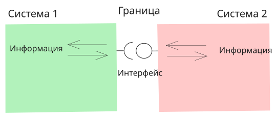</p>

Сам по себе интерфейс - просто способ соединить несколько систем друг с другом. Чтобы воспользоваться интерфейсом *для своих целей* необходимо ещё определить точную последовательность действий со стороны каждой из систем. Эта последовательность действий называется **протоколом**. Например, для передачи файлов через интерфейс USB будет один протокол, для зарядки устройства через тот же интерфейс, другой протокол.

Интерфейс предназначенный для взаимодействия программ друг с другом называется API (*Application Programming Interface*) - интерфейс прикладного программирования. При этом программа может быть любая, пользовательское приложение, веб-сервер, операционная система и т.д. В этом случае API - это **набор функций** (точнее их прототипов), которые одна программа может вызывать у другой, напрямую или удалённо через gRPC (*Google Remote Procedure Calling*) или REST (*Representational State Transfer*) и т.д.

Интерфейс предназначенный для взаимодействия программы и пользователя называется UI (*User Interface*).

<p align="center">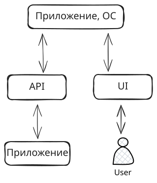</p>

Пользовательский интерфейс как правило делят на:

- GUI (*Graphical User Interface*) - графический интерфейс пользователя. Позволяет взаимодействовать с программой и/или операционной системой через визуальные элементы: кнопки, иконки, окна и т.д.;
- CLI (*Command Line Interface*) - интерфейс командной строки. Позволяет человеку взаимодействия с программой и/или операционной системой путём отправки команд, представляющих собой последовательность символов;
- Специальные. Голосовые интерфейсы (VUI, *Voice User Interface*), жестовые и тактильные интерфейсы (GBI, *Gesture-Based Interface*) и т.д.

<p align="center">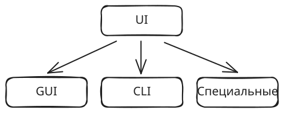</p>

В текущей работе, для взаимодействия с операционной системой и другими программами мы, в основном, будем использовать интерфейс командной строки.

## Терминал, консоль, командная строка, оболочка

В ходе работы часто будут встречаться понятия: терминал, консоль, командная строка, оболочка. Разберёмся в этих терминах, чтобы не возникало недопонимания. Удобнее всего это сделать в контексте их исторического появления.

### Мейнфрейм

В 50-x годах компьютеры стоили очень дорого и занимали большие площади, поэтому в организации мог быть один "мощный" компьютер ([мейнфрейм](https://youtu.be/Hcywf9mwF5U?si=QXz8OZ1nSLo6ivyW)) или вообще компьютера могло не быть, а вычислительные мощности арендовали у тех, у кого он был. Сотрудники организации (фирмы, библиотеки, школы) подключались к этому компьютеру кабелем (обычно через последовательный COM порт; позже через сеть) при помощи относительно дешёвых **устройств ввода вывода**, которые называли - терминал.

<p align="center">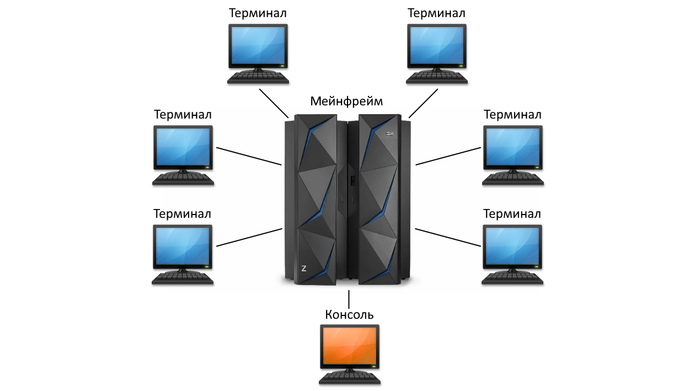</p>

### Терминал

Слово терминал происходит от лат. terminalis - «конечный».

В качестве первых терминалов использовались телетайпы (телепринтер, TTY) - пишущие машинки подключённые к компьютеру. Когда оператор нажимал на клавишу телетайпа, соответствующий символ печатался на бумаге, а код символа отправлялся компьютеру. Когда компьютер выводил данные, то они тоже распечатывались на бумаге.

<p align="center"><br>Рис. <a hreh="https://en.wikipedia.org/wiki/Teletype_Model_33">Teletype Model 33</a></p>

В 1970-х годах телетайпы были заменены более современными электронными вариантами с экраном вместо рулона бумаги. Такие устройства, хоть и напоминают внешне полноценные компьютеры, так же как и телетайпы не обладали собственными "мозгами" и служили только как устройство ввода вывода.

<p align="center">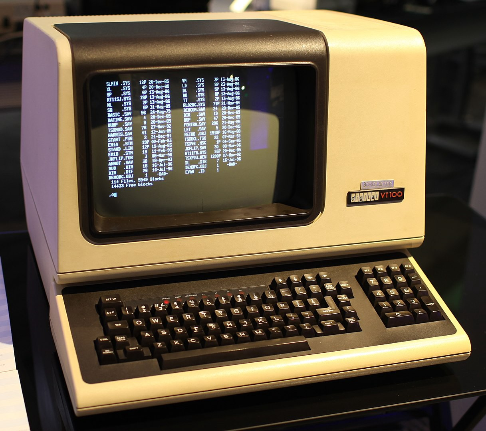<br>Рис. <a hreh="https://ru.wikipedia.org/wiki/VT100">Терминал VT100</a></p>

В настоящий момент мы не используем для работы физическое устройство-терминал, а вместо этого используем программы-эмуляторы терминала. Эмулятор притворяется реальным устройством, такими как VT100, а базовая система Unix по-прежнему думает, что вы печатаете на физическом терминале, подключенном последовательным кабелем.

<p align="center">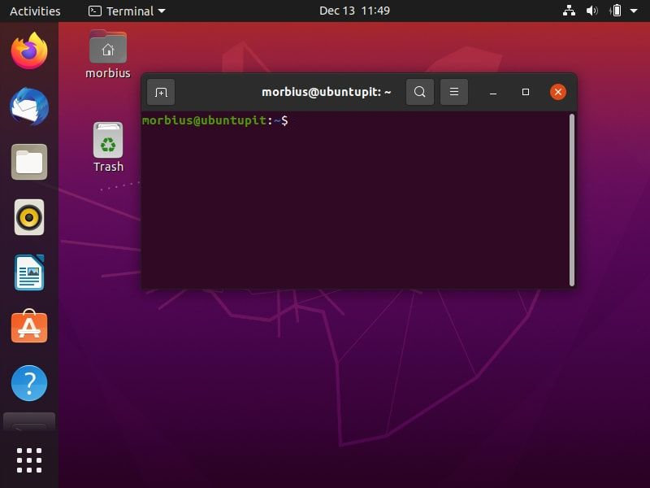<br>Рис. Встроенный в Ubuntu эмулятор терминала</p>

### Консоль

Консоль - это терминал специального назначения. В отличие от пользовательского терминала, консоль могла иметь другой внешний вид (а могла быть такой же), но главное она подключалась к выделенному последовательному консольному порту компьютера.

На экран консоли обычно выводилась информация, которая не должна попадать обычному пользователю (например, логи загрузки системы) и с неё же можно было выполнять команды не доступные обычному пользователю. Консоль было разрешено использовать строго определенному кругу лиц, так как она позволяла настраивать мейнфрейм. 

На текущий момент, в Linux системах, есть:
- отдельное устройство `/dev/console`;
- набор виртуальных терминалов `/dev/tty[N]` (где `N` это число `1-63`). Как будто бы к компьютеру уже подключены физические терминалы. Между ними можно переключаться - <kbd>Ctrl</kbd> + <kbd>Alt</kbd> + <kbd>F1</kbd> ... <kbd>F6</kbd>, <kbd>F7</kbd> или <kbd>F8</kbd> - возврат в графический интерфейс.
  Терминал `/dev/tty0` - это не отдельное устройство, а ссылка на текущий виртуальный терминал;
- набор `/dev/ttyS[N]` для подключения физических устройств (модемов, микроконтроллеров и т.д.). Обычно `/dev/ttyS0`, `/dev/ttyS1` и т.д. соответствуют физическим портам COM1, COM2 и другим;
- псевдотерминалы `/dev/pts/[N]` для удалённых подключений (например, по `ssh`) и окон терминала в графической среде. `/dev/pts/[N]` создаются и удаляются динамически.

В современных системах, по умолчанию `/dev/console` не закреплено за каким-то выделенным портом (например COM1), а ссылается на активный виртуальный терминал. Но, при желании, его можно закрепить за любым терминалом.

На текущий момент, в разговорной речи слово терминал и консоль используются как синонимы.

### Командная оболочка

Терминал/консоль отвечает только за передачу байт от пользователя компьютеру и отображение байт полученных от машины на экран. Терминал умеет раскрашивать вывод (если получает специальные управляющие байты), перемещать позицию курсора на экране и тому подобные вещи.

За то, чтобы в потоке байт найти команды, обработать их и выполнить запуск программы или обращение к ОС отвечает **программа** которая называется **Командная оболочка** (интерпретатор командной строки, shell (шелл)). Например: `sh`, `bash`, `zsh` и ещё много других. В Linux каждый пользователь может установить и настроить командную оболочку по своему вкусу.

<p align="center">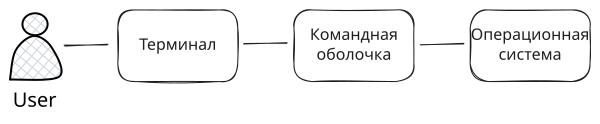</p>

По сути, запуская терминал вы взаимодействуете с командной оболочкой, поэтому термины командная оболочка, шелл, консоль и терминал мы будем использовать как синонимы.

### Как в Windows

ОС Windows построена по другому принципу чем Unix системы, т.к. Windows создавалась не во времена мейнфреймов, а во времена микрокомпьютеров и специально заточена под них.

>[!NOTE]
>
>В 1970-80 годы персональные компьютеры относили к классу микрокомпьютеров, собственно отсюда и Microsoft, т.е. софт для микрокомпьютеров. 

В Windows изначально предполагалось, что с компьютером единовременно работает только один пользователь и у него есть графически интерфейс, поэтому интерфейс командной строки представляет из себя просто командную оболочку (обычную программу) которая напрямую взаимодействует с операционной системой. Т.е. между командной оболочкой и пользователем нет посредника в виде терминала.

Аналогично, как и для Linux будем использовать термины командная строка, терминал, консоль и т.д., чтобы указать на необходимость использования командной оболочки.

## Основы работы с командной оболочкой

Основной рабочий цикл выглядит так:

1. Компьютер сообщает, что готов к вводу;
2. Пользователь вводит команду;
3. Компьютер выполняет команду;
4. Переход к пункту 1.

### Строка приглашения к вводу (prompt)

Командная оболочка сообщает о своей готовности взаимодействовать с пользователем отображая строку приглашения к вводу. Большинство командных оболочек позволяет настраивать промпт по своему вкусу. В зависимости от оболочки могут поддерживаться довольно широкие возможности настройки промпта, например добавление часов, текущей ветки и статуса git-репозитория и т.д.

<p align="center">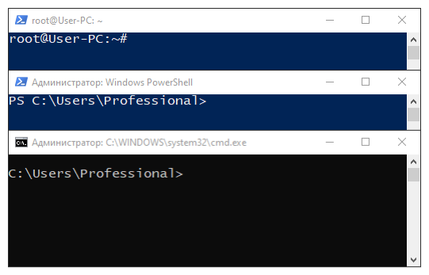</p>

### Команда

Символы, вводимые пользователем после промпта воспринимается как команда. Признаком конца ввода команды является нажатие клавиши <kbd>Enter</kbd>. Если команда длинная или пользователь вводит цепочку команд, то можно перенести её часть на новую строку, для лучшей читаемости при помощи символа `\` (обратный слэш) и следом нажать <kbd>Enter</kbd>. Ввод команды не произойдёт, курсор просто перейдёт на новую строку:

```bash
очень \
длинная \
команда
```

Существует два типа команд:

- Внутренние команды - это команды, которые встроены в оболочку. По сути это обычные функции оболочки, которые можно вызвать указав их имя. Например, `cd`, `rm` и др. Как правило такие функции являются обёртками вокруг стандартного функционала ОС, а командная оболочка просто под "капотом" дёргает API операционной системы.
- Внешние команды - это команды, которые не встроены в операционную систему и являются независимыми программами, которые командная оболочка просто запускает. Например: `ls`, `ping`, `vim`. Обычно они находятся на диске в каталогах `"/bin"`, `"/usr/bin"` и др. в UNIX или `"C:\Windows\System32"`, `"C:\Program Files"` и др. в Windows. Чтобы оболочка могла их найти, требуется, чтобы путь к каталогу содержащему программу был перечислен в переменной окружения `PATH`.

Как правило, кроме непосредственного запуска команд, оболочка позволяет автоматизировать длинные или повторяющиеся задачи при помощи сценариев, написанных на собственном скриптовом языке программирования. Сценарий можно написать непосредственно в оболочке и сразу запустить или сохранить в файл и запустить из файла.

### Аргументы команды

Любой команде/программе (консольной или с графическим интерфейсом) можно передать набор аргументов. Аргументы указываются после имени команды и разделяются одним или несколькими пробелами. Особое внимание следует уделить тому факту, что внутри самого аргумента могут присутствовать пробелы, в этом случае аргумент следует целиком взять в кавычки или экранировать пробелы при помощи символа `\` (обратный слэш):

```bash
cat Screen Shot 2021-06-05 at 10.23.16 PM.png       # 6 аргументов
cat Screen\ Shot\ 2021-06-05\ at\ 10.23.16\ PM.png  # 1 аргумент
cat "Screen Shot 2021-06-05 at 10.23.16 PM.png"     # 1 аргумент
```

> [!NOTE]
>
> Аргументы передаются программе просто как набор строк и каждая программа самостоятельно решает каким образом она интерпретирует эти строки.

Т.к. не существует строгих правил работы с аргументами команд, это порождает ситуацию при которой разные программы могут обрабатывать аргументы совершенно по разному и приходится приспосабливаться к каждой программе отдельно. Чтобы как-то сгладить эту проблему существуют рекомендации определяющие правила хорошего тона при разработке программ с интерфейсом командной строки, например [POSIX](https://pubs.opengroup.org/onlinepubs/9699919799/utilities/V3_chap02.html), [CLI guidelines](https://clig.dev/) и др.

Условно аргументы делят на: 

- Ключи (флаги, опции). Изменяют/настраивают поведение команды. Отличительная особенность ключей - наличие одного или двух минусов перед именем ключа (в Windows cmd вместо минусов принято использовать `/`);

  Опции обычно бывают двух видов:

  - Без параметра: `-a`, `-l`;
  - С параметром. В этом случае после ключа обязательно нужно указать параметр `-p 3000`.

  Кроме того опции можно записывать в двух форматах:

  - Короткий. Как правило обозначается одной буквой и одним минусом `-a`, `-p 3000`. Параметр может быть задан через пробел `-u root` или слитно с аргументом, без пробела `-uroot`;
  - Длинный. Как правило обозначается словом и двумя минусами: `--all`, `--port 3000`. Параметр может быть задан через пробел `--port 3000` или через `=` без пробелов `--port=3000`.

  Ключи можно передавать в любом порядке. Короткие ключи, как правило можно группировать (`-a -l` `-la` или `-al`). Когда ключи группируются, то ключ с параметром должен быть последним. Несколько ключей с параметром группировать нельзя.

  Если один и тот же ключ с параметром задан несколько раз (например с различными параметрами), то это можно трактовать как аналог массива: `-p 3000 -p 5000 -p 8080`.

- Позиционные аргументы. Данные, которые необходимы команде для выполнения её непосредственной работы. Часто порядок позиционных аргументов важен: `mkdir project`, `cd project`, `mv src dst`. Здесь `project`, `src` и `dst` - это позиционные аргументы.

- Подкоманды. Можно сказать, что это подвид позиционных аргументов, но у них более специфическое назначение, чем просто передать данные. Подкоманды уточняют основную команду и часто указываются сразу после неё, например: `docker start`, `docker stop`, `apt install`. Здесь `start`, `stop`, `install` является подкомандами. У подкоманд могут быть свои подкоманды, свои ключи и аргументы. Бывает, что часть ключей относится к основной команде, а часть к подкоманде, в этом случае порядок перечисления ключей важен.

Данное разделение не является строгого обязательным и каждый разработчик можем творить, что хочет. Хорошим тоном считается добавление справочной информации по вариантам использования команды, списку ключей, подкоманд и позиционных аргументов. Обычно справочную информацию можно получить вызвав команду/подкоманду с опцией `--help`, `-h` и т.п.

> [!WARNING]
>
> Все дальнейшие инструкции и команды будут исходить из того, что у вас созданы две папки: `"tools"` и `"projects"`. В моём случае это: `"C:\tools"` и `"C:\projects"` для Windows и `"~/tools"` и `"~/projects"` для Linux.
> Вы можете разместить `"tools"` и `"projects"` в удобное для вас место, но учитывайте это внося соответствующие изменения в команды.

> [!WARNING]
>
> Выбирая пути к каталогам `"tools"` и `"projects"` избегайте промежуточных каталогов с русскими (и вообще не латинскими) символами, т.к. некоторые инструменты могут начать вести себя непредсказуемым образом.
> Если название промежуточного каталога будет содержать пробел, то в командах весь путь обязательно нужно заключить в кавычки.

## C++ Linux

> [!WARNING]
>
> Если у вас основная операционная система Windows, то этот раздел выполняйте в Docker контейнере. Для этого:
> 1. Запустите Docker Desktop (из первой практической работы);
> 2. В каталоге `"projects"` создайте каталог `"lab2"`;
> 3. Откройте каталог `"lab2"` в VScode;
> 4. Переключитесь в профиль Remote (из первой практической работы). Если профиль Remote вы не создавали, то установите набор плагинов Remote Development;
> 5. Добавьте конфигурацию Dev Container:
>    - Нажмите на значок в левом нижнем углу  и выберите _Add Dev Container Configuration Files..._;
>    - На вопрос, где сохранить конфигурацию контейнера выберите _Add configuration to workspace_. В этом случае, конфигурация контейнера будет храниться в папке проекта. Альтернативный вариант создаст конфигурацию в другом месте, но она тоже будет действовать только на этот проект. Разница в том, хотите ли вы, чтобы конфигурация контейнера могла отслеживаться системой контроля версий или нет;
>    - В поле поиска шаблона введите _C++_ и выберите одноимённый шаблон;
>    - Шаблон _С++_ доступен на основе нескольких ОС. Выберите контейнер на основе _ubuntu-24.04_;
>    - Затем будет несколько вопросов касающихся установки в контейнер дополнительного софта. Нажмите: _none_, _ОК_ и _ОК_;
>    В папке проекта появится каталог `".devcontainer"` с файлом `"devcontainer.json"` и другими.
> 6. Запустите контейнер, например нажмите на значок  и в выпадающем выберите *Reopen in Container*.
> 7. Дождитесь пока загрузится образ и запустится контейнер. При успешном запуске контейнера значок в левом углу изменится на .

> [!WARNING]
>
> Если у вас основная операционная система Linux/MacOS, то этот раздел можете выполнять как на основной системе, так и в Docker контейнере, по своему желанию.
> 1. В каталоге `"projects"` создайте каталог `"lab2"`;
> 2. Откройте каталог `"lab2"` в VScode;

### Работа с аргументами

На текущий момент у вас должен быть открыт VScode в каталоге `"lab2"`.

1. В VScode откройте терминал и выполните команды:

   ```bash
   mkdir cli  # создаём каталог cli в lab2
   cd cli     # переходим в cli
   mkdir cpp  # создаём каталог cpp в cli
   cd cpp     # переходим в cpp
   ```

   По итогу, в терминале ваш рабочий каталог должен быть `"cpp"` (текущий рабочий каталог показан в промпте). Новые каталоги отобразятся в интерфейсе VScode. Если среда их не показывает, нажмите символ `↻` (*Refresh Explorer*).

2. В графическом интерфейсе VScode выберите каталог `"cpp"` и создайте файл `"main.cpp"` содержащий:

   ```cpp
   #include <iostream>
   
   int main(int argc){
       std::cout << argc << std::endl;
   }
   ```

   Как видно у функции `main` теперь есть один параметр `argc`. Имя параметра может быть любым, но обычно используют `argc` (*arguments count*).

3. В терминале выполните команду:

   ```bash
   g++ main.cpp
   ```

   Данной командой мы запустили компилятор `g++` и в качестве аргумента передали файл с исходным кодом `main.cpp`. В результате, в текущем каталоге должен быть создан файл `"a.out"` (имя по умолчанию для исполняемого файла). Если среда его не показывает, нажмите символ `↻`.

   В терминале может появится предупреждение (*warning*). Игнорируйте его.

4. Выполните команду:

   ```bash
   ls
   ```

   В результате, вы получите список файлов и каталогов в текущем рабочем каталоге. На текущий момент должно быть 2 файла.

5. Выполните команду:

   ```bash
   whereis g++ # если не заработает, то: where g++
   ```

   В результате, вы получите путь к компилятору. Это бывает полезно, если в системе установлено несколько программ с одинаковыми именами и вы не понимаете, какую из них запускает оболочка.

6. Выполните команду:

   ```bash
   ./a.out
   ```

   Этой командой мы запускаем нашу программу. Обратите внимание, что перед именем файла указано `./`. Точка - это специальный символ, который обозначает путь к текущему каталогу. Если попробовать запустить программу просто указав её имя, то мы получим ошибку, т.к. оболочка по умолчанию будет искать данный файл в каталогах перечисленных в переменной окружения `PATH`, но НЕ в текущем каталоге. Именно для этого мы и добавляли в начало `./`, чтобы указать оболочке, что `"a.out"` нужно искать в текущем каталоге.

   В результате работы программы вы должны получить единицу.

7. Выполните команды:

   ```bash
   ./a.out a
   ./a.out -a
   ./a.out -a --b ---c
   ./a.out -m "hello world"
   ```

   Как видно, в результате на экран выводится число на единицу больше чем количество аргументов переданных программе. Это связано с тем, что первым аргументом программа получает своё имя (точнее, то как мы запустили программу).

8. Модифицируйте файл `"main.cpp"` следующим образом:

   ```cpp
   #include <iostream>
   
   int main(int argc, char** argv){
       for(int i=0; i<argc; i++)
           std::cout << i << ": " << argv[i] << std::endl;
   }
   ```

   Как видно, к списку параметров функции `main` добавился `argv` (*arguments values*).

   >Тип `char*` - используется для записи С-строк, т.е. строка символов завершающаяся нулевым байтом (`\0`). Например: `char* str = "Hello, World!";` (нулевой байт добавляется автоматически).
   >
   >При выводе `cout << str;` будут печататься все символы, пока не будет достигнут `\0`. 
   >
   >Параметр `char** argv` так же можно записать в виде `char* argv[]`, что является тем же самым, с точки зрения компилятора (array-to-pointer decay). Т.е. `argv` здесь это массив C-строк.
   >
   > <p align="center">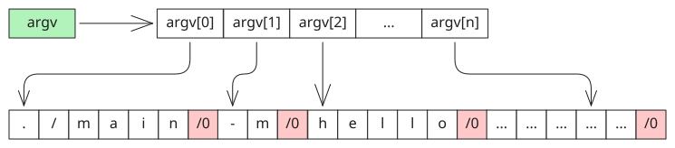</p>

9. Скомпилируйте обновлённую программу:

   ```bash
   g++ main.cpp -o main # Так тоже можно: g++ -o main main.cpp
   ```

   Здесь `-o` - это ключ с параметром. В качестве параметра указано имя выходного-исполняемого файла созданного как результат компиляции (вместо дефолтного `"a.out"`).

   В результате, в текущем каталоге должен появится файл `"main"`.

10. Выполните команды:

    ```bash
    ./main a
    ./main -m hello world
    ./main -m "hello world"
    ```

    Как видно, в результате на экран выводится имя программы и все её аргументы.

11. Создайте в текущем каталоге файл `"sum.cpp"` содержащий:

    ```cpp
    #include <iostream>
    #include <algorithm>
    #include <string_view>
    #include <vector>
    
    using namespace std;
    
    int main(int argc, char* argv[]){
        // Оборачиваем оргументы в string_view и помещаем в вектор
        vector<string_view> args(argc);
        for(int i=0; i<args.size(); i++) args[i] = argv[i];
        
        // Если среди аргументов есть --help или -h, выводим справку и выходим
        if (find(args.begin(), args.end(), "-h") != args.end() ||
            find(args.begin(), args.end(), "--help") != args.end()){
            cout << "Usage: sum VALUE...\n"
                 << "Print sum of all passed integer VALUEs.\n\n"
                 << "  -h, --help     display this help and exit" << endl;
            return 0;
        }
        
        if (args.size() == 1) cout << 0 << endl;
    }
    ```

    Для удобства здесь используется класс-обёртка [`string_view`](https://en.cppreference.com/w/cpp/header/string_view.html). Т.к. аргументы программы - это C-строки, то работать с ними не так удобно как со стандартным `string`. Класс `string_view` предоставляет тот же интерфейс, что и `string`, но:

    - Не владеет данными, а просто ссылается на них. Т.е. не выделяет дополнительную память и не делает лишних копирований;
    - Рассматривает строку как константную и не позволяет её изменять. Если нужно менять строку, то можно воспользоваться обычным `string`, который создаст собственную копию данных.

12. Модифицируйте программу таким образом, чтобы она вычисляла сумму всех передых ей аргументов. Чтобы не усложнять код обработкой ошибок, будем считать, что программе могут быть переданы только допустимые данные, т.е.: `-h`, `--help` или набор целых аргументов.

    > Т.к. аргументы - это строки, то их придётся преобразовать в целые числа. Функции вроде `atoi` не работают со `string_view`, но это можно обойти получив у `string_view` данные на которые он ссылается при помощи метода `data()`:
    >
    > ```cpp
    > atoi(arg.data());
    > ```

13. Скомпилируйте программу:

    ```bash
    g++ sum.cpp --std=c++17 -o sum
    ```

    Здесь мы дополнительно передаём ключ `--std` со значением `c++17`. Это нужно, чтобы указать компилятору собирать код используя 17-й стандарт языка, т.к. `string_view` был добавлен в стандартную библиотеку только начиная с C++17.

14. Проверьте работоспособность программы:

    ```bash
    ./sum -h
    ./sum --help
    ./sum 1 2 3 4 5
    ./sum 1 -2 3 -4 5 -6
    ```

15. Выполните команду:

    ```bash
    ./sum 1 -2 3 -4 5 -6 > result.txt
    ```

    Оператор `>` перенаправляет стандартный вывод программы (`cout`) в файл `"result.txt"`. Если файл не существует, то он будет создан. Если существует, то его содержимое удаляется. По умолчанию поток вывода программы связан с терминалом.

    Существует похожий оператор `>>`. Если файл не существует, то он будет создан. Если существует, то вывод дописывается в конец файла.

    <p align="center">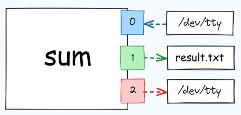</p>

    Здесь `0` - это поток ввода (`cin`); `1` - поток вывода (`cout`); `2` - поток ошибок (`cerr`); `/dev/tty` - терминал.

16. Проверьте содержимое файла `result.txt` при помощи команды `cat`:

    ```bash
    cat result.txt # покажет что в result.txt
    ```

    Команда `cat` выводит содержимое файла на экран.

17. Доработайте программу, следующим образом: если программе не передаются аргументы (т.е. передаётся только имя программы), то она переходит в режим чтения данных со стандартного ввода и читает ввод пока он не закончится:

    ```cpp
    int value = 0;
    while (cin >> value) sum += value;
    ```

18. Скомпилируйте программу и проверьте её работу как с аргументами так и без.

    ```bash
    ./sum 1 2 3
    ./sum
    ```

    **Внимание!** Когда запустите программу без аргументов, введите несколько чисел и чтобы сообщить программе, что ввод закончен нажмите сочетание клавиш <kbd>Ctrl</kbd>+<kbd>D</kbd>.

19. Создайте в текущем каталоге файл `"data.txt"` содержащий:

    ```bash
    1 2 3
    ```

20. Выполните команды:

    ```bash
    cat data.txt
    ```

21. Выполните команду:

    ```bash
    ./sum < data.txt
    ```

    Оператор `<` перенаправляет содержимое файла `"data.txt"` на стандартный ввод программы (эти данные программа прочитает через `cin` как будто их ввел пользователь).

    <p align="center">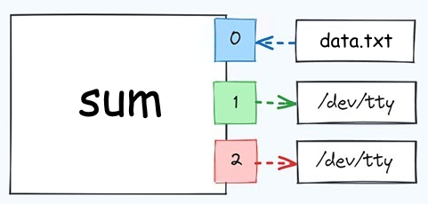</p

22. Выполните команды:

    ```bash
    ./sum < data.txt > result.txt
    cat result.txt
    ```

    Здесь данные из файла `"data.txt"` передаются программе как ввод, а вывод сохраняется в файл `"result.txt"`.

23. Выполните команду:

    ```bash
    cat data.txt | ./sum
    ```

    В данном случае мы используем `pipe` (труба). Символ `|` позволяет перенаправить стандартный вывод первой программы (`cout`) на стандартный ввод второй программы (`сin`). При этом остальные потоки, при необходимости тоже можно перенаправлять, например передав вывод `sum` следующей программе.

    <p align="center">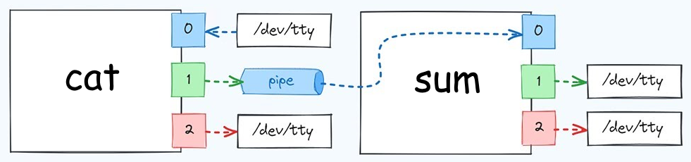</p>

    Можно рассматривать `|` как аналог `<`, но только второй работает для файлов, а первый для программ.

### Работа с переменными окружения

Каждая программа при запуске получает набора переменных окружения. Переменные окружения (или переменные среды) - это набор пар ключ-значение (значение - всегда строкового типа):

```bash
KEY=value
NAME="John Smith"
AGE=28
```

Переменные окружения можно сравнить с глобальными переменными в программе, но только существующими на уровне операционной системы. Так же как функции могут получать данные из глобальных переменных, программы могут получать данные из переменных окружения. Но есть и существенное отличие - переменные окружения передаются программе в виде **копии** переменных окружения родительского процесса:

```bash
[ОС] --порождает--> [Процесс 1] --порождает--> [Процесс 2]
  |
  └  --порождает--> [Процесс 3]
```

Как следствие:

- Изменение переменных окружения внутри программа никак не повлияет на значение переменных родительского процесса или его предков;
- Если вы изменили системные переменные среды, то программу (например терминал) нужно перезапустить, чтобы она получила обновлённые значения переменных;
- Процесс может изменять значение своих переменных среды перед тем, как запустить дочерний процесс. Тогда дочерний процесс получит изменённые значения переменных.

Переменные окружения позволяют программе получить дополнительную информацию о системе. Часто через них передают пути к конфиг-файлам, имя пользователя, секреты и т.д. Переменные окружения в их современном виде появились в 1979 году в седьмой версии Unix (Unix V7), и до сих пор актуальны особенно часто они используются в практиках DevOps.

> [!NOTE]
>
> Командные оболочки `bash`, `cmd`, `PowerShell` и т.д. в дополнении к переменным среды имеют **переменные оболочки**. С точки зрения использования в самой командной оболочке они ведут себя также как переменные среды, но при создании дочернего процесса, переменные оболочки ему НЕ передаются.
>
> <p align="center">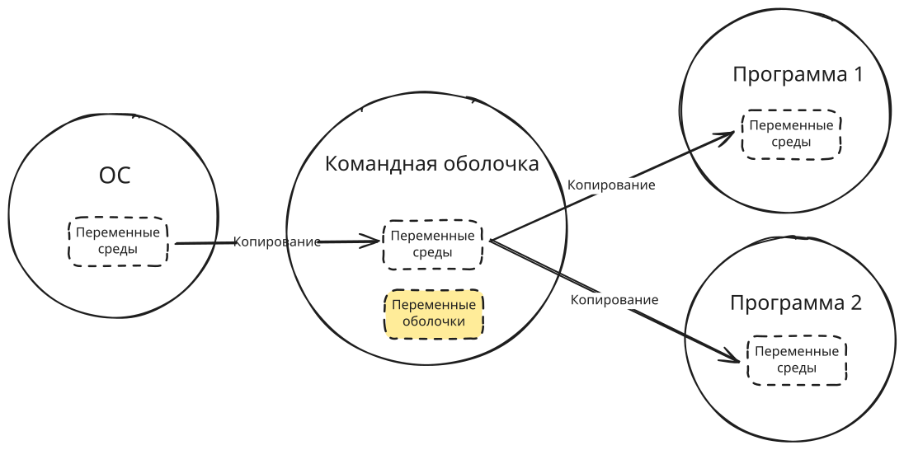</p>

> [!NOTE]
>
> В Unix системах, регистр имён переменных окружения имеет значение, т.е. `PATH` и `Path` - это 2 разные переменные. В Windows, можно писать и так и так, это всё равно будет одна и та же переменная.
>
> Традиционно имена переменных окружения пишут в верхнем регистре. Это не требование системы, а правило хорошего тона, уменьшающее вероятность потенциальных ошибок.

24. В терминале посмотрите список переменных окружения и их значения:

    ```bash
    printenv # или env
    ```

    Команды [`printenv`](https://manpages.ubuntu.com/manpages/noble/en/man1/printenv.1.html) или [`env`](https://manpages.ubuntu.com/manpages/noble/en/man1/env.1posix.html) запущенные без аргументов позволяют посмотреть список переменных окружения.

25. В текущем каталоге создайте файл `"my_env.cpp"` содержащий:

    ```cpp
    #include <iostream>
    #include <cstdlib>  // Для environ
    
    extern char** environ;
    
    int main() {
        for (int i=0; environ[i] != nullptr; i++) {
            std::cout << environ[i] << std::endl;
        }
    }
    ```

    В заголовочном файле `"unistd.h"` (или `"cstdlib"`) объявлен внешний двумерный массив `environ`. При страте программы переменная `environ` инициализируется значением указывающим на копию окружения процесса.

    <p align="center">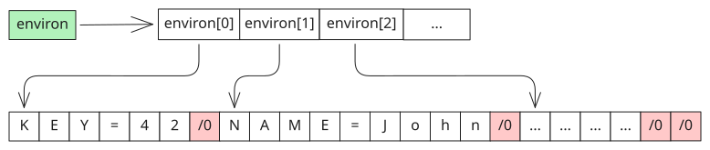</p>

    Для переменных окружения известно, что `n+1` элемент равен нулевому байту, поэтому мы продолжаем чтение до тех пор, пока не дойдём до этого элемента.

    > Выше сказано, что `environ` указывает на **копию** окружения процесса. Это получается вот почему:
    >
    > - При старте процесса, операционная система создаёт структуру описывающую процесс и копирует переменные окружения родительского процесса в эту структуру (не совсем так, но почти);
    > - Стандартная библиотека С/С++ выполняет копирование переменных окружения из этой структуры себе в память.

26. Скомпилируйте и запустите программу:

    ```bash
    g++ my_env.cpp -o my_env
    ./my_env
    ```

    В результате вы получите список переменных окружения, которые программа получила от командной оболочки.

27. В терминале выполните команды:

    ```bash
    echo $PATH     # Печтатем значение переменной среды PATH
    MY_LOCAL=123   # Создаём свою переменную оболочки (НЕ среды)
    echo $MY_LOCAL # Печтатем значение переменной оболочки MY_LOCAL
    ```

    Обратите внимание, что пробелов нигде быть не должно. Если значение переменной содержит пробел, то его (значение) нужно взять в кавычки, либо экранировать пробел символом `\`.

28. Выполните команду:

    ```bash
    ./my_env
    ```

    И попробуйте найти переменную `MY_LOCAL`. Её не должно быть в списке.

29. Выполните команду:

    ```bash
    export MY_LOCAL
    ```

    Этой командой мы назначаем переменную оболочки `MY_LOCAL` переменой среды, но только для текущего сеанса. Т.е., пока терминал открыт `MY_LOCAL` будет вести себя как переменная среды для текущей оболочки и для всех её дочерних процессов. Когда терминал закроют никаких следов от `MY_LOCAL` не останется. Кроме того `MY_LOCAL` существует только в текущем терминал, и если открыть другой, то `MY_LOCAL` там не будет.

30. Выполните команду:

    ```bash
    ./my_env
    ```

    И попробуйте найти переменную `MY_LOCAL`. Она должна быть в списке, потому-что наша программа получила её от оболочки.

31. Выполните команды:

    ```bash
    MY_ONE_RUN_VAR=42 ./my_env
    ./my_env
    ```

    Обратите внимание, что при первом запуске в списке переменных окружения была `MY_ONE_RUN_VAR`, но при втором уже нет. Такой способ запуска программы позволят задать или поменять значение переменной среды, но только для текущего запуска программы.

32. Выполните команды:

    ```bash
    unset MY_LOCAL
    ./my_env
    ```

    И попробуйте найти переменную `MY_LOCAL`. Её снова не должно быть в списке, т.к. мы удалили её командой `unset`.

33. В текущем каталоге создайте файл `"shifter.cpp"` содержащий:

    ```cpp
    #include <iostream>
    #include <string>
    #include <cstdlib>  // Для getenv
    
    int main() {
        std::string str;
        if (std::getenv("FULLMOON") != nullptr) str = std::getenv("FULLMOON"); // Если переменная существует
    
        if (str == "True") std::cout << "I am a werewolf" << std::endl;
        else std::cout << "I am human" << std::endl;
    }
    ```

    Здесь функция [`getenv`](https://en.cppreference.com/w/cpp/utility/program/getenv) позволяет найти переменную среды, если она была передана, по её названию. Под капотом `getenv` использует `environ`.

34. Скомпилируйте и запустите программу:

    ```bash
    ./shifter
    FULLMOON=True ./shifter
    ```

35. В текущем каталоге создайте файл `"check.cpp"` содержащий:

    ```cpp
    #include <iostream>
    #include <string>
    #include <cstdlib>  // Для getenv, putenv, unsetenv
    
    int main(int argc, char* argv[]) {
        if (argc != 2) return 1;
    
        // Проверяем значение переменной
        if (std::getenv(argv[1]) != nullptr) std::cout << argv[1] << " = " << std::getenv(argv[1]) << std::endl;
        else std::cout << argv[1] << " not exist" << std::endl;
    
        // Изменяем значение переменной
        std::string str = argv[1];
        str += "=VALUE"; // Формат ИМЯ=ЗНАЧЕНИЕ
        putenv(str.data());
        // Проверяем
        if (std::getenv(argv[1]) != nullptr) std::cout << argv[1] << " = " << std::getenv(argv[1]) << std::endl;
        else std::cout << argv[1] << " not exist" << std::endl;
    
        // Удаляем переменную
        unsetenv(argv[1]);
        // Проверяем
        if (std::getenv(argv[1]) != nullptr) std::cout << argv[1] << " = " << std::getenv(argv[1]) << std::endl;
        else std::cout << argv[1] << " not exist" << std::endl;
    }
    ```

    Здесь используется функция `putenv` для изменения значения переменной или для создания переменной, если она не существовала и функция `unsetenv` для удаления переменной. Под капотом они используют `environ`. Каждый раз, когда переменные среды модифицируются происходит их перемещение в новое место и как следствие изменение `environ`.

    Эти функции полезны в том случае, если вы собираетесь запускать дочерний процесс (например поток) и хотите изменить для него значения переменных окружения. Или вы хотите загрузить переменные окружения из файла.

    > Одной из популярных практик является конфигурирование программы через `.env` файлы. Это обычный текстовый файл, который содержит список переменных окружения необходимых приложению для работы:
    >
    > ```
    > DB_HOST=local_db_host
    > DB_PORT=local_db_port
    > DB_NAME=local_db_name
    > DB_USER=local_db_user
    > ```
    >
    > При старте, программа загружает этот файл и если переменная среды не установлена, то берётся значение из файла.
    >
    > Правилами хорошего тона считается размещение в репозитории проекта файла с именем `".env.example"`, который должен хранить список необходимых для заполнения переменных. При этом реальный `.env` файл добавлять в репозиторий нельзя.

36. Скомпилируйте и запустите программу:

    ```bash
    ./check ANSWER
    ANSWER=42 ./check ANSWER
    ```

Часто требуется, чтобы переменная среды была доступна не только в текущем сеансе оболочки, а на постоянной основе. Как и всё в Unix это требует внесение изменений в какой-то файл. Подобнее об этом можно почитать например [здесь](https://wiki.merionet.ru/articles/peremennye-okruzheniya-v-linux-kak-posmotret-ustanovit-i-sbrosit).

Кроме рассмотренного выше способа доступа к переменным среды через `environ` есть второй. Функция `main` может принимать третий аргумент, который при старте программы указывает туда же, куда и `environ`.

```cpp
int main(int argc, char* argv[], char* envp[]){
    // Используем envp также как и environ
}
```

Проблема данного способа проявляется тогда, когда вы изменяете значения переменных окружения. Как было сказано выше, функции изменяющие переменные среды автоматически меняют `environ`, но не `envp`. Т.е. `envp` будет указывать на блок переменных которые программа получила при запуске и в которых не внесены никакие изменения.

## C++ Windows

### Работа с аргументами

Работа с аргументами в Windows с точки зрения программы на С++ ничем не отличается от работы с аргументами в Linux. Единственное отличие может быть в принятых соглашениях. Например встроенные команды в оболочке `cmd` как правило для обозначения ключей используют не `-`, а `/`. К примеру:

```cmd
dir /B /D
dir /?
```

При этом, в своей программе, вы сами может выбирать какой вариант вам больше нравится, главное опишите всё в справке. 

### Работа с переменными окружения

> [!WARNING]
>
> Если вы всё ещё работаете в контейнере, то закройте VScode и по новой откройте каталог  `"projects\lab2\cli\cpp"` в VScode.

В Windows работа с переменными окружения:

- Если использовать компилятор `g++` и стандартную библиотеку С++, то код будет таким же как и для Linux. Единственное, в Windows функция `unsetenv("VAR_NAME");` не работает, вместо этого используйте: `putenv("VAR_NAME=");`. Если значение не указано, то переменная считается не установленной;
- Если использовать компилятор от Microsoft (например в Visual Studio) и стандартную библиотеку С++, то можно написать такой же код, как и для Linux, но IDE будет ругаться на небезопасные функции `getenv`, `putenv`. Это можно обойти, если добавить в начало кода (перед включением `cstdlib`) строку `#define _CRT_SECURE_NO_WARNINGS`. В противном случае, среда откажется собирать код, пока вы не замените их на их безопасные версии (среда скажет на какие именно). Эти версии отличаются по сигнатуре, поэтому код придётся немного доработать;
- Кроме стандартной библиотеки С++, Windows предоставляет собственное API позволяющее работать с переменными окружения. Для использования API нужно подключить [`processenv.h`](https://learn.microsoft.com/ru-ru/windows/win32/api/processenv/) или `windows.h`, который подключает всё нужное внутри себя. В отличие от функций из стандартной библиотеки, которые были рассмотрены ранее, функции WinAPI работают не с копией переменных окружения, а с их настоящими значениями. По этой причине не желательно смешивать функции стандартной библиотеки С++ и WinAPI в одном коде, т.к. изменения переменных окружения через функции WinAPI могут быть не видны функциям из стандартной библиотеки и наоборот.

Далее будет рассмотрено использование функций WinAPI для работы с переменными окружения. 

37. В VScode:

    - Откройте вкладку "Terminal" и убедитесь, что у вас открыта оболочка PowerShell;
    - Нажмите на символ "стрелка вниз" рядом с `+` и в открывшемся меню выберите Command Prompt (это оболочка cmd). В результате справа откроется маленькое окно со списком запущенных терминалов;
    - В списке терминалов возьмите и перетащите PowerShell в левую часть открытого cmd. В результате у вас должно получится 2 одновременно открытых терминала.

    <p align="center">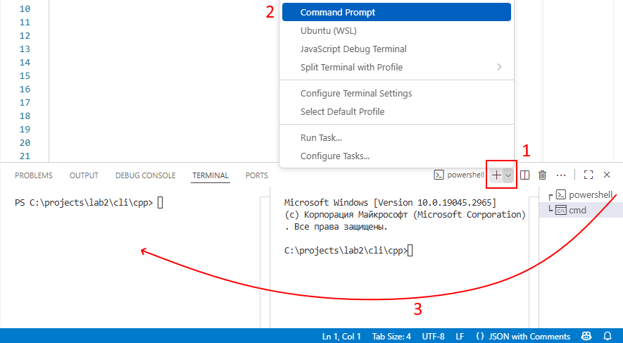</p>

38. Посмотрите список переменных окружения и их значения:

    - cmd:

       ```cmd
       set
       ```
       
    - PowerShell:

       ```powershell
       Get-ChildItem Env: # или 
       gci env: # или 
       dir env:
       ```

39. Если в первой работе вы создавали профиль VScode для С++, то переключитесь на него, чтобы активировались соответствующие плагины, если нет, то убедитесь, что у вас установлен набор расширений *C/C++ Extension Pack*.

    Так же предполагается, что у вас, локально установлен компилятор `g++`. Проверить это можно командой (в любой оболочке):

    ```bash
    g++ --version
    ```

    > На самом деле можно использовать и компилятор от Майкрософт, но в этом случае нужно открыть оболочки PowerShell и cmd как внешние, т.е. в меню Пуск запустить *"Developer PowerShell for Visual Studio"* и *"Developer Command Prompt for Visual Studio"* и перейти в них в каталог `"projects\lab2\cli\cpp"`.

    > Вместо VScode можно использовать IDE Visual Studio, но в этом случае нужно также открыть оболочки PowerShell и cmd как внешние и кроме того, скомпилированный файл будет лежать НЕ в папке и сходным кодом, и это нужно учитывать при выполнении пунктов задания.

40. В текущем каталоге, через интерфейс VScode создайте файл `"my_env_win.cpp"` содержащий:

    ```cpp
    #undef UNICODE       // Чтобы использовать обычные char вместо широких wchar
    #include <windows.h> // Внути подключается processenv.h
    #include <iostream>
    
    int main() {
        auto env = GetEnvironmentStrings();
        if (env == nullptr) {
            std::cerr << "GetEnvironmentStrings failed" << std::endl;
            return 1;
        }
        
        auto current = env; // Компируем, чтобы не менять env, он понадобится в конце
        while (*current) {
            std::cout << current << std::endl;
            current += strlen(current) + 1;
        }
        
        FreeEnvironmentStrings(env);
    }
    ```

    Здесь мы используем функцию WinAPI [`GetEnvironmentStrings`](https://learn.microsoft.com/ru-ru/windows/win32/api/processenv/nf-processenv-getenvironmentstrings) чтобы получить указатель на место в памяти в котором находятся переменные среды (можно воспринимать его как аналог `environ` из стандартной библиотеки). Согласно документации после работы нужно сообщить системе, что данный участок памяти вам больше не нужен при помощи функции [`FreeEnvironmentStrings`](https://learn.microsoft.com/ru-ru/windows/win32/api/processenv/nf-processenv-freeenvironmentstringsa).

    Функция `GetEnvironmentStrings` возвращает нам указатель на одномерный массив символов, в котором переменные среды расположены последовательно друг за другом и разделены нулевым байтом (т.е. это С-строки). В конце гарантировано лежит пустая строка благодаря которой мы можем понять, что достигли конца списка.

    <p align="center">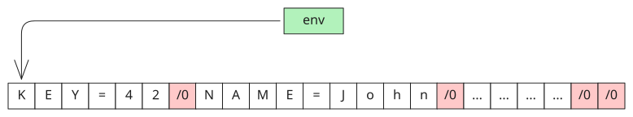</p>

    После того, как мы выводим на экран очередную переменную среды мы перемещаем указатель на начало следующей при помощи функции [`strlen`](https://en.cppreference.com/w/cpp/string/byte/strlen) (возвращает длину С-строки, т.е. количество символов до ближайшего `\0`). Чтобы перешагнуть за нулевой байт прибавляем к длине строки единицу.

    > В начале кода, перед подключением `windows.h` указана строка `#undef UNICODE`. Это связано с тем, что в Windows есть две версии функции `GetEnvironmentStrings`. Одна работает с обычными однобайтовыми `char`, а вторая с двухбайтовыми (широкими) `wchar`.
    >
    > Не будем вдаваться в подробности, но не текущий момент нам удобнее работать с простыми `char`, т.к. для широких пришлось бы использовать "широкие версии" всех стандартных функций, например вместо `cout` нужно было бы `wcout` и т.д.

41. Скомпилируйте программу (в любом терминале):

    ```cmd
    g++ my_env_win.cpp -o my_env.exe
    ```

    и запустите:

    - cmd:

      ```cmd
      my_env
      ```

      Для оболочки `cmd` можно указать просто имя. По умолчанию она сначала ищет программу в текущем каталоге, а потом по путям указанным в `PATH`;

    - PowerShell:

      ```powershell
      .\my_env
      ```

      По умолчанию оболочка PowerShell НЕ ищет программы в текущем каталоге, поэтому мы должны дописать `.\` перед именем программы, чтобы явно попросить оболочку об этом.

42. Добавьте новую переменную:

    - cmd:

      ```cmd
      echo %PATH%       # Печтатем значение переменной среды PATH
      set MY_LOCAL=123  # Создаём свою переменную среды
      echo %MY_LOCAL%   # Печaтаем значение переменной среды MY_LOCAL
      ```

      В оболочке `cmd` нет переменных оболочки. Значение `MY_LOCAL` будет добавлено к переменным среды и следовательно дочерние процессы тоже её получат.

    - PowerShell:

      ```powershell
      echo $env:PATH      # Печтатем значение переменной среды PATH
      $MY_LOCAL = "value" # Создаём свою переменную оболочки
      echo $MY_LOCAL      # Печатем значение переменной оболочки MY_LOCAL
      ```

      В PowerShell **переменные оболочки** дополнительно делятся по областям видимости:

      ```powershell
      # Локальная область (по умолчанию). Применяется к текущей функции, блоку скрипта или оболочке
      $localVar = "value"
           
      # Глобальная область. Переменные, определённые в глобальной области, доступны везде: в функциях, скриптах, модулях и оболочке
      $global:globalVar = "value"
           
      # Область скрипта. Применяется к текущему .ps1-файлу. Переменная в области скрипта доступна во всём скрипте, включая вложенные функции, но не выходит за пределы скрипта
      $script:scriptVar = "value"
           
      # Приватная область. Переменные с областью Private доступны только в пределах текущей области, где они определены, и не доступны во вложенных или внешних областях видимости
      $private:privateVar = "value"
      ```

43. Запустите `my_env` в каждой из оболочек и убедитесь, что в `cmd` переменная `MY_LOCAL` присутствует в списке, а в PowerShell нет.

44. Чтобы сделать переменную оболочки переменной окружения выполните:

    - cmd: как было сказано ранее в `cmd` нет переменных оболочки, поэтому никаких специальных действий не требуется;

    - PowerShell:

      ```powershell
      $MY_LOCAL=123            # Создаём свою переменную оболочки
      $env:MY_LOCAL=$MY_LOCAL  # Теперь это переменная среды
      ```

      В отличие от оболочки `bash` в Linux, в PowerShell появляется вторая (не связанная с первой) переменная `env:MY_LOCAL`. При изменении `MY_LOCAL`, значение `env:MY_LOCAL` не поменяется и наоборот.

45. Запустите `my_env` в PowerShell и убедитесь, что теперь переменная `MY_LOCAL` появилась в списке.

46. В текущем каталоге создайте файл `"get_moon.cpp"` содержащий:

    ```cpp
    #undef UNICODE       // Чтобы использовать обычные char вместо широких wchar
    #include <windows.h> // Внути подключается processenv.h
    #include <iostream>
    
    int main() {
        const int bufSize = 32767;
        char buffer[bufSize];
        auto count = GetEnvironmentVariable("FULLMOON", buffer, bufSize);
        if (count == 0) {
            std::cerr << "GetEnvironmentVariable failed" << std::endl;
            return 1;
        }
        if (count == bufSize) {
            std::cerr << "Buffer too small" << std::endl;
            return 1;
        }
        
        std::cout << "FULLMOON = " << buffer << std::endl;
    }
    ```

    Здесь мы используем функцию WinAPI [`GetEnvironmentVariable`](https://learn.microsoft.com/ru-ru/windows/win32/api/processenv/nf-processenv-getenvironmentvariablea), чтобы получить значение конкретной переменной окружения. Эта функция принимает на вход имя переменной, буфер, который получит значение указанной переменной окружения в виде С-строки и размер буфера. Как результат возвращается количество символов записанное в буфер (в конце добавляется нулевой байт, но не учитывается к количестве символов).

    Размер буфера должен быть как минимум на единицу больше, чем значение в переменной среды (+1 для нулевого байта в конце). Если передать буфер меньшего размера чем значение переменной оболочки, то он будет заполняться пока не кончится. Здесь мы используем буфер размером 32767, т.к. в документации указано, что переменная среды имеет максимальный размер 32767 символов, включая нулевой байт.

    Буфер можно будет использовать повторно.

47. Скомпилируйте программу `get_moon` и запустите в обеих оболочках без установки переменной `FULLMOON`, затем установите `FULLMOON` любое значение, сделайте её переменной среды и повторно запустите программу.

48. Модифицируйте `"get_moon.cpp"` следующим образом:

    ```cpp
    #undef UNICODE       // Чтобы использовать обычные char вместо широких wchar
    #include <windows.h> // Внути подключается processenv.h
    #include <iostream>
    
    int main() {
        const int bufSize = 32767;
        char buffer[bufSize];
        // Читаем переменную FULLMOON
        auto count = GetEnvironmentVariable("FULLMOON", buffer, bufSize);
        if (count == 0) {
            // Если FULLMOON не установлено, устанавливаем
            if (!SetEnvironmentVariable("FULLMOON", "default value")){
                std::cerr << "SetEnvironmentVariable failed" << std::endl;
                return 1;
            }
        }
        
        // Повторно читаем переменную FULLMOON
        count = GetEnvironmentVariable("FULLMOON", buffer, bufSize);
        if (count == 0) {
            std::cerr << "GetEnvironmentVariable failed" << std::endl;
            return 1;
        }
    
        std::cout << "FULLMOON = " << buffer << std::endl;
    }
    ```

    Здесь была добавлена функция WinAPI [`SetEnvironmentVariable`](https://learn.microsoft.com/ru-ru/windows/win32/api/processenv/nf-processenv-setenvironmentvariablea) которая принимает на вход имя переменной и значение. Если переменная существует, она будет изменена, если нет, то создана. Если в качестве значения указать `nullptr` (или `NULL`) то переменная будет удалена (аналог `unsetenv` из стандартной библиотеки).

49. Скомпилируйте и запустите `get_moon` в обеих оболочках.

    На текущий момент у вас переменная `FULLMOON` должна быть установлена, поэтому вы увидите своё значение.

50. Чтобы удалить переменную оболочки выполните:

    - cmd:

      ```cmd
      set FULLMOON=
      ```
      
    - PowerShell:

      ```powershell
      rm env:FULLMOON
      ```

51. Запустите `get_moon` повторно в обеих оболочках.

    На текущий момент переменная `FULLMOON` удалена и вы должны получить в выводе `"default value"`.

Системные переменные окружения к Windows хранятся в реестре. Чтобы переменная среды была доступна не только в текущем сеансе оболочки, а на постоянной основе можно отредактировать реестр, выполнить определённую команду в терминале, но проще всего внести изменения через графический интерфейс как это описано, например [здесь](https://remontka.pro/environment-variables-windows/).

## Go

В случае с Go мы будем используем только стандартную библиотеку, т.к. отдельного API для Go операционные системы не предоставляют, поэтому код для Windows и Linux будет одинаковым. Кроме того, Go поддерживает возможность кросскомпиляции, т.е. мы можем на одной операционной системе собирать приложения для всех остальных (обычно ОС на которой собирают программу должна совпадать с целевой ОС).

Далее все команды будут указаны для Windows и оболочки PowerShell, вы можете использовать другую ОС и оболочку или даже выполнять работу в Docker-контейнере.

### Работа с аргументами

52. Создайте и откройте в VScode каталог `C:\projects\lab2\cli\go`;

53. Если в первой работе вы создавали профиль VScode для Go, то переключитесь на него, чтобы активировались соответствующие плагины, если нет, то убедитесь, что у вас установлен набор расширений разработки для Go (плагин так и называется).

    Кроме того, убедитесь, что установлен набор дополнительных инструментов для Go:

    - VS Code открыть палитру команд <kbd>Shift</kbd>+<kbd>Ctrl</kbd>+<kbd>P</kbd>;

    - Наберите `Go: Install/Update tool`;

    - В выпадающем списке выберите все инструменты:

      <p align="center">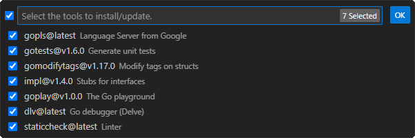</p>

    - Дождитесь завершения установки инструментов *Go*.  
      Процесс может быть довольно долгим и потребовать VPN (для *staticcheck*).

    Так же предполагается, что у вас, установлен компилятор `Go`. Проверить это можно командой (в любой оболочке):

    ```bash
    go version
    ```

54. В текущем каталоге создайте файл `"main.go"` содержащий:

    ```go
    package main
    
    import (
    	"fmt"
    	"os"
    )
    
    func main() {
    	for i, v := range os.Args {
    		fmt.Printf("%d: %s\n", i, v)
    	}
    }
    ```

    Как видно, в отличие от С++ данные о аргументах программы мы получаем не через функцию `main`, а через слайс `Args` из пакета `os`. Чтобы получить количество аргументов можно воспользоваться функцией `len`.

55. Скомпилируйте программу:

    ```bash
    go mod init cli  # Эта строка создаёт модуль (проект) с именем cli
    go build
    ```

    В результате с текущем каталоге появится исполняемый файл имя которого, по умолчанию, совпадает с именем модуля. На Windows будет добавлено расширение `.exe`, на Linux файл будет без расширения.

56. Выполните команды:

    ```bash
    ./cli a
    ./cli -m hello world
    ./cli -m "hello world"
    ```

    Как видно, в результате на экран выводится абсолютный путь к файлу и все аргументы переданные программе.

В стандартной библиотеке Go есть пакет под названием `flags`, который позволяет нам анализировать флаги и аргументы командной строки с помощью множества встроенных функций. Здесь мы не будем рассматривать все его возможности, т.к. их довольно много, мы ограничимся только базовым функционалом.

57. Создайте в текущем каталоге файл `"sum.go"` содержащий:

    ```go
    package main
    
    import (
    	"flag"
    	"fmt"
    	"os"
    )
    
    func main() {
        // Переопределяем стандартный вывод справки
    	flag.Usage = func() {
    		fmt.Fprintln(os.Stderr, "Usage: sum -- VALUE...")
    		fmt.Fprintln(os.Stderr, "Print sum of all passed integer VALUEs.\n")
    		flag.PrintDefaults()
    		fmt.Fprintln(os.Stderr, "  -h, --help\n        display this help and exit")
    	}
    
    	flag.Parse()
        fmt.Println("0")
    }
    ```

    Пакет `flag` самостоятельно обрабатывает ключи `h` и `help` (если их не переопределить) и предоставляет стандартный вывод справочной информации, поэтому мы его заменяем на свой. Сначала выводим текст о способе использования программы, затем при помощи `flag.PrintDefaults()` просим вывести информацию о всех известных программе флагах и в конце добавляем информацию о флагах `h` и `help` (по умолчанию не отображается).

58. Скомпилируйте и запустите программу :

    ```bash
    go build sum.go
    
    ./sum -h
    ./sum --h
    ./sum -help
    ./sum --help
    ./sum h # а так вывода справки не будет
    ```

    Как видно, пакет `flags` для каждого ключа обеспечивает возможность вводить его как с одним, так и с двумя минусами. Если минусы не указать, то это будет не флаг, а позиционный параметр или подкоманда.

59. Модифицируйте файл `"sum.go"`:

    ```go
    package main
    
    import (
    	"flag"
    	"fmt"
    	"os"
    )
    
    func main() {
    	flag.Usage = func() {
    		fmt.Fprintln(os.Stderr, "Usage: sum [options] -- VALUE...")
    		fmt.Fprintln(os.Stderr, "Print sum of all passed integer VALUEs.\n")
    		flag.PrintDefaults()
    		fmt.Fprintln(os.Stderr, "  -h, --help\n        display this help and exit")
    	}
    
    	flag.Parse()
    
    	// Получаем все позиционные аргументы в видей слайса
    	posArgs := flag.Args()
    
    	// Ваш код здесь
    }
    ```

    Пакет `flag` позволяет получить доступ к позиционным аргументам, которые не являются флагами через функцию `flag.Args()`. Позиционные аргументы должны быть указаны после всех ключей, если ключ указан после позиционных аргументов, то он тоже будет добавлен в слайс `flag.Args()`.

    Если попробовать передать программе, например `-10`, то пакет `flag` воспримет его как флаг. Чтобы однозначно отделить флаги от позиционных аргументов нужно использовать два минуса `--`.

60. Доработайте код из предыдущего пункта, чтобы программа выполняла суммирование своих позиционных пергаментов.

61. Скомпилируйте и проверьте работоспособность программы:

    ```bash
    ./sum -- 1 2 3 4 5
    ./sum -- 1 -2 3 -4 5 -6
    ```

62. Модифицируйте файл `"sum.go"` следующим образом:

    ```go
    package main
    
    import (
    	"flag"
    	"fmt"
    	"os"
    )
    
    func main() {
    	flag.Usage = func() {
    		fmt.Fprintln(os.Stderr, "Usage: sum [options] -- [VALUE...]")
    		fmt.Fprintln(os.Stderr, "Print sum of all passed integer VALUEs.\n")
    		flag.PrintDefaults()
    		fmt.Fprintln(os.Stderr, "  -h, --help\n        display this help and exit")
    	}
    
    	s := flag.Bool("s", false, "Put data via std input")
    	std := flag.Bool("std", false, "Put data via std input")
    
    	flag.Parse()
    
    	var data []string
    	if *s || *std {
    		// Заполняем data со стандартного ввода
    	} else {
    		data = flag.Args()
    	}
    
    	// Основной код сложения чисел
    }
    ```

    Здесь мы добавили два флага `s` и `std` при помощи функции `flag.Bool`. Данная функция принимает 3 аргумента: название флага, значение по умолчание (если флаг не задан) и пояснение, которое будет отображаться в справке. В качестве возвращаемого значения мы получаем указатель на переменную в которой будет храниться значение флага.

    Альтернативный вариант создания флагов:

    ```go
    var s, std bool
    flag.BoolVar(&std, "std", false, "Put data via std input")
    flag.BoolVar(&s, "s", false, "Put data via std input")
    ```

    В данном случае, в коде не нужно разыменование переменной при помощи `*`.

63. Доработайте код, скомпилируйте и проверьте работоспособность программы:

    ```bash
    ./sum -- 1 2 3 4 5
    ./sum -s
    ./sum --std
    ```

    > В PowerShell, чтобы сообщить о конце ввода нужно нажать <kbd>Ctrl</kbd> + <kbd>Z</kbd> и затем <kbd>Enter</kbd>.

    Дополнительно можно задавать значение флага так:
    
    ```bash
    -s --s -s=True  -s=true  -s=1 # Аналогично для --s, -std и --std
           -s=False -s=false -s=0 # Аналогично для --s, -std и --std
    ```


Кроме булевых флагов пакет `flags` позволяет создать флаги и других типов: целые, вещественные, строковые и т.д. в том числе и пользовательских типов. Далее рассмотрим создание флага пользовательского типа на примере массива значений.

64. Модифицируйте файл `"sum.go"` следующим образом:

    ```go
    package main
    
    import (
    	"flag"
    	"fmt"
    	"os"
    	"strconv"
    )
    
    // Свой тип
    type nums []string
    
    func (n *nums) String() string {
    	return fmt.Sprintf("%s", *n)
    }
    
    func (n *nums) Set(value string) error {
        // Валидируем значениеы
    	_, err := strconv.Atoi(value)
    	if err != nil {
    		return fmt.Errorf("'%s' not a number", value)
    	}
    
    	*n = append(*n, value)
    	return nil
    }
    
    func main() {
    	flag.Usage = func() {
    		fmt.Fprintln(os.Stderr, "Usage: sum [options] -- [VALUE...]")
    		fmt.Fprintln(os.Stderr, "Print sum of all passed integer VALUEs.\n")
    		flag.PrintDefaults()
    		fmt.Fprintln(os.Stderr, "  -h, --help\n        display this help and exit")
    	}
    
    	s := flag.Bool("s", false, "Put data via std input")
    	std := flag.Bool("std", false, "Put data via std input")
    
    	var data nums
    	flag.Var(&data, "num", "The integer number")
    
    	flag.Parse()
    
    	if *s || *std {
    		// Заполняем data со стандартного ввода
    	} else {
    		data = append(data, flag.Args()...)
    	}
    
    	// Основной код сложения чисел
    }
    ```

    Здесь мы добавляем свой тип `nums` на базе слайса строк. Для нашего типа нужно реализовать два метода:

    - `String() string`, чтобы правильно печатать его;

    - `Set(value string) error`. Данный метод будет вызываться всякий раз, когда в списке аргументов будет найден флаг нашего типа и значение, которое будет указано для этого флага будет передано как `value` в метод. Далее мы можем обрабатывать это значение как хотим. В примере выше, мы проверяем, что `value` это число и добавляем его в слайс. Таким образом, если ключ будет указан множество раз все его значения будут добавлены в наш слайс.

      В качестве возвращаемого значения нужно вернуть либо `nil`, если ошибки нет, либо ошибку с текстовым пояснением, которое автоматически будет выводиться на экран.

     Сам флаг нашего типа добавляется обычным образом, только вместо `flag.Bool` или `flag.Int` нужно использовать `flag.Var`.

65. Доработайте код, скомпилируйте и проверьте работоспособность программы:

    ```bash
    ./sum -- 1 2 3 4 5
    ./sum --num 1 --num 2 --num 3 -- 4 5
    ```

Кроме рассмотренного выше, пакет `flag` позволяет добавлять подкоманды у которых могут быть свои флаги.

Подробнее рассматривать стандартный пакет `flag` мы не будем, т.к. он не очень удобен для сложных программ с интерфейсом командной строки. Для Go существует множество альтернативных решений, которые более удобны в использовании, например:

| Библиотека                                                   | Подходит для                  | Сложность | Основные особенности                  |
| ------------------------------------------------------------ | ----------------------------- | --------- | ------------------------------------- |
| [`cobra`](https://cobra.dev/)                                | Большие проекты               | Средняя   | Поддержка подкоманд, автодополнение   |
| [`urfave/cli`](https://cli.urfave.org/)                      | Простые и средние проекты     | Низкая    | Лёгкий синтаксис, гибкость            |
| `flag`                                                       | Маленькие проекты             | Низкая    | Встроена в стандартную библиотеку     |
| [`go-flags`](https://github.com/jessevdk/go-flags?tab=readme-ov-file) | Проекты со сложной структурой | Средняя   | Работа с аргументами через структуры  |
| [`spf13/pflag`](https://github.com/spf13/pflag)              | CLI с POSIX-совместимостью    | Низкая    | Расширение стандартного пакета `flag` |

Перенаправление потоков ввода и вывода, пайпы и др. точно так же работают для программы на Go как и для программ на С++ (и на других языках), т.к. это функционал самой оболочки.

### Работа с переменными окружения

66. Создайте файл `"my_env.go"` содержащий:

    ```go
    package main
    
    import (
    	"fmt"
    	"os"
    )
    
    func main() {
    	envs := os.Environ()
    	for _, e := range envs {
    		fmt.Println(e)
    	}
    }
    ```

    Здесь мы используем `os.Environ()`, чтобы получить слайс с переменными среды.

67. Скомпилируйте и запустите программу :

    ```bash
    go build my_env.go
    
    ./my_env
    ```

68. Создайте файл `"do_env.go"` содержащий:

    ```go
    package main
    
    import (
    	"flag"
    	"fmt"
    	"os"
    )
    
    func main() {
    	action := flag.String("action", "set", "")
    	flag.Parse()
    	name := flag.Arg(0)
    
    	switch *action {
    	case "look":
    		{
    			val, exists := os.LookupEnv(name)
    			if !exists {
    				fmt.Printf("%s not exist\n", name)
    				return
    			}
    			fmt.Printf("%s = %s\n", name, val)
    		}
    	case "get":
    		{
    			fmt.Printf("%s = %s\n", name, os.Getenv(name))
    		}
    	case "set":
    		{
    			os.Setenv(name, flag.Arg(1))
    			fmt.Printf("%s = %s\n", name, os.Getenv(name))
    		}
    
    	case "unset":
    		{
    			os.Unsetenv(name)
    			val, exists := os.LookupEnv(name)
    			if !exists {
    				fmt.Printf("%s not exist\n", name)
    				return
    			}
    			fmt.Printf("%s = %s\n", name, val)
    		}
    	default:
    		{
    			fmt.Println("action not in [look, get, set, unset]")
    		}
    	}
    }
    ```

    Как видно для получения конкретного значения, изменения и удаления переменной среды используются соответствующие функции: `os.Getenv`, `os.Setenv` и `os.Unsetenv`.

    Функция `os.Getenv` возвращает пустую строку если переменная не существует, но с другой стороны сама переменная может существовать и иметь пустое значение. Если для вас важно отличать эти два случая, то можно воспользоваться функцией `os.LookupEnv`, которая возвращает само значение и булев флаг существования переменной. 

69. Скомпилируйте и запустите программу:

    ```bash
    go build do_env.go
    
    .\do_env --action=look MY_VAR
    .\do_env --action=get MY_VAR
    .\do_env --action=set MY_VAR 42
    .\do_env --action=unset MY_VAR
    ```

    Затем установите значение переменной окружения и повторите проверку:

    ```bash
    $env:MY_VAR=1
    
    .\do_env --action=look MY_VAR
    .\do_env --action=get MY_VAR
    .\do_env --action=set MY_VAR 42
    .\do_env --action=unset MY_VAR
    ```

Как было сказано ранее, стандартной практикой сейчас является использование файлов `.env`. Мы не рассматривали работу с `.env` файлами в С++, поэтому рассмотрим здесь.

70. Создайте в текущем каталоге файл `".env"` содержащий:

    ```ini
    API_URL=http://example.com/api
    API_KEY=1234567890
    ```

71. Создайте файл `"get_dotenv.go"` содержащий:

    ```go
    package main
    
    import (
    	"fmt"
    	"log"
    	"os"
    
    	"github.com/joho/godotenv"
    )
    
    func main() {
    	err := godotenv.Load()
    	if err != nil {
    		log.Fatal("Error loading .env file")
    	}
    
    	apiURL := os.Getenv("API_URL")
    	apiKey := os.Getenv("API_KEY")
    	fmt.Println(apiURL)
    	fmt.Println(apiKey)
    }
    ```

    Здесь мы используем функцию `godotenv.Load()` из стороннего пакета `"github.com/joho/godotenv"`. По умолчанию будет загружен файл `".env"`, но можно указать другие имена.

72. Установите и добавьте пакет `"github.com/joho/godotenv"` в проект при помощи команд:

    ```bash
    go get github.com/joho/godotenv
    go mod tidy
    ```

73. Скомпилируйте и протестируйте работоспособность программы:

    ```bash
    go build get_dotenv.go
    
    .\get_dotenv
    $env:API_KEY="ABCD"
    .\get_dotenv
    ```

    Как видно, если переменная окружения не задана, то будет использовано значение из файла `.env`, а если задана, то значение из файла игнорируется.

Для более продвинутой работы с переменными среды, с конфиг-файлами и многим другим можно воспользоваться пакетом [Viper](https://github.com/spf13/viper).


