# Практическая работа №2. Часть 2. Программа и её компоненты

## Введение

### Как программа исполняется

Все программы, не зависимо от того, на каком языке они были написаны в конечном итоге исполняются процессором. Программа - это последовательность инструкций процессора.

Ориентировочно процесс работы программы можно представить так:

1. В специальный регистр процессора IP (*instruction pointer*) записывается адрес ячейки в оперативной памяти с которого начинается программа (например `0x400000`). IP - регистр процессора, который указывает, какую команду процессору нужно выполнять следующей;

2. Процессор запрашивает у оперативной памяти данные расположенные в этой ячейке, декодирует команду и исполняет её;

3. IP автоматически увеличивает своё значение на единицу (точнее на размер текущей команды в байтах), тем самым смещаясь в памяти на следующую команду;

4. Цикл продолжается с шага 2, пока не будет встречена команда остановки процессора.

<p align="center">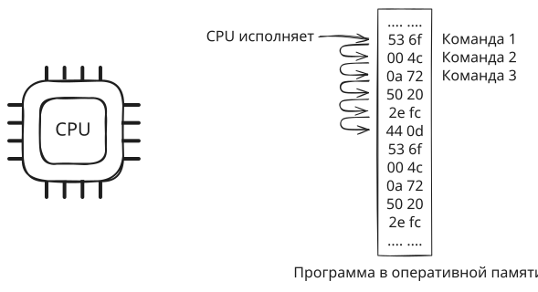</p>

Обычно регистр IP сам увеличивается после исполнения очередной инструкции, но есть команды процессора позволяющие изменить значение IP, например вызов функции смещает IP на адрес в памяти по которому расположена первая инструкция функции, операторы `if`, `for` и др. в языках программирования, тоже работают через возможность изменять значение IP при выполнении определённых условий.

Инструкция процессора - это последовательность байт. В RISC-архитектуре все инструкции имеют фиксированный размер в байтах (например на рисунке выше по 2 байта), в CISC-архитектуре длина инструкций разная.

Например, на рисунке представлен набор инструкций (*instruction_set*) для модельного процессора [LC-3](https://en.wikipedia.org/wiki/Little_Computer_3):

<p align="center">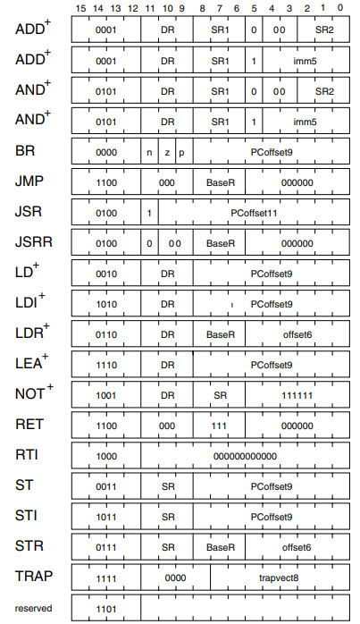</p>

Как видно, есть два варианта инструкции сложения ADD, разберём одну из них как пример:

<p align="center"></p>

- Во всех инструкциях старшие 4 бита означает код операции (опкод). Для `ADD` - это `0001`;
- Следующие 3 бита DR (*destination register*) - код регистра назначения. В этот регистр процессор поместит результат сложения. У LC-3 всего 8 регистров общего назначения + 3 специальных (счётчик команд, указатель на следующую команду и регистр состояния). У регистров общего назначения коды от 0 до 7, поэтому 3 бита достаточно, чтобы записать код любого из них;
- Следующие 3 бита SR1 (*source register*) - код регистра источника. Здесь процессор будет искать первое слагаемое. Это означает, что перед вызовом инструкции `ADD` должна быть инструкция загружающая данные из памяти в этот регистр;
- Бит по индексу 5 позволяет процессору понять как передаётся второе слагаемое, через регистр с номером SR2 или как 5-ти битовое целое число явно записанное в команде (imm5). В нашем случае указана `1`, что означает второй вариант;
- Младшие 5 бит - это второе слагаемое. Целое число, записанное непосредственно в команде.

Например:

```bash
В бинарном виде: 0001 000 000 1 00011
В шестнадцатеричном виде: 10 23
Ассемблер: ADD R0, R0, 3
```

Прочитав эти 2 байта процессор выполнит инструкцию сложения данных загруженных в регистр R0 и числа 3. Результат сложения будет записан в регистр R0.

Для других инструкций схема та же самая. Берём действие, которое хотим, чтобы процессор выполнил, заполняем нужными данными и получаем 2 байта. Эти 2 байта записываем в оперативную память. Когда процессор до них дойдёт, то исполнит команду. Кроме команд в память нужно записать данные, которые процессор будет загружать в регистры, например при помощи инструкции `LD`.

Для реальных процессоров дела обстоят точно также, только инструкции длиннее и их гораздо больше. У каждого процессора может быть полностью свои, несовместимые с другим процессорами таблицы инструкций и правила их составления. Соответственно, для процессора LC-3 байты `10 23` означают сложение, а для другого процессора, что угодно другое.

Чтобы мы могли запускать одни и те же программы на разных профессорах существует ISA (Instruction Set Architecture, архитектура набора команд). ISA определяет набор инструкций, типы данных, набор регистров и т.д.

Классические примеры ISA:
- x86;
- ARM;
- MIPS, RISC-V, PowerPC;
- SPARC, Alpha, VAX.

Фирмы выпускающие процессоры делают их совместимыми с каким-то ISA, поэтому одни и те же байты означают одно и тоже для разных процессоров, но только в пределах одного ISA. В дополнении, процессор может поддерживать и другие наборы инструкций и, современные компиляторы позволяют указать, что программу нужно собирать, с учётом этих дополнительных инструкций. Как правило получаются более быстрые/безопасные/компактные программы, но они не запустятся на процессорах не поддерживающих эти инструкции (например на старых).

### Из чего программа состоит

Чтобы не писать программы в машинных кодах, мы пишем их на языках высокого уровня и затем используем компилятор.

>[!NOTE]
>
> Компилятор - это программное обеспечение, которое переводит компьютерный код, написанный на одном языке программирования (исходном языке), на другой язык (целевой язык). Название "компилятор" в основном используется для программ, которые переводят исходный код с языка программирования высокого уровня на язык программирования низкого уровня [[Википедия]](https://en.wikipedia.org/wiki/Compiler).

Теоретически мы можем взять весь код программы и поместить его в один файл. Затем передать его компилятору и получить программу, которая будет загружена в оперативную память и процессор будет её исполнять.

<p align="center">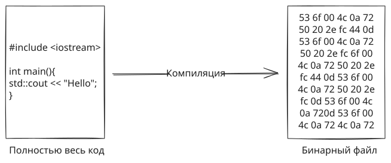</p>

По многим причинам так не делают:
- Компиляция процесс сложный и многоступенчатый, поэтому большие программы могут компилироваться часами:

  <p align="left">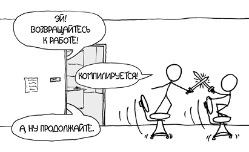</p>

- Код большой программы записанный в одном файле человеку слишком сложно читать/изменять: 

   <p align="left"></p>

Для управления сложностью программы, код разделяют на функции, классы, файлы, пакеты, модули и т.д. В С++ код делят на `.cpp` и .`h` файлы и структурируют при помощи дерева каталогов. В Go код делится на пакеты, каждый из которых состоит из одного или нескольких `.go` файлов. Несколько связанных пакетов могут быть объединены в модуль, а несколько связанных модулей в workspace.

<p align="center">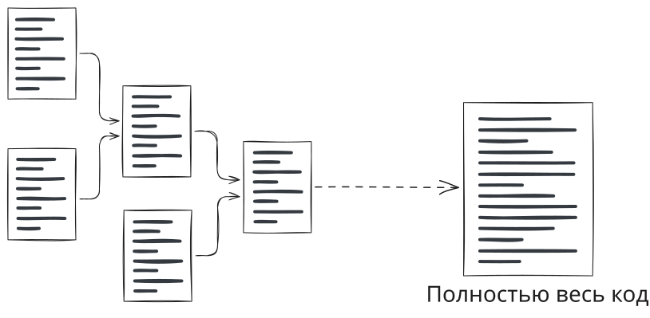</p>

Такой подход позволяет управлять когнитивной сложностью, но перед компиляцией, отдельные элементы программы все равно должны быть объединены в один файл содержащий полный код программы. Таким образом вопрос со временем компиляции остаётся не решённым.

Для его решения, процесс объединения элементов программы в одно целое можно выполнять не до компиляции, а после. Т.е., на первом этапе, каждый файл/пакет/др. компилируется отдельно от остальных в некоторое почти готовое для исполнения процессором представление (для С++ и Go - это бинарный объектный файл). А на втором этапе эти фрагменты объединяются в одно целое, чтобы получить итоговую программу. Таким образом, при изменении кода в одном файле нужно перекомпилировать только его, а затем объединить обновлённый фрагмент с остальными.

<p align="center">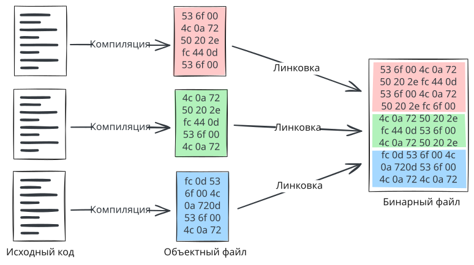</p>

Процесс объединения фрагментов существенно проще и быстрее компиляции и состоит из двух шагов:

- Склеить фрагменты, просто переписав байты из всех файлов в один;

- Поправить адреса переменных, функций и их вызовы. Процессор не умеет обращаться к переменным/функциям по именам, вместо этого процессор использует адреса памяти по которым расположена переменная или находится первая инструкция функции:

  ```assembly
  mov eax, [0x601000] ; Чтение данных из переменной в регистр
  ```

  Т.к. фрагменты кода склеиваются в один, то конкретные адреса переменных/функций для конкретного фрагмента будут зависеть от количества и длин фрагментов которые были добавлены перед ним. Таким образом для каждого фрагмента нужно выполнить корректировку адресов.

Объединением фрагментов программы занимается модуль который называется линкер (компоновщик, редактор связей).

#### Статические библиотеки 

Большие программы могут состоять из большого числа таких фрагментов, поэтому для упрощения команды компиляции (чтобы не перечислять сотни объектных файлов в команде) объектные файлы упаковываются в один архивный файл (обычный архив, такой же как `zip` или `rar`). Такой архив называется **статической библиотекой** и обычно имеет расширение `.a` на Linux и `.lib` на Windows.

<p align="center">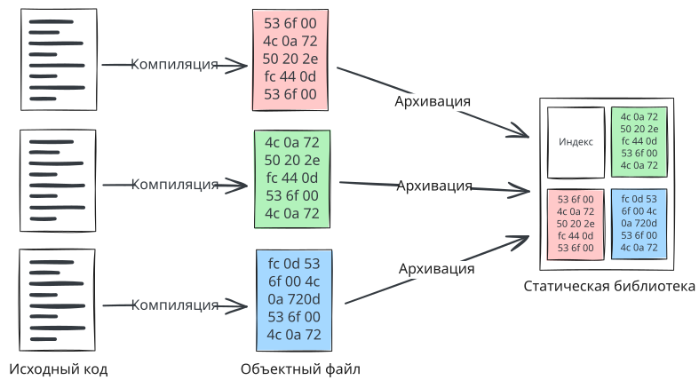</p>

Статическую библиотеку можно передать компилятору вместе с исходным кодом, который использует функции/переменный из библиотеки. Компилятор преобразует файлы с исходным кодом в объектный файл и вместе со статическими библиотеками передаст линкеру. Линкер в свою очередь достанет из статических библиотек только нужные объектные файлы и объединит в программу.

> В статической библиотеке могут быть сотни объектных файлов и чтобы линкеру проще было анализировать их содержимое, в процессе создания библиотеки автоматически формируется индексный файл. Он содержит списки имён функций/переменных и названия файлов в которых они присутствуют. Своего рода оглавление архива.

<p align="center">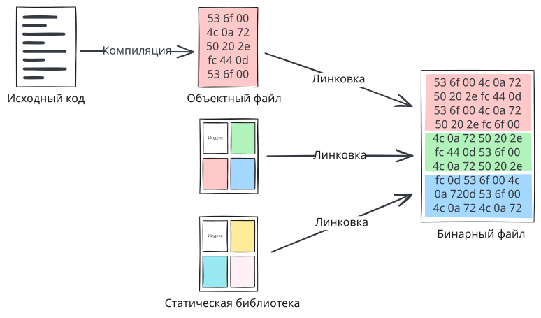</p>

Такой подход позволяет, как вариант разработать набор полезных функций, один раз скомпилировать и упаковать их в стат. библиотеку и в дальнейшем просто использовать её в своих проектах или распространять среди других людей. Ещё одним плюсом такого подходя является возможность держать исходный код своих функций в секрете от пользователей, т.к. получить из бинарного файла код на высокоуровневом языке не очень просто, точнее такой код будет плохо пригоден для изучения, особенно если применить [обфускацию](https://ru.wikipedia.org/wiki/Обфускация_(программное_обеспечение)).

#### Динамические библиотеки

Объектные файлы упакованные в статической библиотеке, на этапе линковки становятся частью нашей программы, таким образом увеличивая её размер на диске и в оперативной памяти. Существуют библиотеки, которые используются практически всеми программами в системе, таким образом код этих библиотек сотни или тысячи раз дублируется на диске и в оперативной памяти.

Чтобы не расходовать зря ресурсы можно рассмотреть следующий подход. Вместо того, чтобы приклеивать код объектного файла к каждой программе просто разместить библиотеку в памяти по определённому адресу и все программы, будут использовать её совместно.

<p align="center">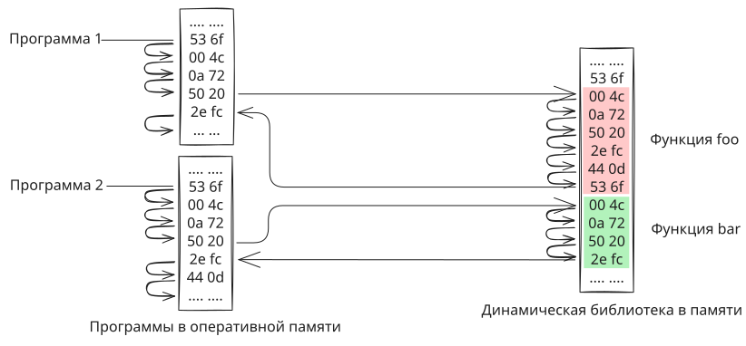</p>

В Linux такие библиотеки называют общий объект (*shared object*) и на диске имеют расширение `.so` в Windows их называют динамически подключаемая библиотека (*dynamic link library*) и расширение у них `.dll`. Динамическая библиотека по своей сути ближе к обычной программе, которая запускается, выполняет подготовительную работу, а затем просто висит в памяти ничего не делая.

Но не всё так просто как могло показаться на первый взгляд.

##### Виртуальная память процесса

В целях безопасности операционная система обеспечивает изоляцию в памяти каждой запущенной программы, т.е. программа считает, что кроме неё и операционной системы в памяти "никого" нет.

Это достигается за счёт того, что для каждой программы операционная система создаёт свое виртуальное адресное пространство. Идея заключается в том, что любое обращение программы в память по адресу `X` автоматически (встроенный механизм процессора) смещается на некоторое число `Z`, таким образом реальное обращение в память происходит по адресу `X+Z`. Число `X` - адрес в виртуальном адресном пространстве программы, а число `X+Z` - адрес в физической памяти. Для каждой программы и для каждого блока памяти принадлежащего программе операционная система подбирает своё значение `Z`, таким образом, чтобы в физической памяти они не пересекались. Т.е. даже если две программы обратятся в память по одному адресу `X` то они попадут в разные участки физической памяти.

<p align="center">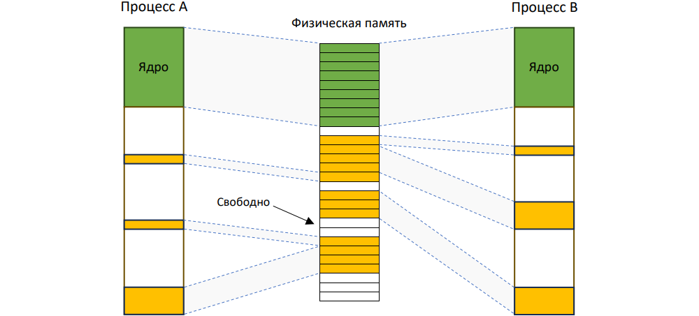</p>

Разумеется для каждого отдельного байта подбирать своё смещение - это слишком затратно, поэтому операционная система делит всю доступную её физическую память на блоки. Эти блоки называют страницами памяти. Типичный размер страницы 4 КБ (но может быть и больше), т.е. на 4 ГБ ~ миллион страниц.

Для каждой страницы можно установить программу-владельца, смещение, права доступа и др. Например страницы памяти по которым загружен код программы отмечены как доступные только для чтения и любая попытка их изменить приведёт к завершению программы. Операционная система выделяет память только целыми страницами. Если программе нужно 5 КБ, то ОС выделит 2 страницы. Именно по этому попытка доступа к данным за пределами массива может привести как к падению программы, если вы вылезли в памяти за пределы своей страницы, так и пройти без проблем, если вы вылезли за пределы массива, но остались в пределах своей страницы памяти.

Для работы динамических библиотек операционная система может "нарушать" эту изоляцию, проецируя библиотеку в виртуальное адресное пространство одной или нескольких программ.

<p align="center">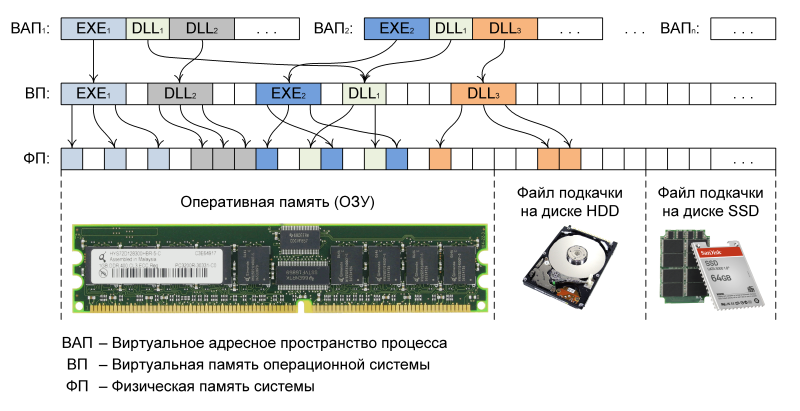<br>Источник: <a href="https://habr.com/ru/articles/129558/">https://habr.com/ru/articles/129558/</a></p>

Т.е. ОС специально подбирает такие смещения, чтобы программа обращаясь по адресу `X` физически попадала в память где расположен код библиотеки. Для этого программа обращается к ОС и просит дать доступ к библиотеке или загрузить её, если она ещё не в памяти.

##### Реллокация

На этом проблемы с динамическими библиотеками не заканчиваются.

Когда компилятор и линкер создают бинарный файл, они предполагают, что программа будет загружена по определённому **базовому адресу** (например, `0x400000`) и относительно этого адреса рассчитываются **абсолютные** адреса функций, глобальных переменный и др. Например: любое обращение к переменной `global_var` будет заменено на её конкретный адрес `0x401000`.

Программа состоит из секций (данные, код, стек и др.) каждый новый запуск программы эти секции загружается в оперативную память в новое место ASLR (*Address Space Layout Randomization*), в основном в целях безопасности, чтобы усложнить жизнь хакерам. Если загрузить нашу программу в другое место, то обращаясь по адресу `0x401000` мы попадём совсем не туда, куда ожидали и следовательно программа не будет работать.

Чтобы программа продолжала корректно работать даже в другом месте оперативной памяти применяет процедура реллокации (перемещения).

Например операционная система выбрала другой базовый адрес (`0x7f8a1b200000`). Поэтому программу нужно "перенастроить", подправив в ней все адреса, чтобы они указывали на правильные места в новой области памяти. Перед запуском программы в тех местах программы, где прописаны абсолютные адреса будет добавлено смещение `0x7f8a1b200000` - `0x400000`.

<p align="center">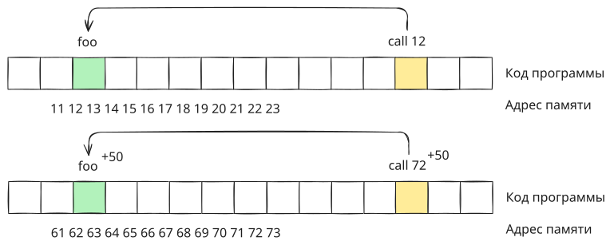</p>

Динамическая библиотека загружается в память в единственном экземпляре и затем проецируется (отображается, маппится) в память программ использующих её код. Если повезёт и будет свободное место в виртуальном адресном пространстве процесса, то библиотека будет спроецирована по тем же адресам виртуальной памяти, что и в своём адресном пространстве и тогда код библиотеки будет работать правильно. Но если нужные адреса будут заняты, то библиотека спроецируется по другим адресам и её код будет обращается по неправильным адресам.

<p align="center">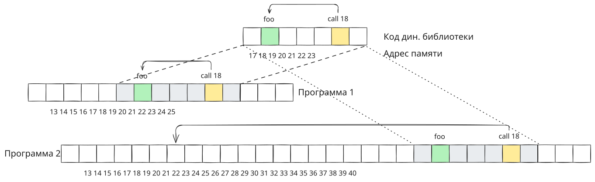</p>

В этом случае часть динамической библиотеки дублируется в другой участок оперативной памяти и к ней применяется реллокация, но это понижает эффективность библиотеки, т.к. в худшем случае придётся создавать полную копию динамической библиотеки для каждой программы.

Чтобы решить эту проблему динамические библиотеки компилируются в специальном режиме PIC (*Position Independent Code*, позиционно-независимый код), который не использует абсолютные адреса, а рассчитывает смещение относительно текущего положения счетчика команд, а для глобальных данных используется специальная таблица GOT (*Global Offset Table*) в которой записаны смещения для них. Таблица GOT копируется для каждой программы которая использует библиотеку и для каждой программы рассчитываются свои смещения.

```
; Не-PIC
lea rax, [global_var]          # Загружаем переменную 

; PIC
lea rax, [rip + got_offset]    # Загружаем адрес из GOT
mov rax, [rax]                 # Загружаем переменную
```

Обычные программы не компилируют в режиме PIC, т.к. PIC код немного больше и медленнее обычного.

##### Нюансы использования динамических библиотек

Может возникнуть вопрос. Если какая-то функция в динамической библиотеке выделяет блок памяти, то в чьём адресном пространстве он будет выделен и не будет ли конфликта, если две программы "одновременно" будут использовать одну и туже функцию динамической библиотеки?

Воспользуемся аналогией. Пусть есть толпа людей и все они хотят заварить кофе по нашему новому рецепту. Мы можем распечатать и раздать каждому индивидуальную инструкцию потратив при этом много бумаги и чернил. Как альтернативный вариант можно распечатать одну инструкцию на всех и повесить её на стене кухни. Каждый человек будет "одновременно" читать одну и ту же инструкцию и выполнять указанные там действия, но со своей собственно чашкой.

Поэтому, если в динамической библиотеке есть функция выделяющая блок данных, то данные будут выделены в адресном пространстве каждой программы свои, т.к. библиотека содержит только инструкции для процессора которые исполняются к контексте каждой программы отдельно. Глобальные переменные динамической библиотеки напротив будут общими для всех программ, т.к. место под них было выделено в процессе загрузки библиотеки в единственном экземпляре.

## C++ Linux

> [!WARNING]
>
> Если вы выполняли предыдущую часть в Docker контейнере можно выполнить сброс Docker Desktop к начальным настройкам, чтобы удалить всё ненужные артефакты и освободить место на диске:
>
> 1. Запустите Docker Desktop;
> 2. На нижней панели окна Docker Desktop нажмите на три вертикальные точки и выберите пункт меню *Troubleshoot*. То же самое можно получить нажав на символ вопросительного знака  на верхней панели (раньше был символ жука).
> 3. В открывшемся окне нажмите на кнопку *Reset to factory defaults* и подождите некоторое время.
>    В результате Docker Desktop перезапуститься и покажет такое же окно как и сразу после установки.

> [!WARNING]
>
> Если у вас основная операционная система Windows, то этот раздел выполняйте в Docker контейнере. Для этого:
> 1. Запустите Docker Desktop;
> 2. В каталоге `"projects/lab2"` создайте каталог `"manual_build"`;
> 3. Откройте каталог `"manual_build"` в VScode;
> 4. Переключитесь в профиль Remote. Если профиль Remote вы не создавали, то установите набор плагинов Remote Development;
> 5. Добавьте конфигурацию Dev Container:
>    - Нажмите на значок в левом нижнем углу  и выберите _Add Dev Container Configuration Files..._;
>    - На вопрос, где сохранить конфигурацию контейнера выберите _Add configuration to workspace_. В этом случае, конфигурация контейнера будет храниться в папке проекта. Альтернативный вариант создаст конфигурацию в другом месте, но она тоже будет действовать только на этот проект. Разница в том, хотите ли вы, чтобы конфигурация контейнера могла отслеживаться системой контроля версий или нет;
>    - В поле поиска шаблона введите _C++_ и выберите одноимённый шаблон;
>    - Шаблон _С++_ доступен на основе нескольких ОС. Выберите контейнер на основе _ubuntu-24.04_;
>    - Затем будет несколько вопросов касающихся установки в контейнер дополнительного софта. Нажмите: _none_, _ОК_ и _ОК_;
>    В папке проекта появится каталог `".devcontainer"` с файлом `"devcontainer.json"` и другими.
> 6. Запустите контейнер, например нажмите на значок  и в выпадающем выберите *Reopen in Container*.
> 7. Дождитесь пока загрузится образ и запустится контейнер. При успешном запуске контейнера значок в левом углу изменится на .

Стандарт насчитывает 9 [этапов трансляции](https://en.cppreference.com/w/cpp/language/translation_phases), которые упрощённом виде можно объединить в следующие три (этап под номером 4 не относится к сборке):

<p align="center">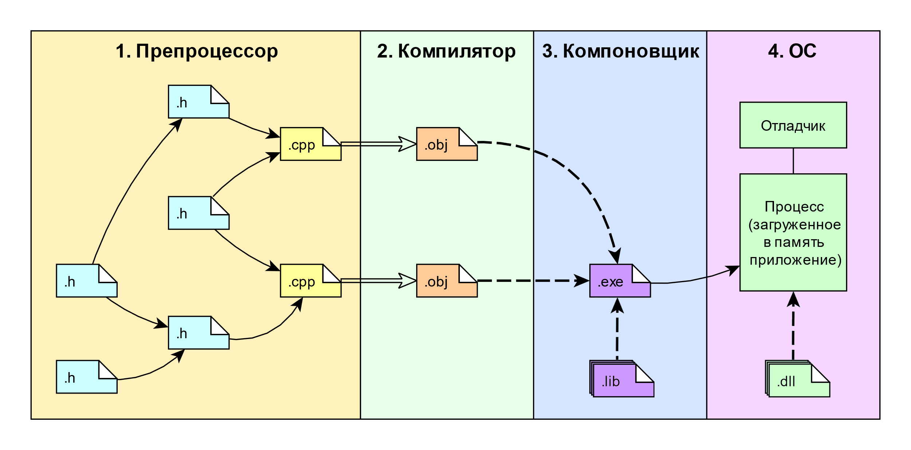</p>

> [!Note]
>
> Расширения файлов показаны для *Windows*. Для *Linux*: `.obj` соответствует `.o`; `.lib` соответствует `.a`; `.dll` соответствует `.so`; для `.exe` соответствия нет, т.к. на *Linux* исполняемые файлы обычно без расширения.

Большинство компиляторов позволяют остановить процесс сборки после указанного этапа и вывести промежуточное состояние файлов, после препроцессирования, после компиляции и т.д. Сборка программы под разные ОС в целом следует одному сценарию, но всё-таки присутствуют мелкие отличия. Чтобы не "утонуть" в мелочах, далее мы будем работать с компиляторам *g++* под *Linux*. g++ - это компилятор языка программирования *C++*, который является частью *GNU Compiler Collection (GCC)*.

Компилятор *g++* не делает всю работу самостоятельно, а последовательно вызывает другие команды: сначала *cc1plus*, потом *as*, в конце *collect2*, который вызывает *ld*. Сценарий сборки со всеми параметрами можно посмотреть командой:

```bash
echo | g++ -v -x c++ -
```

### Фаза препроцессинга

>[!NOTE]
>
> Подробности работы препроцессора *g++* можно посмотреть в [документации](https://gcc.gnu.org/onlinedocs/cpp/). 

Препроцессинг выполняется препроцессором. Препроцессор можно воспринимать, как **интерпретатор** некоторого простого **языка** программирования, предназначенного для работы с текстом. Команды препроцессора называются директивами. Всё, что не является директивой, с точки зрения препроцессора - это просто текст.

Таким образом, можно сказать, что в `.cpp` и `.h` файлах у нас присутствует код одновременно на двух языках: на языке С++ и на языке препроцессора.

<p align="center">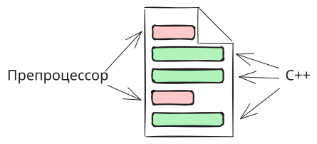</p>

Препроцессор принимает на вход `.cpp` файл, исполняет директивы и на выходе отдаёт `.cpp` файл. Файлы с расширением `.h` обрабатываются препроцессором только в том случае если они подключаются при помощи директивы `include`.

<p align="center">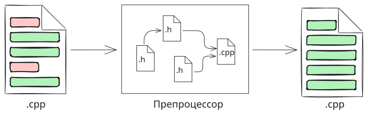</p>

Перед началом работы препроцессор выполняет ряд текстовых преобразований над переданными ему файлами. Например: удаляет комментарии и лишние пробельные символы, объединяет строки перенесённые при помощи символа `\` и т.д. Эти преобразования примерно соответствуют первым трём «этапам трансляции», описанным в стандарте C++.

Директивы препроцессора занимают одну полную строку и имеют следующий формат:

- Символ `#`;
- Название стандартной директивы или название нестандартной директивы или ничего (тогда директива ничего не делает). Нестандартные директивы (например `#pragma`) могут работать на одних компиляторах и игнорироваться другими;
- Перевод строки.

Компилятор `g++` с опцией `-E` позволяет остановить сборку после этапа препроцессирования и вывести результат на экран, а если добавить опцию `-o имя_файла`, то сохранить его в файл. Прошедшему через стадию препроцессинга C коду, обычно, дают расширение `.i`. В случае С++, расширение `.ii`.

1. Создайте каталог `"preprocessor"` и внутри него создайте файл `"info.cpp"` содержащий:

   ```cpp
   cout << "Welcome to LoggerDemo version 1.0" << endl;
   ```

2. Откройте встроенный в VS Code терминал и перейдите в каталог `"preprocessor"`.

3. Выполните команду:

   ```bash
   g++ -E -o info.ii info.cpp
   ```

   В результате в текущем каталоге должен появится файл `"info.ii"`. Посмотрите его содержимое. Если среда не показывает файл, нажмите символ `↻` (*Refresh Explorer*).

   Препроцессор никак не изменил исходный текст, а только добавил сверху "шапку" (может отличаться в зависимости от компилятора). Несмотря на то, что строки в "шапке" тоже начинаются с решётки - это НЕ директива препроцессора, а метаинформация для компилятора и инструментов, работающих с кодом.

   Компилятор получив на вход файл обработанный препроцессором используя метаинформацию сможет понять в каком файле и в какой строке находился код до препроцессирования.

   Например, в исходном файле наш код находится на первой строке, а в препроцессированном на седьмой. Чтобы компенсировать такое смещение, препроцессором было добавлено `# 1 "info.cpp"`, чтобы компилятор понимал, что следующая за директивой строка кода должна восприниматься как первая и она изначально находилась в файле `"info.cpp"`. Таким образом, если компилятору понадобится сообщить об ошибке, то он сможет указать правильное название файла и номер строки.

4. Измените текст файла `"info.cpp"` на следующий:

   ```cpp
   #define WELCOME_MSG "Welcome to LoggerDemo version 1.0"
   cout << WELCOME_MSG << endl;
   ```

   Запустите препроцессирование и затем откройте файл `"info.ii"`. Чтобы в терминале повторить прошлую команду нажмите на клавиатуре стрелку вверх.

   В данном примере директива `#define` объявляет "константу" препроцессора с именем `WELCOME_MSG` и значением `"Welcome to LoggerDemo version 1.0"`. Такое определение ещё называют макроопределением или макросом.

   В процессе работы, препроцессор ищет и заменяет в тексте все упоминания `WELCOME_MSG` на его значение. Ещё говорят, что макрос `WELCOME_MSG` раскрывается в `"Welcome to LoggerDemo version 1.0"`. Вместо самого макроса в препроцессированном файле останется пустая строка.

5. Выполните команду:

   ```bash
   g++ -P -E -o info.ii info.cpp
   ```

   Опция `-P` уберёт пустые строки и предотвратит генерацию директив с номерами строк. В результате код станет чище и понятнее для изучения.

6. Измените текст файла `"info.cpp"` на следующий:

   ```cpp
   #define APP_NAME "LoggerDemo"
   #define WELCOME_MSG "Welcome to " APP_NAME " version " APP_VERSION
   #define APP_VERSION "1.0"
   
   cout << WELCOME_MSG << endl;
   ```

   Запустите препроцессирование и затем откройте файл `"info.ii"`.

   Здесь дополнительно объявлены ещё два макроса `APP_NAME` и `APP_VERSION` и макрос `WELCOME_MSG` изменен таким образом, что в его значении встречаются имена этих макросов.

   Когда препроцессор будет читать объявления макросов, он запомнит их значения как есть, никакая подстановка выполнятся не будет. Далее, когда препроцессор дойдёт до `cout` он начнёт раскрывать макрос `WELCOME_MSG`, т.е. просто подставит вместо него значение как есть и отметит `WELCOME_MSG` как использованный. Получившаяся строка будет проанализирована ещё раз и в неё будут подставлены макросы `APP_NAME` и `APP_VERSION`. Т.к. неиспользованных макросов больше не осталось, то `WELCOME_MSG` считается полностью раскрытым.

   Если препроцессор встретит `WELCOME_MSG` ещё раз, то весть процесс повторится сначала с учётом той информации которой препроцессор будет обладать на тот момент.
   
   > После препроцессирования появится конструкция вида:
   >
   > ```cpp
   > "Welcome to " "LoggerDemo" " version " "1.0"
   > ```
   >
   > Это абсолютно корректная запись, которая после склеивания строк превратится в одну:
   >
   > ```cpp
   > "Welcome to LoggerDemo version 1.0"
   > ```

7. Измените текст файла `"info.cpp"` на следующий:

   ```cpp
   #define APP_NAME "LoggerDemo"
   #define WELCOME_MSG "Welcome to " APP_NAME " version " APP_VERSION
   #define APP_VERSION "1.0"
   
   #define APP_AUTOR
   
   cout << WELCOME_MSG << endl;
   cout << "Autor: " APP_AUTOR << endl;
   cout << "URL: " APP_URL << endl;
   ```

   Запустите препроцессирование и затем откройте файл `"info.ii"`.

   Если у макроса не указано значение, как у `APP_AUTOR`, то он будет разрешён в пустое место, т.е. будет отсутствовать в обработанном тексте. Если для слова присутствующего в тексте препроцессору не известен макрос, то текст будет перенесён в обработанный файл без изменения (`cout`, `APP_URL`, `endl` препроцессору не известны).

   Препроцессор не будет воспринимать текст как макрос если он указан в кавычках или является частью текста, например `"APP_NAME"` и `MY_APP_NAME` препроцессор оставит без изменения.

   > Имена макросов не обязательно должны состоять из больших букв, можно использовать любые. Есть 2 причины использовать заглавные:
   >
   > - Во многих языках (особенно скриптовых) константы принято писать большими буквами;
   > - Макросы с параметрами иногда работают странно, поэтому привлечь к ним внимание визуально - хорошая идея.

   > Значением макроса не обязательно должен быть текст в кавычка. В качестве значения можно указать вообще любой набор символов.

8. Введите по очереди команды:

   ```bash
   echo | g++ -dM -E -x c++ -
   echo "#include <iostream>" | g++ -dM -E -x c++ -
   g++ -dM -E -x c++ info.cpp
   ```

   Кроме макросов определённых нами, существует набор предопределённых макросов (какие именно зависит от системы, компилятора и т.д.). Первый вариант покажет только их. Второй, покажет список макросов, но с учётом кода в кавычках. Третий вариант, добавит к стандартным, макросы из `"info.cpp"`.

9. Если перенаправить вывод утилите `grep`, то можно отфильтровать нужный макрос и проверить правильно ли он установлен. Выполните команду:

   ```bash
   g++ -dM -E -x c++ info.cpp | grep APP
   ```

   Утилита `grep` ищет по тексту или по регулярному выражению, поэтому в выводе будет любая строка включающая в себя искомый фрагмент текста.

На С++ часто пишут код, который должен собираться по разному в зависимости от некоторого набора условий, например вида операционной системы, разрядности процессора и т.д. Препроцессор предоставляет набор директив для **условной компиляции**, т.е мы можем, включать, либо отключать фрагменты кода в зависимости от объявленных макросов и/или их значений.

10. Измените текст файла `"info.cpp"` следующим образом:

    ```cpp
    #define APP_NAME "LoggerDemo"
    #define WELCOME_MSG "Welcome to " APP_NAME " version " APP_VERSION
    #define APP_VERSION "1.0"
    
    #define APP_AUTOR
    
    cout << WELCOME_MSG << endl;
    cout << "Autor: " APP_AUTOR << endl;
    
    #ifdef APP_URL
    cout << "URL: " APP_URL << endl;
    #endif
    ```

    Запустите препроцессирование и затем откройте файл `"info.ii"`.

    Директива `#ifdef` (*if defined*) проверяет был ли определён макрос. Если макрос определён с любым значением или без значения, то код в блоке `#ifdef` обрабатывается препроцессором, если макрос не определён, то игнорируется. Директива `#ifdef` требует наличия закрывающей директивы `#endif`.

    > Между директивами `#if` и `#endif` может быть любое количество директив `#elif`, но допускается не более одной директивы `#else`. Директива `#else`, если она присутствует, должна быть последней директивой перед `#endif`.
    >
    > Директивы `#if`, `#elif`, `#else` и `#endif` могут быть вложены в текст других директив `#if`.

    Существует обратная директива `#ifndef` (*if not defined*), которая оставляет код в блоке, если макрос НЕ определён.

11. Запустите компилятор следующим образом:

    ```bash
    g++ -P -E -D 'APP_URL="https:\\localhost"' -o info.ii info.cpp
    ```

    и затем откройте файл `"logger.ii"`.

    При помощи ключа компилятора `-D` можно определить макрос прямо в терминале. Если нужно несколько макросов, повторите ключ нужное количество раз. Пробел между ключом и объявлением макроса часто не ставят.

    > Здесь значение ключа `-D` взято в одинарные кавычки. Это пришлось сделать, т.к. само значение `APP_URL` должно быть в двойных кавычках. Для простых макросов наличие кавычек опционально, например:
    >
    > ```bash
    > -DVALUE -DVERSION=42
    > ```

12. Создайте файл `"logger.cpp"` содержащий:

    ```cpp
    #define LOG(msg) cout << msg << endl
    LOG("Hello, world");
    ```

    Запустите препроцессирование и затем откройте файл `"logger.ii"`.

    Здесь мы объявили макрос `LOG` с параметром `msg`. В результате раскрытия, аргумент переданный макросу будет подставлен в его тело вместо `msg`.

    Хотя такое выражение и похоже на функцию, работает оно по другому. Препроцессор никак не анализирует результат раскрытия макроса на корректность с точки зрения синтаксиса С++, т.к. он работает на уровне текста и понятия не имеет, что этот текст означает.

13. Создайте файл `"sum.cpp"` следующим образом:

    ```cpp
    #define sum(a, b) a + b
    
    cout << sum(2, 2) << end;     // Ожидаем 4
    cout << 3 * sum(2, 2) << end; // Ожидаем 12
    ```

    Запустите препроцессирование и затем откройте файл `"sum.ii"`.

    Как видно, макрос `sum` раскрылся правильно, но совершенно не так, как мог бы ожидать человек читающий код, особенно, если объявление макроса не находится в поле зрения. Такого рода сюрпризы могут заставить усомниться в собственной адекватности и подарить многие часы увлекательного дебагинга. Это одна из причин, почему макросы принято называть заглавными буквами. Чтобы они сразу бросались в глаза.

    Чтобы уменьшить количество неожиданных ситуаций с макросами, принято заворачивать само тело и каждый параметр макроса в круглые скобки:

     ```cpp
    #define sum(a, b) ((a) + (b))
     ```

    Общая рекомендация для С++ - не использовать макросы вообще. Большая часть функционала, ради которого используют макросы, покрывается обычными переменными и функциями объявленными с добавлением ключевого слова `constexpr` или `consteval`:

       ```cpp
    constexpr int sum(int a, int b) {
        return a + b;
    }
       ```

14. Вернитесь обратно в `"logger.cpp"` и измените его следующим образом:

    ```cpp
    #define LOG_INFO(msg) cout << "[INFO]  " << msg << endl
    #define LOG_ERROR(msg) cerr << "[ERROR] " << msg << endl
    
    #define LOG(msg, type) LOG_##type(msg)
    
    LOG("Start program", INFO);
    LOG("File not exist", ERROR);
    ```

    Запустите препроцессирование и затем откройте файл `"logger.ii"`.

    Здесь объявлен макрос `LOG` с двумя параметрами. В теле макроса `LOG`, используется спец. символ `##`, который позволяет склеить то, что находится слева от него с тем, что находится справа. Если справа от решёток находится параметр макроса, то перед склеиванием он будет подставлен. Если убрать решётки, то `LOG_type` останется без изменения, т.к. `type` НЕ будет воспринят как имя параметра макроса.

15. В файле `"logger.cpp"` после определения макроса `LOG` вставьте следующий фрагмент:

    ```cpp
    // Уровни логирования
    #define LOG_LEVEL_NONE   0
    #define LOG_LEVEL_ERROR  1
    #define LOG_LEVEL_INFO   2
    
    #if CURRENT_LOG_LEVEL < LOG_LEVEL_ERROR
        #undef LOG_ERROR
        #define LOG_ERROR(msg) 
    #endif
    
    #if CURRENT_LOG_LEVEL < LOG_LEVEL_INFO
        #undef LOG_INFO
        #define LOG_INFO(msg) 
    #endif
    
    cout << "CURRENT_LOG_LEVEL: " << CURRENT_LOG_LEVEL << endl;
    ```

    Здесь используется директива `#if`, которая может оценить результат **целочисленного** выражения. Вместо выражения можно так же использовать `defined(имя макроса)`, тогда мы получим аналог `#ifdef`, а если перед `defined` поставить `!`, то аналог `#ifndef`.

    Так же здесь присутствует директива `#undef`, которая удаляет объявленный ранее макрос. Здесь он используется, чтобы переопределить макросы `LOG_ERROR` и `LOG_INFO` новыми значениями. Переопределение существующего макроса вызовет ошибку препроцессора.

16. Запустите компилятор указав уровень логирования 0:

    ```bash
    g++ -P -E -DCURRENT_LOG_LEVEL=0 -o logger.ii logger.cpp
    ```

    В результате оба макроса `LOG_ERROR` и `LOG_INFO` будут удалены и заменены на макросы без значения. Это приведёт к тому, что компилятор получит код, в котором удалён весь код выводящий логи.

17. Запустите компилятор указав уровень логирования 2:

    ```bash
    g++ -P -E -DCURRENT_LOG_LEVEL=2 -o logger.ii logger.cpp
    ```

    В результате оба макроса `LOG_ERROR` и `LOG_INFO` останутся в коде и логи всех уровней будут выводится на экран.

18. Создайте файл `"debug.cpp"` содержащий:

    ```cpp
    #define DBG(x) cout << __FILE__ << ":" << __LINE__ << " " << #x << " = " << (x) << endl
    
    #define ASSERT(cond) \
        if (!(cond)) { \
            cerr << "Assert failed: " << #cond << " at " << __FILE__ << ":" << __LINE__ << endl; \
        }
    
    int value = 42;
    DBG(value);
    DBG(value * 2 + 10);
    
    ASSERT(value > 0);
    ```

    Запустите препроцессирование и затем откройте файл `"debug.ii"`.

    Здесь, в теле макроса `DBG`, перед именем параметра `x` указан спец. символ `#`. Этот спец. символ завернёт весь текст который будет передан в качестве `x` в двойные кавычки, т.е. превратит его в текстовый литерал. Например в `DBG(value)` фрагмент `#x` развернётся в `"value"`, а `x` развернётся в `value` без кавычек.

    Кроме того в `DBG` присутствуют встроенные макросы `__FILE__` и `__LINE__`, которые автоматически развернутся в имя текущего файла и номер строки в которой будет обрабатываться макрос.

    Второй новый макрос - это `ASSERT`. Он проверяет утверждение переданное ему как параметр и выводит сообщение на экран, если это утверждение оказалось ложным. Как было сказано ранее директива препроцессора - это одна строка, поэтому здесь используется символ `\`. На этапе первичной обработки текста, встречая конструкцию вида `\` и следом перевод строки, препроцессор удаляет и `\` и перевод строки. Таким образом весь макрос `ASSERT` считается за одну строку.

    > Например такая запись вполне валидное объявление переменной:
    >
    > ```cpp
    > in\
    > t val\
    > ue = 42;
    > ```

19. Создайте файл `"chains.cpp"` содержащий:

    ```cpp
    // Цепочка макросов
    #define STEP1 STEP2
    #define STEP2 STEP3  
    #define STEP3 STEP4
    #define STEP4 STEP5
    #define STEP5 "Конец"
    
    // "Рекурсивная" цепочка
    #define ALPHA BETA
    #define BETA GAMMA
    #define GAMMA ALPHA  // Возвращаемся в начало ?
    
    STEP1
    ALPHA
    ```

    Запустите препроцессирование и затем откройте файл `"chains.ii"`.

    Здесь, `STEP1` последовательно раскрывался в `STEP2`, затем в `STEP3` и т.д. пока не дошёл до `STEP5`, который окончательно раскрылся в строку `"Конец"`.

    Вторая цепочка макросов выглядит как замкнутая `ALPHA` -> `BETA` -> `GAMMA` -> `ALPHA` -> `...`, но на самом деле это не так. Когда препроцессор раскрывает макрос, он последовательно вычёркивает определения, которые уже были использованы, поэтому вторая цепочка остановилась на `ALPHA`.

Для С++ характерным является разделение кода на два типа файлов `.cpp` (*source code*) и `.h` (*header*). При этом `.h` используются только на этапе препроцессирования, выстраиваясь в `.cpp` файлы, и на этап компиляции не попадают.

20. Создайте файл `"header.txt"` содержащий:

    ```cpp
    Text from header
    ```

21. Создайте файл `"main.cpp"` содержащий:

    ```cpp
    Start main
    #include "header.txt"
    #include "header.txt"
    #include "header.txt"
    End main
    ```

    Запустите препроцессирование и затем откройте файл `"main.ii"`.

    Директива `#include` говорит компилятору вставить содержимое указанного файла в текущий, начиная с этой строки. Расширение файла при этом значения не имеет, его вообще может не быть (например как у файла стандартной библиотеки `"iostream"`). Перед вставкой, файл пройдёт процедуру препроцессирования с учётом информации, которая известна компилятору на текущий момент.

    Имя файла можно указать как полностью, начиная от корня диска, так и в относительном формате  с использованием символов `./` (текущий каталог) и `../` (родительский каталог). Если внутри вставляемого файла (`a.h`) тоже встретится `#include "b.h"`, то путь к файлу `"b.h"` будет определятся относительно `a.h`.

22. Измените текст `"main.cpp"` на следующий и снова запустите препроцессирование:

    ```cpp
    Start main
    #include <header.txt>
    End main
    ```

    В результате, препроцессор должен сообщить о том, что `"header.txt"` не найден.

    Директива `#include` позволяет указать путь к файлу в двух форматах:
    ```C++
    #include "header.txt"
    #include <header.txt>
    ```

    Первый вариант, сначала ищет файл в текущем каталоге (поведение по умолчанию), и если не находит переходит к такому же поведению, как и второй вариант. Второй вариант, ищет файл по стандартным путям, которые зависят от компилятора и платформы. Это короткая версия процесса поиска файла. Для компилятора *g++* подробности можно посмотреть [здесь](https://man7.org/linux/man-pages/man1/g++.1.html) в разделе *Options for Directory Search*.

23. Выполните команду:

    ```bash
    echo | g++ -v -E -x c++ -
    ```

    и в выводе найдите раздел *#include "..." search starts here:* и *#include <...> search starts here*:. Здесь указаны пути по которым препроцессор будет искать файлы в зависимости от способа их подключения.

24. Измените текст файла `"main.cpp"` на следующий:

    ```cpp
    Start main
    #if __has_include(<header.txt>)
        #include <header.txt>
    #else
        Ooops!
    #endif
    End main
    ```

    Запустите препроцессирование и затем откройте файл `"main.ii"`.

    Макрос `__has_include` (доступен с С++17), возвращает единицу, если искомый файл существует и ноль в противоположном случае. Он также доступен в нескольких формах:

    ```cpp
    __has_include("file_name")
    __has_include(<file_name>)
    ```

25. Выполните команду:

    ```bash
    g++ -E -P -I . -o main.ii main.cpp
    ```

    Как видно, процесс завершился без ошибок и заголовочный файл был успешно вставлен.

    Опция `-I` позволяет добавить указанный путь **в начало** списка путей поиска. Здесь мы указываем точку, что означает - текущий каталог. При необходимости, можно добавить и больше путей, при помощи дополнительных опций `-I`. Порядок поиска определяется слева направо. Как только по одному из путей будет найден искомый файл, поиск остановится
    
    Кроме директивы `-I` есть и другие. В основном они отличаются только местом добавления пути в общий список путей, т.е. приоритетом.

Не трудно понять, что у препроцессора имеется как минимум 2 проблемные ситуации:

- Циклическая вставка:
  
  ```mermaid
  flowchart LR
      subgraph B[" "]
      direction LR
      a1[C: #include ''A'']-->a2[A: #include ''B'']
      a2-->a3[B: #include ''C'']
      a3-->a1
      end
      subgraph A[" "]
      direction LR
      b1[B: #include ''A'']-->b2[A: #include ''B'']
      b2-->b1
      end
  ```
  
  Процесс зацикливается и падает с ошибкой на этапе препроцессинга;
  
- Ромбовидная (*diamond*) вставка:

    ```mermaid
    flowchart
        subgraph B[" "]
        direction BT
        a[A: #include ''B'' \n #include ''С'']-->b[B: #include ''D']
        a-->c[C: #include ''D']
        b-->d[D]
        c-->d
        end
    ```

  На этапе препроцессинга проблем нет, но на этапе компиляции может возникнуть ситуация нарушения *ODR* (*One Definition Rule*). Например, если файл `D` содержит **определение** переменной или функции, то файл `A`  получит это определение дважды: один раз их `B`, второй из `C`.

26. Создайте в текущем каталоге файл `"B.txt"`:

    ```cpp
    - From B
      #include "header.txt"
    ```

    и файл `"C.txt"`:

    ```cpp
    From C
    #include "header.txt"
    ```

27. Измените текст файла `"main.cpp"` на следующий:

    ```cpp
    Start main
    #include "B.txt"
    #include "C.txt"
    End main
    ```

    Запустите препроцессирование и изучите содержимое файла `"main.ii"`. Как видно, содержимое `"header.txt"` присутствует дважды.

28. Измените текст файла `"header.txt"` на следующий:

    ```cpp
    #ifndef HEADER_TXT
    #define HEADER_TXT
    Text from header
    #endif
    ```

    Запустите препроцессирование и изучите содержимое файла `"main.ii"`.

    Как видно, текст из `"header.txt"` теперь присутствует в единственном экземпляре. Такая конструкция носит название *header guards* и является стандартной для заголовочных файлов.

    В качестве альтернативы *header guards* используют **нестандартную** директиву `#pragma once`. В общем случае, поддержка директив из семейства `#pragma` не гарантируется, но `#pragma once` настолько популярна, что большинство компиляторов работают с ней нормально. Если разместить её в начале файла, то эффект будет такой же как и от *header guards*. Некоторые замеры показываю, что использование `#pragma once` ускоряет сборку проекта по сравнению с *header guards*.
        
    В нашем же случае порядок работы препроцессора такой:

     - Строка *"Start main"* остаётся без изменения;
     - Нужно вставить в `"main.cpp"` файл `"B.txt"`. Запускаем обработку  `"B.txt"`:
       - Строка *"- From B"* остаётся без изменения;
       - Нужно вставить в `"B.txt"` файл `"header.txt"`. Запускаем обработку  `"header.txt"`:
         - Макрос `HEADER_TXT` не объявлен, значит заходим в тело `#if` и выполняем код;
         - Объявляем макрос `HEADER_TXT`;
         - Строка *"Text from header"* остаётся без изменения.
         - Файл `"header.txt"` обработан.
       - Вставляем обработанное содержимое `"header.txt"`;
       - Файл `"B.txt"` обработан.
     - Вставляем обработанное содержимое `"B.txt"`;
     - Нужно вставить в `"main.cpp"` файл `"C.txt"`. Запускаем обработку  `"C.txt"`:
       - Строка *"- From C"* остаётся без изменения;
       - Нужно вставить в `"C.txt"` файл `"header.txt"`. Запускаем обработку  `"header.txt"`:
         - Макрос `HEADER_TXT` объявлен, значит пропускаем всё до `#endif`;
         - Файл `"header.txt"` обработан (пустой).
       - Вставляем обработанное содержимое `"header.txt"`;
       - Файл `"С.txt"` обработан.
     - Вставляем обработанное содержимое `"B.txt"`;
     - Файл `"main.cpp"` обработан.

29. Измените текст файла `"main.cpp"` на следующий:

    ```cpp
    #include <iostream>
    
    int main(){
        std::cout << "Hello, World!" << std::endl;
    }
    ```

    и пропроцессируйте командой:

    ```bash
    g++ -E -H main.cpp -o main.ii
    ```

    Посмотрите, какое количество строк кода получилось в файле `"main.ii"` и найдите в нём функцию `main` (в самом низу).

    Здесь, опция `-H` заставит компилятор вывести на экран все файлы, которые были подключены при помощи `#include`. Количество точек показывает уровень вложенности.

Начиная со стандарта С++20 в язык была добавлена концепция модулей. Модули устраняют или уменьшают многие проблемы, связанные с использованием заголовочных файлов и были введены для их замены. Чтобы не усложнять работу мы не будем здесь рассматривать модули, а ограничимся только заголовочными файлами.

Кроме рассмотренных здесь, если несколько других директив препроцессора, но они используются значительно реже и не несут для нас практической пользы.

### Фаза компиляции

На фазе компиляции каждая единица трансляции преобразуется в бинарный объектный файл, организованный определённым образом. У разных платформ свои [форматы объектных файлов](https://en.wikipedia.org/wiki/Comparison_of_executable_file_formats). Вот несколько самых распространённых из них:

- *[COFF](https://docs.microsoft.com/en-us/archive/msdn-magazine/2002/february/inside-windows-win32-portable-executable-file-format-in-detail)* – изначально использовался на *UNIX* системах (`.o`, `.obj`) и не поддерживал 64-битные архитектуры (потому что их в тот момент просто не было). Позже был заменён на формат ELF. С его развитием появился *Portable Executable (PE)*, который до сих пор используется в *Windows* (`.exe`, `.dll`).
- *[Mach-o](https://en.wikipedia.org/wiki/Mach-O)* – формат объектных файлов на *macOS*. Отличается от *COFF* структурой, но выполняет те же функции. Формат поддерживает хранение кода для разных архитектур. Например, в одном исполняемом файле можно хранить код как для *ARM*, так и для *x86* процессоров.
- *[ELF](https://en.wikipedia.org/wiki/Executable_and_Linkable_Format)* – формат объектных файлов на *Unix* системах. Так же используется как формат исполняемых файлов и динамических библиотек.

Наиболее распространённой конструкцией традиционного статического компилятора является трёхфазная. Её основные компоненты: фронтенд, оптимизатор и бэкенд.

<p align="center">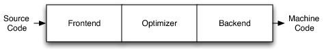</p>

Фронтенд анализирует исходный код, проверяя его на наличие ошибок, и создаёт абстрактное синтаксическое дерево *([AST](https://godbolt.org/#z:OYLghAFBqd5QCxAYwPYBMCmBRdBLAF1QCcAaPECAMzwBtMA7AQwFtMQByARg9KtQYEAysib0QXACx8BBAKoBnTAAUAHpwAMvAFYTStJg1DIApACYAQuYukl9ZATwDKjdAGFUtAK4sGIM6SuADJ4DJgAcj4ARpjEIADMpAAOqAqETgwe3r7%2ByanpAiFhkSwxcYl2mA4ZQgRMxARZPn4BldUCtfUERRHRsQm2dQ1NOa1D3aG9pf3xAJS2qF7EyOwcoQQA1Ao%2BEOsbTKQbe1GzJgDsVhoAghu3G8SYBEsM%2BxvWG1Em8ZdX5wAiHHmtE4AFZeH4OFpSKhOG5rO8FItlpg3mZ4jxSARNID5ghMEwsHEIPMANYgEEafScSTg7HQzi8BQgSlYyGA0hwWAwRAoVAsJJ0WLkShofmCuLIAxGAD6BGIXgYJL4dAIsSZECidKioXqAE9OBjtcxiLqAPJRbRVVkY0VsQSmhi0fVs0hYKJeYBuMS0JncXhYFiGYDiF34B7VABumF9UMwqiqXlVBt460wwJdtDwUWIeo8WDpcrwLGTpCjxCiqUwf0wgaMmaM2PmVAMwAUADU8JgAO6mpKMEv8QQiMTsKQyQSKFTqF26Lj6IMoeGWfRZpmQeaoJKOAS%2B3ioMvEPBYNfE2xpq0ZFwMdyeZp6YKTEplPQpNLbzK3nJz18FBg9J/9HObTvp0wyfn4QHnu0DCgRMxR9HEQHjCMEGDF0/4IRI8yIksKxYVSHBgqQEJQjCHAbKoAAcABsAC01GSBskpBhsEBygqJKzKxuCECQqLorMvCslosy4vihKUKS5KUumNKkMWkhnAAdAAnNRGiSJpKkqfElFcCpIKJCRe4MrYzKYo2HLchASBMAoBDChAooCvQxDhKwqxUXRDFMVKwCsexiqCYE%2BBEIe6B6IOwiiOIY5RZOah0rOZ72O%2BV43tkqEPvB0yIXkb4ZChL75O%2BGG5XowE1Mh4EVVBIHjGVz5IV0RXNQ0jWAfMcqYJgR7MkCoK0i6ZFXPZGwdt2sQUTR9GMcxRgBfKQXcaFfHmOihweGKrn8VwwXCTipB4gS/SnrJvDFiCZhKRo8QGSCFIaNRXCURpZzEXSZGMuZB2iaQZIUgR8RDaRpm/QNHBmCDJkcEJjbzGWaTOJIQA%3D%3D))* для представления входного кода. *AST* при необходимости преобразуется в новое промежуточное представление для оптимизации (например *clang* использует *LLVM IR* (*Intermediate Representation*), а *g++* -  [GIMPLE](https://gcc.gnu.org/onlinedocs/gccint/GIMPLE.html)). Оптимизатор отвечает за выполнение широкого спектра преобразований, направленных на улучшение времени выполнения кода, за устранение избыточных вычислений, и обычно более или менее независим от языка и целевой платформы. Затем бэкенд (также известный как генератор кода) создаёт машинный код в соответствии с набором команд и особенностей конкретной целевой платформы.

Такое разделение позволяет упростить разработку компиляторов для новых языков, т.к. достаточно написать только часть отвечающую за преобразование нового языка в промежуточное представление, а вторая, самая сложная часть, которая сгенерирует машинные коды под заданную архитектуру процессора уже написана.

<p align="center">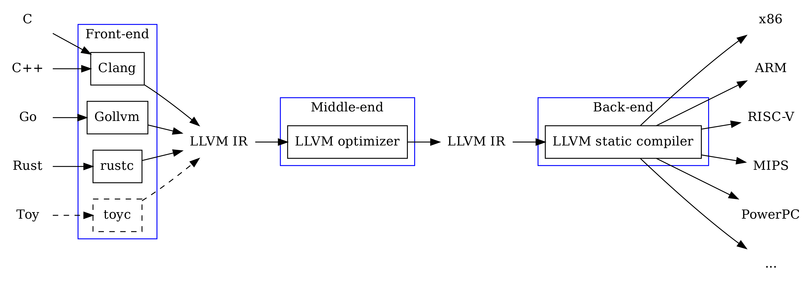</p>

Компилятор *g++* на выходе создаёт ассемблерный код под целевую платформу, а он в свою очередь преобразуется в бинарный при помощи отдельной программы. Эта добавочная фаза называется - ассемблирование (преобразование ассемблера в машинные коды). *Clang* же умеет генерировать как ассемблерное представление (по запросу), так и машинные коды напрямую из промежуточного представления (*LLVM IR*).

30. В корневой папке `"lab2/manual_build"` создайте каталог `"compilation"` и перейдите в него в терминале;

31. Создайте файл `"main.cpp"` содержащий:

    ```cpp
    int main(){
        int a = 2, b = 2;
        int c = a + b;
    }
    ```

    и запустите команду:

    ```bash
    g++ -S -masm=intel -O0 main.cpp
    ```

    Опция `-S` говорит компилятору сгенерировать ассемблерный код, сохранить его в файл и остановиться (препроцессирование тоже произойдёт). Сам файл будет сохранён в этот же каталог под именем `main.s` (как и ранее опция `-o` позволяет указать имя выходного файла).

    Опция `-masm=intel` говорит компилятору использовать синтаксис ассемблера Intel, а не AT&T. Синтаксис AT&T менее популярный и менее читаемый, по сравнению с Intel-овским.

    Опция `-O0` говорит компилятору применить минимальный уровень оптимизаций (значение по умолчанию). Этот уровень обычно выставляется во время **отладки** программы, т.к. скомпилированная программа практически идентична написанной программистом. Ещё есть: `-O1`, `-O2`, `-O3`, `-Os`, `-Ofast`, `-Og` ([подробнее](https://gcc.gnu.org/onlinedocs/gcc-11.5.0/gcc/Optimize-Options.html)).

32. Изучите файл `"main.s"`. В выводе содержится довольно много вспомогательной информации, которая нам сейчас не нужна. Чтобы посмотреть очищенный вариант ассемблерного кода перейдите на сайт [godbolt.org](https://godbolt.org/z/TnaE6cb5d).

    Как видно, в первой строке присутствует метка `main:`. Метки - это не ассемблерные команды, они используются для удобства в командах перехода (типо `goto` в С++). В исполняемом файле метки будут заменены на конкретные адреса.

33. В окне godbolt измените уровень оптимизации на `-O2`. Как правило **релизные** версии программ собираются с этим уровнем оптимизации.

    Как видно, компилятор понял, что переменные, `a`, `b` и `c` никак не используются и просто удалил их. То что осталось делает всего две вещи:

    - `xor  eax, eax` - после этого в регистре процессора `eax` будет 0 (это код завершения программы);
    - `ret` - вернуться в точку вызова (конец функции main).

34. Создайте файл `"foo.cpp"` содержащий:

    ```cpp
    int second();
    
    int first(){
        return second();
    }
    
    int foo(){
        return first();
    }
    ```

    и запустите команду:

    ```bash
    g++ -S -masm=intel -O0 foo.cpp
    ```

    Изучите получившийся файл, затем посмотрите на очищенную версию [здесь](https://godbolt.org/z/cff4Yvz6Y).

    Обратите внимание, что функции называются не так как в коде, а: `_Z3foov`, `_Z5firstv`, `_Z6secondv`. Это называется манглирование (искажение) имён (*name mangling*). Манглирование необходимо, для реализации махизма перегрузки (в Go нет, в C нет), чтобы можно было использовать одно и тоже имя для функций с разными типами параметров, например:

    ```c++
    int foo(int);         // _Z3fooi
    double foo(int);      // _Z3fooi
    int foo(int, int);    // _Z3fooii
    int foo(int, double); // _Z3fooid
    ```

    Чтобы получить исходное имя по мангилрованному можно воспользоваться https://demangler.com/.

35. Запустите команду:

    ```bash
    g++ -S -masm=intel -O0 -x c foo.cpp
    ```

    Здесь, при помощи опции `-x` со значением `c` мы говорим компилятору, что код в файле написан на языке программирования С, не смотря на расширение `*.cpp` (обычно компилятор выбирает язык ориентируясь именно на расширение). Добавьте эту же опцию на странице godbolt.

    Как видно, теперь имена функций не манглируются. Так происходит, потому что, в С нет поддержки перегрузки и в манглировании нет необходимости.

    Такое различие в именах может вызвать проблемы, например в случае использования С и С++ в одной кодовой базе. Такое может быть, если вы подключаете к проекту на C++ скомпилированную C-шную библиотеку, а не собираете её из исходников.

36. Измените содержимое файла `"foo.cpp"` на:

    ```cpp
    extern "C" int second();
    
    extern "C" int first(){
        return second();
    }
    
    int foo(){
        return first();
    }
    ```

    и скомпилируйте без опции `-x`, т.е. по правилам С++. Аналогично сделайте на godbolt.

    Как видно, добавление `extern "C"` привело к тому, что имена перестали манглироваться. Про `extern` будет далее. Для функций отмеченных `extern "C"` мы всё ещё можем использовать перегрузку (т.е. создавать функции с таким же именем но другим списком параметров), но только одна из них может быть помечена как `extern "C"` по понятным причинам.

37. Изучите ассемблерный вывод и найдите инструкции `call`. Данная инструкция отвечает за вызов функции и по сути сводится к двум действиям: записать адрес следующей за `call` инструкции на стек и перепрыгнуть на указанную метку/адрес. Как только будет встречена инструкция `ret`, будет выполнен обратный прыжок по тому адресу, который сейчас указан на вершине стека.

    Обратите внимание, что несмотря на то, что функция `second` только объявлена и не имеет определения, процесс компиляции завершился успешно. При этом в ассемблерном выводе нет блока отмеченного меткой `second`.

    При помощи объявления мы пообещали компилятору, что функция есть либо далее по тексту либо в других `.cpp` файлах. Теперь понятно, почему компилятору *С++* обязательно нужно такое объявление, т.к. без него он не сможет правильно манглировать имя в точке вызова. В языке C наличие объявлений не обязательно, т.к. имя функции всегда будет совпадать с именем метки.

38. Запустите команду:

    ```bash
    g++ -S -g -masm=intel main.cpp
    ```

    Опция `-g` позволяет добавить в ассемблер отладочную информацию, которая будет использоваться дебагером для синхронизации с исходным кодом в процессе отладки. Опция имеет рад уровней от 0 до 3 и позволяет генерировать информацию в разных форматах. Как правило, просто `-g` достаточно для большинства случаев.

    Изучите содержимое `"main.s"` (godbolt больше не понадобится). Как видно, ассемблер существенно разбух и теперь тут можно найти: путь и название файла с исходным кодом, инструкции вида `.loc 1 2 9`, которые говорят, в каком файле, на какой строке и на каком символе должен находится курсор во время исполнения текущей ассемблерной инструкции. Кроме того, можно найти даже имена локальных переменных.

    Именно благодаря наличию этой информации мы можем устанавливать точки останова на определённых строках, отслеживать значения переменных по их имени и при этом наблюдать процесс работы кода интерактивно в среде. Если собрать программу добавив ещё ключи оптимизации, то можно наблюдать всякого рода "глюки", которые будут связаны с тем, что часть кода была удалена или переделана компилятором. В принце можно отлаживать программу собранную и без ключа `-g`, но в этом случае у нас не будет возможности пройти построчно по коду, посмотреть значения локальных переменных и т.д. Можно будет смотреть только на стек вызовов и устанавливать точки останова по именам функций, т.к. дебагер понятия не имеет как связать исполняемые инструкции и исходный код. Кстати, где находится нужный файл с кодом он тоже знать не будет.

39. Выполните команду:

    ```bash
    g++ -c foo.cpp
    ```

    Опция `-c` говорит компилятору остановиться после этапа ассемблирования и сохранить полученный объектный файл. Сам файл будет сохранён в этот же каталог под именем `foo.o` (как и ранее опция `-o` позволяет указать имя выходного файла).

    Это бинарный файл, поэтому посмотреть его содержимое в текстовом редакторе будет проблематично. На самом деле отличие текстовых и бинарных файлов не большое и то и то - это просто последовательность байт. Разница заключается в том, как текстовые редакторы интерпретируют эти байты. Например, символ с кодом `0` (нулевой байт) может быть воспринят как конец файла, другая часть байт в принципе не имеет [глифа](https://ru.wikipedia.org/wiki/Глиф) для отображения. Ещё есть разница как воспринимается символ конца строки на *linux*, *macOS* и *windows* ([подробнее](https://habr.com/ru/articles/358154/)).

40. Выполните команду:

    ```bash
    hexdump -C foo.cpp
    ```

    Опция `-C` настраивает вывод утилиты [`hexdump`](https://man7.org/linux/man-pages/man1/hexdump.1.html) в виде трёхколоночного: номер первого байта в строке (цифры шестнадцатеричные), 16 байт из файла (тоже в шестнадцатеричной системе счисления) и попытка интерпретировать байты как коды ASCII-символов. Если символ не имеет графического представления, то отображается точка.

    Т.к. `"foo.cpp"` это текстовый файл, то почти все символы имеют графическое представление (кроме символа перевод строки).

41. Выполните команду:

    ```bash
    hexdump -C foo.o
    ```

    Т.к. `"foo.o"` это бинарный файл, то большая часть символов уже не является печатными.

42. Утилита `hexdump` и подобные ей, позволяют только просматривать содержимое файлов, но иногда требуется в них что-то поправить. Есть множество программ hex-редакторов с кучей дополнительного функционала (например дизассемблирование), но раз уж мы работаем в vs code, то воспользуемся одним из его плагинов:

    - Перейдите в раздел плагинов, найдите и установите расширение *Hex Editor*;
    - Вернитесь в раздел *Explorer* выберите файл `"foo.cpp"`;
    - Нажмите сочетание клавиш <kbd>Ctrl</kbd>+<kbd>Shift</kbd>+<kbd>P</kbd> и начните набирать *hex* пока не появится пункт: *Hex Editor: Open Active File in Hex Editor*;
    - Изучите возможности плагина по просмотру и редактированию файла.

43. Выполните команду:

    ```bash
    objdump -D -M intel foo.o
    ```

    Опция `-D` или длинный вариант (`--disassemble-all`) выполняет обратное преобразование объектного файла в ассебмлерное представление, а опция `-M` со значением `intel` указывает, что нужно использовать синтаксис от *Intel*.

    Как видно, здесь довольно много информации, которая разбита на секции.

44. Выполните команду:

    ```bash
    objdump -d -M intel foo.o
    ```

    Опция `-d` дизассемблирует только секцию `.text`. В этой секции расположен исходный код программы.

    Макет представления тоже разделён на три колонки: в начале, смещение в байтах от начала секции, затем один или несколько байт из файла, в зависимости от того какая распознана инструкция, и справа соответствующие этим байтам ассемблерные мнемоники. Например: байт `с3` соответствует мнемонике `ret` для архитектуры x86 процессора ([справочник](https://blic.fandom.com/ru/wiki/Таблица_с_кодами_операций)), а байт `e8` - мнемонике `call`.

    Обратите внимание, что вызов функции записан как:

    ```
    e8 00 00 00 00          call   d <first+0xd>
    ```

    Здесь, после кода инструкции должны быть 4 байта указывающие адрес на который нужно выполнить переход (адрес функции), но сейчас тут нули. Это заглушка, которую оставил компилятор, т.к. ему НЕ известно точное расположение функций в полном исходном коде программы, ведь он видит только её кусочек - один объектный файл из многих. На следующем этапе программа будет собрана в единый исполняемый файл и эти заглушки будет заменены на реальные адреса функций.

### Фаза линковки (компоновки)

После фазы компиляции мы получаем набор отдельных объектных файлов. Как мы видели, объектные файлы содержат вызовы функций, но без указания конкретного адреса перехода. Это происходит, потому что отдельные объектные файлы будут склеены линковщиком в один бинарный файл, но заранее не известны ни их размеры, ни количество файлов, ни порядок склеивания. После склеивания всех файлов в один, линковщик (редактор связей) пройдёт по нему и заменит заглушки на реальные адреса.

45. Выполните команду:

    ```bash
    nm -C foo.o
    ```

    Утилита [`nm`](https://manpages.ubuntu.com/manpages/trusty/man1/nm.1.html) позволяет посмотреть все имена (обычно их называют символы) доступные в текущем бинарном файле или те, на которые он ссылается (зависимости). Опция `-С`, говорит, что нужно выполнить деманглирование имён.

    Символ `T` перед именем означает, что оно находится в секции `.text`, т.е. эта функция присутствует в данном файле; символ `U`, говорит о том, что функция/переменная не определена (*undefined*) в текущем файле, т.е. ожидается, что она определена в другом объектном файле.

46. Измените содержимое `"main.cpp"` на следующее:

    ```cpp
    int second(){
        return 42;
    }
    
    int foo();
    
    int main(){
        return foo();
    }
    ```

    Здесь мы определяем функцию `second` и объявляем `foo`, т.к. она используется в `main`.

47. Выполните компиляцию файла `"main.cpp"` без линковки и посмотрите список символов:

    ```bash
    g++ -c main.cpp
    nm -C  main.o
    ```

48. Выполните команду:

    ```bash
    g++ main.o
    ```

    Т.к. на вход передан объектный файл, то *g++* сразу отправит его на этап линковки. В результате вы получите сообщение от линковщика о том, что не найдена функция `foo()`. Сообщение от линковщика можно отличить по именам *collect2* и *ld*.

49. Выполните команду:

    ```bash
    g++ main.o foo.o
    ```

    Сообщение от линковщика должно поменяться, теперь он больше на жалуется на отсутствие функции `foo`, т.к. она присутствует в `"foo.o"`, но ругается на отсутствие функции `second`. Это может показаться странным, т.к. она определена в файле `"main.cpp"` и следовательно должна быть в `"main.o"`.

50. Выполните команду и внимательно изучите вывод:

    ```bash
    nm main.o foo.o
    ```

    Здесь намеренно нет ключа `-C`, чтобы выводились настоящие (манглированные) имена. Теперь можно заметить, что в файле `"foo.o"` определён символ `second`, а в `"main.o"` такого нет. Вместо него там `_Z6secondv`.

    Чтобы это поправить нужно либо добавить `extern "C"` к определению функции `second` в `"main.cpp"`, либо убрать его из объявления в файле `"foo.cpp"`. Выберите любой вариант на ваше усмотрение и **затем пересоберите** соответствующий объектный файл.

51. Снова выполните команду:

    ```bash
    g++ main.o foo.o
    ```

    Теперь процесс должен завершится успешно и в текущем каталоге должен появится файл `"a.out"` (название по умолчанию для скомпилированной программы). Это полностью готовая к работе программа.

52. Посмотрите список символов в этом файле:

    ```bash
    nm -C a.out
    ```

    Как видно их стало гораздо больше. Это связано с тем, что кроме указанных нами файлов линковщик получает на вход ряд дополнительных объектных файлов и библиотек, которые приклеиваются к нашему коду и выполняют некоторые служебные задачи.

    Посмотреть все опции и библиотеки переданные линковщику, как обычно можно в сценарии сборки (огромная команда в самом конце начиная с */usr/libexec/gcc/x86_64-linux-gnu/13/collect2*):

    ```bash
    echo | g++ -v -x c++ -
    ```

53. Выполните команду:

    ```bash
    objdump -d -M intel a.out
    ```

    Найдите инструкции `call`. Как видно, теперь, в качестве аргумента у них указаны конкретные адреса функций, а не нулевые заглушки.

54. Выполнить все стадии сборки от препроцессирования до линковки можно командой:

    ```bash
    g++ main.cpp foo.cpp -o main
    ```

    Либо можно комбинировать, передавая часть файлов как исходный код, а часть как уже скомпилированные объектные файлы:

    ```bash
    g++ main.cpp foo.o -o main
    ```

Кроме рассмотренных опций, компилятор поддерживает кучу других. Вот некоторые из них, которые могут быть полезными:

-  `-std` - при помощи этой опции можно явно указать компилятору в соответствии с каким стандартом он должен работать. Например: `-std=c++17`, `-std=c++2a`, `-std=c++2b`. Некоторые языковый фишки могут не работать, если используется версия стандарта которая их не поддерживает;
- `-pedantic` - опция заставляет компилятор строго следовать стандарту языка и не использовать всякие дополнительные (не стандартные) расширения свойственные только компилятору *g++*. Может быть полезной, если вы пишите библиотеку и хотите, чтобы её могли использовать с широким кругом разных компиляторов С++;
- `-Wall` - активирует множество дополнительных проверок кода на потенциальные ошибки. В результате будут выводится предупреждения (*warning*), но программа всё равно будет собираться. Обычно, релизную версию собирают с этой и подобными опциями, чтобы обнаружить критически места в коде и исправить.  
- `-Werror` - с этой опцией любое предупреждение трактуется как ошибка и приводит к остановке компиляции.

### Статические библиотеки

Пока программа состоит из нескольких `.cpp` файлов, полная перекомпиляция программы занимает не очень много времени. Сборка большой программы из исходников может длиться несколько часов. Обычно, в процессе разработки программист не меняет весь код, а по не многу вносит изменения в **отдельные** файлы. Чтобы не проходилось перекомпилировать **всё**, можно передавать компилятору исходный код только изменённых файлов (и тех, которые от них зависят), остальные же отдавать в виде объектных файлов. Таким образом, время на пересборку программы существенно сократиться, т.к. линковка расходует намного меньше времени по сравнению с фазой компиляции.

Чтобы не перечислять в команде сборки большое количество объектных файлов, те из них, которые меняются редко собирают в архив (буквально обычный архив) который называют статической библиотекой. Этот архив потом передаётся линкеру целиком и он сам распаковывает его и находит нужные объектные файлы.

55. В корневой папке `"lab2/manual_build"` создайте каталог `"static"` и перейдите в него в терминале;

56. Создайте файл `"main.cpp"` содержащий:

    ```cpp
    void print(int);
    int sum(int, int);
    
    int main(){
        print(sum(1, 2));
    }
    ```

57. Создайте файл `"print.cpp"` содержащий:

    ```cpp
    #include <iostream>
    
    void print(int a){
        std::cout << a << std::endl;
    }
    ```

58. Создайте файл `"sum.cpp"` содержащий:

    ```cpp
    int sum(int a, int b){
        return a + b;
    }
    ```

59. Скомпилируйте файлы `"print.cpp"` и `"sum.cpp"` в объектные без линковки (опция `-c`):

    ```bash
    g++ -c print.cpp sum.cpp
    ```

    В результате, а текущем каталоге появятся 2 файла `"print.o"` и `"sum.o"` соответственно.

60. Соберите объектные файлы в архив при помощи утилиты [`ar`](https://man7.org/linux/man-pages/man1/ar.1.html):

    ```bash
    ar rcs libutils.a print.o sum.o
    ```

    В результате, а текущем каталоге появится файл `"libutils.a"`. Опции `r`, `c` и `s` можно не добавлять, т.к. библиотека будет работать и без них, но обычно это делают:

    - `r` (replace). эта опция добавляет файлы в архив или заменяет существующие файлы с тем же именем. Если архив не существует, он будет создан;
    - `c name` (create): создает архив, если такого нет, в противном случае файлы будут добавлены к имеющемуся;
    - `s` (index): добавляет (обновляет) индекс архива. Индекс архива - это таблица, в которой для каждого определенного в архивируемых файлах символического имени (имени функции или блока данных) сопоставлено соответствующее ему имя объектного файла. Индекс архива необходим для ускорения работы с библиотекой - для того чтобы найти нужное определение, отпадает необходимость просматривать таблицы символов всех файлов архива, можно сразу перейти к файлу, содержащему искомое имя.

    По соглашению, на *linux* имена статических библиотек должны начинаться с префикса *lib* и иметь расширение *.a*. Таким образом созданная библиотека называется просто *utils*.

61. Выполните команды:

    ```bash
    ar -t libutils.a
    nm -C libutils.a
    ```

    Первая покажет файлы присутствующие в архиве, а вторая и файлы и символы в этих файлах. В файле `"print.o"` подключается `iostream`, поэтому кроме функции `print` там будет куча других.

62. Соберите исполняемый файл при помощи статической библиотеки:

    ```bash
    g++ main.cpp libutils.a -o main
    ```

    Здесь мы передаём библиотеку напрямую, но как правило их складывают в отдельную папку, и чтобы не прописывать полный путь к каждой по отдельности подключают другим способом:

    ```bash
    g++ main.cpp -L . -l utils -o main
    ```

    Опция `-L` добавляет путь поиска статических библиотек к списку стандартных путей. Здесь мы указали точку, чтобы добавить текущий каталог. При необходимости опция `-L` может быть добавлена любое количество раз. Порядок поиска будет определяться порядком добавления путей слева направо. Опция `-l` указывает, что её параметр (у нас `utils`) это библиотека, которую нужно искать в каталогах с библиотеками. Заметьте, что префикса и расширения нет. Они будут добавлены автоматически. Как правило пробелы между `-L` и `-l` пропускают и команду записывают так:

    ```bash
    g++ main.cpp -L. -lutils -o main
    ```

63. Проверьте, что исполняемый файл `"main"` появился в текущем каталоге и он работает.

64. Воспользуйтесь утилитой `nm` и убедитесь, что файл `"main"` содержит функции `print` и `sum` в секции с кодом (символ `T`).

65. Выполните команду:

    ```bash
    g++ -L. -lutils main.cpp -o main
    ```

    Вы должны получить от линковщика сообщение об ошибке, в котором сказано, что функции `print` и `sum` не найдены. Странно, только что же всё собиралось. Это произошло, потому что мы поместили в команде компиляции файл `"main.cpp"` после подключения библиотеки. Дело в том, что для ряда опций *g++* важен порядок их следования в командной строке. Так линковщик ищет символы необходимые файлу в библиотеках, перечисленных в командной строке **после** имени этого файла. Содержимое библиотек перечисленных до имени файла линковщик игнорирует. В общем подключаемые библиотеки необходимо перечислять после имени ссылающегося на них файла. По этой причине, можно встретить команды сборки, в которых одни и те же библиотеки перечислены по несколько раз.

Код из статической библиотеки встраивается в исполняемый файл, что с одной стороны делает исполняемый файл независимым от наличия в системе файла с библиотекой, но с другой стороны приводит к увеличению размера.

### Динамические библиотеки

Если статические библиотеки встраиваются в каждую программу в которой используется, после чего линкер выполняет поиск и разрешение символов (статическая линковка), то динамические библиотеки поступают иначе. В момент старта программы динамический загрузчик (`ld.so` или `ld-linux.so`) определяет список динамических библиотек от которых зависит программа и далее пробует их загрузить в оперативную память. Если библиотека была загружена ранее, то повторно она загружаться не будет, а программа просто получит ссылку на уже загруженный экземпляр.

66. В корневой папке `"lab2/manual_build"` создайте каталог `"shared"` и скопируйте туда файлы `"main.cpp"`, `"print.cpp"` и `"sum.cpp"` из каталога `"static"`. Затем перейдите в него в терминале; 

67. Компилируйте `"print.cpp"` и `"sum.cpp"`  в объектные файлы:

    ```bash
    g++ -c -fPIC print.cpp sum.cpp
    ```

    Опция `-fPIC` (*Position Independent Code*) указывает компилятору генерировать код, который может быть загружен в любое место памяти, что необходимо для динамических библиотек.

68. Создайте динамическую библиотеку:

    ```bash
    g++ -shared print.o sum.o -o libutils.so
    ```

    Опция `-shared` указывает компилятору создать динамическую библиотеку, а `-o libutils.so` задает имя выходного файла библиотеки.

    По соглашению, на *linux* имена динамических библиотек должны начинаться с префикса *lib* и иметь расширение *.so* (*shared object*). Таким образом созданная библиотека называется просто *utils*.

69. Выполните команду:

    ```bash
    nm -C libutils.so
    ```

    В результате, вы получите список символов присутствующих в этой библиотеке. Как видно, разделения на файлы теперь нет, т.к. динамическая библиотека это не архив, её скорее можно сравнить с исполняемым файлом, который будет загружаться в память отдельно от основной программы.

70. Соберите исполняемый файл при помощи динамической библиотеки:

    ```bash
    g++ main.cpp libutils.so -o main
    ```

    Здесь мы передаём библиотеку напрямую, но как правило их складывают в отдельную папку, и чтобы не прописывать полный путь к каждой по отдельности подключают тем же способом, что и статические:

    ```bash
    g++ main.cpp -L. -lutils -o main
    ```

    Если компилятор найдёт и статическую и динамическую версию библиотеки (файлы с одинаковым именем), то он, по умолчанию, слинкует программу с динамической библиотекой.

71. Попробуйте запустить исполняемый файл `"main"`.

    Вы должны получить сообщение об ошибке, готовящие, что `"libutils.so"` не найдена. Всё дело в том, в каком порядке динамически загрузчик выполняет поиск файла с библиотекой. На *Linux*, загрузчик по умолчанию НЕ ищет библиотеку в текущем каталоге (в отличие от *Windows*).

72. Выполните команду:

    ```bash
    ldd main
    ```

    Утилита [`ldd`](https://manpages.ubuntu.com/manpages/noble/ru/man1/ldd.1.html) показывает от каких динамических библиотек зависит исполняемый файл, а так же абсолютный путь к файлу библиотеки найденной на этой машине. Как видно и наша библиотека присутствует в списке, но вместо пути указано *not found*.

73. Запустите программу так:

    ```bash
    LD_LIBRARY_PATH=. ./main
    ```

    Как видно, всё работает хорошо. В данном случае мы установили значение переменной окружения `LD_LIBRARY_PATH` в текущий каталог (точка) и запустили программу передав её эту переменную. Если вам нужно несколько путей, разделяйте их двоеточиями. Такой способ запуска позволяет установить значение переменной среды только для текущей программы на один раз. Если нужно изменить значение для текущего сеанса (пока не закрыли терминал), можно установить значение переменной в отдельной строке.

74. Соберите исполняемый файл при помощи команды:

    ```bash
    g++ main.cpp libutils.so -Wl,-rpath,. -o main
    ```

    Если у пользователя возникает потребность самому вмешаться в процесс линковки он может воспользоваться специальной опцией *g++* `-Wl,-option,value1,value2,..`. Что означает передать линковщику (`-Wl`) опцию `-option` с аргументами `value1, value2` и так далее. Опция `-Wl,-rpath,.` , передать линковщику опцию `-rpath` с аргументом `.`. С помощью `-rpath` в исполняемый файл программы можно прописать дополнительные пути по которым загрузчик разделяемых библиотек будет производить поиск библиотечных файлов. В нашем случае прописан путь ` .` - поиск файлов библиотек будет начинаться с текущего каталога.

75. Выполните команду

    ```bash
    readelf -d main | grep RUNPATH
    ```

76. Выйдите из текущей директории на один уровень назад и снова запустите программу:

    ```bash
    cd ..
    ./shared/main
    ```

    В результате вы снова получите ошибку поиска библиотеки. Это связано с тем, что `.` в `RUNPATH` говорит, что нужно искать библиотеки начиная **с текущего каталога**, а в ткущем каталоге её нет.

77. Перейдите обратно в папку `"shared"` и пересоберите программу так:

    ```bash
    cd shared
    g++ main.cpp libutils.so -Wl,-rpath,"\$ORIGIN" -o main
    ```

    Кавычки и символ `\` перед `$` нужны, чтобы командная оболочка НЕ попыталась заменить `$ORIGIN` на значение переменной среды, а передала его как есть.

78. Выйдите из текущей директории на один уровень назад и снова запустите программу.

    Теперь всё должно работать нормально. Значение `$ORIGIN`, говорит, что поиск библиотек нужно начинать с того места, **где лежит исполняемый файл**, независимо от того, какой каталог считается текущим.

    Кроме `.` и `$ORIGIN`, можно указывать абсолютный путь к библиотеке или относительный: `$ORIGIN/some/path/to/lib`, `./some/path/to/lib`.

79. Вернитесь обратно в каталог `"shared"` и выполните команду:

    ```bash
    du -h main
    ```

    затем прейдите в каталог `"static"` и повторите для `"main"` который лежит там:

    ```
    cd ../static
    du -h main
    ```

    и для библиотеки `"libutils.a"`:

    ```bash
    du -h libutils.a
    ```

    Утилита [`du`](https://manpages.ubuntu.com/manpages/noble/en/man1/du.1.html) (*disk usage*) позволяет посмотреть сколько программа/каталог занимает дискового пространства, а опция `-h` меняет вывод с байтов на более компактное (человекочитаемое) представление.

    Как видно, версия `"main"` с динамической линковкой меньше версии со статической линковкой на размер библиотеки.

80. Выполните команды:

    ```bash
    g++ --static main.cpp -L. -lutils -o main
    du -h main
    ```

    Как видно размер `"main"` вырос более чем в 100 раз по сравнению с тем, что было раньше. Это связано с тем, что опция `--static` указывает линковщику использовать **только** статические версии **всех** необходимых приложению библиотек. Теперь наше приложение можно смело переносить из каталога в каталог и даже на другие машины (с тем же ядром Linux), т.к. `"main"` не имеет внешних зависимостей и зависти только от системных вызовов.

    Как же быть если необходимо осуществить статическую линковку только части использованных библиотек? Возможный вариант решения - сделать имя статической версии библиотеки отличным от имени динамической и указывать тот вариант, который нужно.

81. Выполните команды:

    ```bash
    ldd main
    nm -D main
    ```

    Опция `-D` утилиты `nm` позволяет показать только динамические символы. Как видно, в обоих случаях вывод говорит об отсутствии таковых.

### Динамические библиотеки - плагины

В предыдущем разделе мы линковали программу с динамической библиотекой и за её загрузку в память отвечал системный загрузчик, который делал это перед стартом программы. Существует возможность загружать и выгружать динамические библиотеки вручную по мере необходимости. Таким образом обычно реализуется система плагинов. Программа после старта проверяет определённой каталог на наличие динамических библиотек, загружает их и далее отображает в каком-нибудь меню.

82. В корневой папке `"lab2/manual_build"` создайте каталог `"plagin"` и перейдите в него в терминале;

83. Создайте файл `"main.cpp"` содержащий:

    ```cpp
    #include <string>
    #include <iostream>
    #include <filesystem>
    
    #include <dlfcn.h>
    
    namespace fs = std::filesystem;
    
    int main(){
        std::string path = ".";
        for (const auto & entry : fs::directory_iterator(path)){
            if (entry.path().extension() == ".so"){
                // Загружаем библиотеку
                void* handle = dlopen(entry.path().c_str(), RTLD_LAZY);
                if (!handle) {
                    std::cerr << "Cannot load library: " << dlerror() << '\n';
                    return 1;
                }
    
                // Сбрасываем ошибки
                dlerror();
    
                // Загружаем символ (функцию)
                using info_t = const char* (*)();
                info_t info = (info_t) dlsym(handle, "info");
    
                const char* dlsym_error = dlerror();
                if (dlsym_error) {
                    std::cerr << "Cannot load symbol 'info': " << dlsym_error << '\n';
                    dlclose(handle);
                    return 1;
                }
    
                // Вызываем функцию
                std::cout << info() << std::endl;
    
                // Закрываем библиотеку
                dlclose(handle);
            }
        }
    }
    ```

    Здесь, мы проверяем текущий каталог на наличие файлов с расширением `".so"` и каждый из них загружаем как динамическую библиотеку. Затем ищем там функцию соответствующую прототипу `const char* info();` и получаем её адрес в библиотеке. После чего вызываем функцию и выгружаем библиотеку.

84. Создайте файл `"print.cpp"` содержащий:

    ```cpp
    const char* description = "I can print";
    
    extern "C"
    const char* info(){
        return description;
    }
    ```

    Здесь и далее `extern "C"` добавлено, чтобы имя функции не манглировалось. Можно было бы и не добавлять, но тогда в `"main"` пришлось бы искать функцию по мангилованному имени (*_Z4infov*).

85. Создайте файл `"sum.cpp"` содержащий:

    ```cpp
    const char* description = "I can sum";
    
    extern "C"
    const char* info(){
        return description;
    }
    ```

86. Компилируйте исходный код в объектные файлы:

    ```bash
    g++ -c -fPIC print.cpp sum.cpp
    ```

87. Создайте динамические библиотеки:

    ```bash
    g++ -shared print.o -o print.so
    g++ -shared sum.o -o sum.so
    ```

    Следовать соглашению *linux* для имён динамических библиотек не обязательно, т.к. мы сами будем загружать их вручную. В принципе даже расширение можно указать другое.

88. Выполните команду:

    ```bash
    g++ main.cpp -ldl -o main
    ```

    Как видно мы НЕ линкуемая с библиотеками `"print.so"` и `"sum.so"`, а только с библиотекой `dl`.

89. Запустите программу:

    ```bash
    ./main
    ```

    Как видно, оба плагина были найдены и вывели свои сообщения.

90. Создайте копию `"print.so"` в текущем каталоге под именем `"other.so"` и снова запустите `"main"`:

    ```bash
    cp print.so other.so
    ./main
    ```

    Теперь и третий плагин вывел сообщение на экран.


### Тонкости линковки 

Основные ошибки в процессе сборки как правило возникают на этапе линковки. Разберёмся в этом вопросе подробнее. Каждый символ (имя) в программе имеет атрибут *linkage* (связывание). Всего существует 3 типа связывания: *internal* (внутреннее), *external* (внешнее) и *no linkage* (нет связывания).

Внутреннее и внешнее связывание может быть только у глобальных символов. У локальных всегда - *no linkage*. Это значит, что локальные символы разрешаются на этапе компиляции и линковщик их не видит. Они так же не попадают в таблицу символов которую показывает утилита `nm`.

91. В корневой папке `"lab2/manual_build"` создайте каталог `"linkage"` и перейдите в него в терминале;

92. Создайте файл `"main.cpp"` содержащий:

    ```cpp
    int main(){  // Тут тоже extern 
    }
    
    extern void two(){    
    }
    
    static void three(){    
    }
    ```

93. Соберите объектный файл и посмотрите символы утилитой `nm`.

    Как видно, `main` и `two` обозначены в таблице одинаково - символом `T`. Это означает, что они определены в текущем файле и имеют *external* (внешнее) связывание. Все функции по умолчанию отмечены как `extern` и его добавление вообще ни на что не влияет. Само ключевое слово `extern` говорит, что символ имеет внешнее связывание и его нужно искать либо в этой единице трансляции либо в другой. Вариант `extern "C"` дополнительно запрещает манглировать имя функции.

    Имя `three` обозначено в таблице как `t`. Это означает, что функция определена в текущем файле, но имеют *internal* (внутреннее) связывание. Ключевое слово `static` в объявлении функции устанавливает для неё внутреннее связывание. Такой тип связывания говорит линкеру, что определение нужно искать только в текущей единице трансляции не обращая внимания на то, что есть в других. При разрешении имён в других единиц трансляции этот символ тоже учитываться не будет.

    По понятным причинам объявить функцию одновременно `static` и `extern` нельзя. Для этих модификаторов можно привести аналогию с `private` и `public` в классе. Имена обозначенные как `static` видны только внутри этого `.cpp` файла, а `extern` и внутри и для других `.cpp` файлов.

94. Создайте файл `"other.cpp"` содержащий:

    ```cpp
    extern void two(){    
    }
    ```

95. Попробуйте скомпилировать его:

    ```bash
    g++ main.cpp other.cpp -o main
    ```

    Как видно, фаза компиляции прошла успешно, но на фазе линковки вывалилась ошибка: *multiple definition of `two()'*. Это означает, что у линкера в таблице присутствуют два одинаковых символа с внешним связыванием и он не может выбрать какой из них нужно использовать.

96. Поменяйте в `"other.cpp"` `extern` на `static`:

    ```cpp
    static void two(){    
    }
    ```

97. Попробуйте скомпилировать теперь:

    ```bash
    g++ main.cpp other.cpp -o main
    ```

    Как видно, и компиляция и линковка теперь завершились без ошибок.

98. Посмотрите список символов в файле `"main"` и убедитесь, что в списке имя `two` присутствует дважды. Т.е. в программе есть две версии функции `two`. Одна будет использована только в файле `"other.cpp"`, а вторая во всех остальных.

    В принципе ничего не мешает каждой единице трансляции иметь по своей личной статической функции `two`.

99. В файле `"main.cpp"` измените код на следующий:

    ```cpp
    #include "lib.h"
    
    int main(){
        return lib_foo();
    }
    ```

100. В файле `"other.cpp"` измените код на следующий:

     ```cpp
     #include "lib.h"
     
     int other(){
         return lib_foo();
     }
     ```

101. Создайте файл `"lib.h"` содержащий:

     ```cpp
     int lib_foo(){  // Помним, что тут extern
         return 42;
     }
     ```

102. Выполните компиляцию и линковку:

     ```bash
     g++ -c main.cpp other.cpp
     g++ main.o other.o -o main
     ```

     Как видно, фаза компиляции прошла без ошибок, а линкер ругается на множественное определение функции `lib_foo`. Это вполне ожидаемо, т.к. препроцессор вставил **определение** функции `lib_foo` и в `"main.cpp"` и в `"other.cpp"` и линкер не знает какую из них выбрать. По этой причине в заголовочные файлы рекомендуют помещать только **объявления**, но не определения.

     Ситуацию легко можно исправить изменив способ связывания у функции `lib_foo` на внутренний (т.е. дописать `static`). Иногда этого достаточно, но мы получаем удвоение кода + такой способ не подходит для переменных (про них далее), т.к. в каждом файле будет своя отдельная копия, а не общая переменная на всю программу.

103. Измените код в файле `"lib.h"` на следующий:

     ```cpp
     inline int lib_foo(){  // extern всё равно остался
         return 42;
     }
     ```
    
     Первоначальное назначение ключевого слова `inline` (встроенный) заключалось в том, чтобы служить подсказкой (но не приказом) для оптимизатора, что встраивание функции предпочтительнее вызова. То есть вместо вызова функции и передачи управления ей, тело функции будет скопировано и  вставлено в точку вызова. Это позволяет избежать накладных расходов, связанных с вызовом функции (передача аргументов и получение результата), но может привести к увеличению размера исполняемого файла, поскольку код функции приходится повторять несколько раз.
     
     На данный момент `inline` применяют не для встраивания, а для того же, зачем и мы. Чтобы определение можно было помещать в заголовочные файлы. Это особенно важно, для шаблонов и так называемых *header only* библиотек, т.е. таких, которые распространяются в виде одного или нескольких заголовочных файлов. Весь код таких библиотек (и определения в том числе) размещается в `.h` файлах, а `.cpp` файлы ответствуют. Наш файл `"lib.h"` можно назвать *header only* библиотекой.

104. Выполните компиляцию, линковку и изучите списки символов в бинарных файлах:

     ```bash
     g++ -c main.cpp other.cpp
     g++ main.o other.o -o main
     nm -C main.o other.o main
     ```

     Как видно, функция `lib_foo` присутствует и в `"main.o"` и в `"other.o"`, но отмечена как `W` (*weak* - слабый). При этом, в исполняемом файле `"main"` функция `lib_foo` присутствует только в одном экземпляре.

     В случае слабых символов с одинаковыми именами, линкер имеет право выбрать любой из них, а остальные удалить. В нашем случае это не проблема, т.к. все копии одинаковые, но если функции будут отличаться, то поведение программы может стать не предсказуемым для программиста. В дополнении к тому, что мы не знаем какую из копий выберет линкер, в некоторых местах функция может быть встроена на этапе компиляции, т.е. получится, что в разных местах программы, используется случайный вариант функции. По этой причине, используя `inline` вы должны убедиться, что в программе больше нет другой функции с такой же сигнатурой (имя + параметры) .

105. Создайте файл `"hard.cpp"` содержащий:

     ```cpp
     int lib_foo(){  // Функция НЕ inline
         return 21;  // Тут другое значение
     }
     ```

106. Выполните компиляцию, линковку и изучите списки символов в бинарных файлах:

     ```bash
     g++ -c main.cpp other.cpp hard.cpp
     g++ main.o other.o hard.o -o main
     nm -C main.o other.o hard.o main
     ```

     Обратите внимание, что `lib_foo` присутствует во всех объектных файлах, но в `"hard.cpp"` она отмечена как `T`, а в остальных как `W`. В файле `main` есть только одна версия, при чём она тоже отмечена как `T`, а значит это функция из `"hard.cpp"`.

     В случае, присутствия и слабых и сильных символов, компилятор выбирает сильный, а слабые игнорирует. Это тоже плохая ситуация, т.к. `inline` функция по прежнему может быть встроена в своей единице трансляции (например в `main.cpp` или `other.cpp`) и в итоге мы снова получаем непредсказуемое поведение, зависящее от того в каких местах программы компилятор решит встроить функцию, а в каких вызвать. Этой проблемы нет, если во всех единицах трансляции функция одинаковая.

107. Измените код в файле `"lib.h"` на следующий:

     ```cpp
     inline static int lib_foo(){
         return 42;
     }
     ```

108. Выполните компиляцию, линковку и изучите спиcок символов `"main"`:

     ```bash
     g++ main.cpp other.cpp hard.cpp -o main
     nm -C main
     ```

     Как видно, функция `lib_foo` теперь присутствует в 3-х экземплярах: две с внутренней линковкой и одна с внешней. Т.е. комбинация `inline static` не имеет практически никакого эффекта и работает просто как `static`.

109. Измените код в файле `"main.cpp"` на следующий:

     ```cpp
     inline int lib_foo(){
         return 42;
     }
     
     int main(){
         // Нункция lib_foo() тут не используется
     }
     ```

     А код в файле `"other.cpp"` на следующий:

     ```cpp
     inline int lib_foo();  // Только объявление
     
     int other(){
         return lib_foo();
     }
     ```

110. Выполните компиляцию, линковку и изучите спиcок символов `"main"`:

     ```bash
     g++ -c main.cpp other.cpp
     g++ main.o other.o -o main
     nm -C main.o other.o
     ```

     Как видно, во время фазы компиляции мы получили предупреждение от компилятора, но на фазе линковки уже ошибку. Анализ символов присутствующих в объектных файла показывает, что компилятор выкинул определение функции `lib_foo` из файла `"main.cpp"`, а значит `"other.cpp"`, который её использует теперь не с чем линковать. Если использовать `lib_foo` в `"main.cpp"`, то компилятор оставит функцию и программа соберётся нормально. Если убрать модификатор `inline`, то компилятор оставит функцию в любом случае.

     Второе правило использования `inline` функций - **определение** такой функции должно присутствовать в каждой единице трансляции в которой она используется. Получается такие функции не имеет смысла добавлять в статические или динамические библиотеки, только в *header only*.

В случае с глобальными переменными ключевые слова `static` и `extern` оказывают такой же эффект, что и на функции. Т.е. переменная отмеченная как `static` доступна только в том `.cpp` файле в котором создаётся и является его личной копией. Переменная отмеченная как `extern` создаётся в одном экземпляре на всю программу и доступна везде, где объявлена. По умолчанию все глобальные переменные имеют внешнее связывание. Но есть нюанс.

111. Приведите файлы к следующему виду:

     - `"main.cpp"`:

       ```cpp
       #include "lib.h"
       
       int main(){
           return answer;
       }
       ```

     - `"other.cpp"`:

       ```cpp
       #include "lib.h"
       ```

     - `"lib.h"`:

       ```cpp
       int answer;
       ```

112. Выполните сборку:

     ```bash
     g++ main.cpp other.cpp -o main
     ```

     Как и ожидалось, мы получили ошибку от линкера, который ругается на множественное присутствие символа `answer`.Помним о том, что помещать определения в заголовочный файл это плохая идея. Если добавить к `answer` модификатор `static`, то разумеется всё заработает.

113. Измените код в файле `"lib.h"` на следующий:

     ```cpp
     extern int answer;
     ```

     И снова попробуйте собрать программу.

     Если все переменные по умолчанию `extern`, то добавление ключевого слова явно не должно было ничего поменять, но сообщение об ошибке теперь другое. На этот раз линкер жалуется на отсутствие определения символа `answer`.

     Если изменить код на  `extern int answer = 0;`, то действительно сообщение об ошибке станет прежним, но форма с `extern` и без инициализатора это исключение. В таком виде, мы только объявляем, но не определяем переменную. Чтобы исправить ситуацию можно добавить определение в любой из `.cpp` файлов, но только в один.

114. Измените код в файле `"other.cpp"` на следующий:

     ```cpp
     #include "lib.h"
     int answer = 42;  // extern обычно не добавляют, хотя можно
     ```

     И снова попробуйте собрать программу. В этот раз ошибок быть не должно.

В отличие от переменных, константы по умолчанию имеют внутреннее связывание. Т.е. в явном виде:

```cpp
int a = 10;        // extern       int a = 10;
const int b = 10;  // static const int b = 10;
```

Ключевое слово `inline` с переменными работает также как и с функциями и подчиняется тем же правилам и требованиям. При добавлении `inline` к константе, тип её связывания становится таким же как и у переменной. Т.е. в явном виде:

```cpp
inline int a = 10;        // inline extern       int a = 10;
inline const int b = 10;  // inline extern const int b = 10;
```

Если у вас возникают сомнения, указывайте тип линковки явно.

В случае объявления типа (класса, перечисления, псевдонима и т.д.) в таблицу символов ничего не добавляется, т.е. для типов нет понятия линковки. Т.к. линкер понятия не имеет (почти) что с чем он соединяет и ориентируется в основном на имена, то можно собрать код, который по идее собираться не должен был.

115. Приведите файлы к следующему виду:

     - `"main.cpp"`:

       ```cpp
       #include <iostream>
       
       struct Main{
           double i = 42;
       };
       
       extern Main value;  // Это только объявление
       
       int main(){
           std::cout << value.i << std::endl;
       }
       ```

     - `"other.cpp"`:

       ```cpp
       struct Other{
           int i = 42;
       };
       
       Other value;  // Это определение
       ```

     Обратите внимание, что глобальная переменная `value` присутствует в обоих файлах, но её тип отличается как по названию, так и по структуре.

116. Выполните компиляцию, линковку и изучите спиcок символов в объектных файлах:

     ```bash
     g++ -c main.cpp other.cpp
     g++ main.o other.o -o main
     nm main.o other.o
     ```

     Как видно, программа собралась без каких либо ошибок со стороны компилятора или линковщика. В списке символов имена классов тоже ответствуют. 

117. Запустите программу и проанализируйте вывод:

     ```bash
     ./main
     ```

Методы класса/объединения/перечисления, воспринимаются линковщиком, как обычные функции со всеми вытекающими, но считается, что для методов класса не нужна статическая линковка, поэтому они всегда `extren`. Ключевое слово `static` для методов класса имеет другое значение (не тип линковки) и может быть использовано только внутри тела класса. `static` для метода говорит о принадлежности метода объекту (может работать с данными объекта и класса) или классу (может работать только с  данными класса, но не отдельного объекта).

118. Измените код в файле `"main.cpp"` на следующий:

     ```cpp
     struct Main{
         void first(){
         }
         void second();  // Только объявление
     
         static void third(){
         };
         static void fourth();  // Только объявление
     };
     
     void Main::second(){
         first();  // Чтобы его не удалили
     }
     
     void Main::fourth(){
         third();  // Чтобы его не удалили
     }
     ```

     Здесь объявлен класс с четырьмя методами. Два статических и два не статических. Каждый метод из пары определён как внутри класса, так и за пределами.

119. Выполните компиляцию `"main.cpp"` в объектный файл и изучите таблицу символов:

     ```bash
     g++ -c main.cpp
     nm -C main.o
     ```

     Как видно, методы определённый внутри класса отмечены как `W`, а те, которые объявлены внутри, но определены снаружи (можно даже в другом `.cpp` файле) отмечены как `T`.

     Так происходит, потому что методы определённые внутри класса автоматически отмечаются как `inline`, а определённые за пределами класса нет. Вы можете вручную отмечать методы как `inine`, но для определённых внутри в этом нет смысла, а для определённых снаружи может привести к печальным последствиям. Мы уже видели, что неиспользуемые `inline` методы просто удаляются. 

     Обычно **объявление** класса размещают в `.h` файле, а **определения** методов в одноимённом `.cpp` файле. Именно по этой причине методы определённые внутри класса должны быть `inline` иначе мы бы не смогли включить `.h`  файл с описанием класса сразу в несколько единиц трансляции и получали бы ошибку множественного определения. По этой же причине, методы объявленные за пределами класса, либо должны быть отмечены как `inline` вручную (если они в `.h` файле), либо вынесены в отдельный `.cpp` файл, но без `inline`.
     
120. Отключитесь от контейнера и закройте VScode.

Отдельно нужно сказать про статическое **поле** класса и `inline`. С точки зрения кода - это обычная глобальная переменная и как правило её записывают так (с `inline` или без):

```cpp
struct SomeClass{
    static string myString;  // Нельзя определять 
};

string SomeClass::myString{"This is annoying"}; // Определение здесь (или в .cpp)
```

Однако в C++17 с `inline` можно так:

```cpp
struct SomeClass{
    static inline string myString{"This is cool"};
};
```

## Go

> [!WARNING]
>
> 1. Если вы закрыли *Docker Desktop* снова запустите.
>
> 2. В каталоге `"projects/lab2/manual_build"` найдите и удалите каталог `".devcontainer"`;
>
> 3. Откройте `"manual_build"` в VScode;
>
> 4. Активируйте профиль *Remote* и добавьте конфигурацию *Dev Container* для разработки под *Go* в текущий каталог. В качестве операционной системы выберите ту, которая отмечена как *default*;
>5. Откройте текущий каталог в контейнере;
> 
>6. VScode, обнаружит изменения в  `".devcontainer"` и сообщит о необходимости пересоздать контейнер для текущего рабочего пространства. Согласитесь и дождитесь завершения процесса:
> 
><p align="center">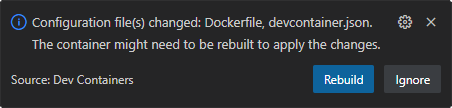</p>
> 
>Все дальнейшие действия нужно выполнять в этом контейнере.

## Процесс сборки Go

На развитие любого инструмента, в том числе и языка программирования оказывает сильное влияние исторический контекст. Языки *С* и *С++* создавались во времена дефицита постоянной и оперативной памяти, поэтому исполняемые файлы, как правило, собираются с зависимостями от динамических библиотек и перед сборкой основного проекта предварительно собираются статические библиотеки. Всё это позволяет коду на *С++* потреблять меньше ресурсов во время сборки программы и меньше оперативной памяти во время её работы (т.к. динамические библиотеки переиспользуются другими программами). Но если в системе не окажется нужной динамической библиотеки, или она будет не совместимой версии, то программа откажется работать, что может стать большой проблемой, особенно для старого ПО (например большинство игр 15-20 летней давности не получится запустить на современных ОС именно из-за отсутствия нужных библиотек).

Язык *Go* появился в 2009 году и вопросам памяти уже уделялось гораздо меньше внимания, но зато актуализировались вопросы переносимости программ на разные платформы. По этой причине идеология *Go* подразумевает сборку полностью из исходных текстов и с минимальными зависимостями от внешних библиотек. Компилятор *Go* собирает всё, что нужно для работы в **единый исполняемый файл** таким образом, чтобы он мог запуститься даже на "голой" ОС при этом, естественно жертвуя дисковым пространством и оперативной памятью.

<p align="center"></p>

Если рассматривать процесс сборки программы в упрощённом виде, то он состоит из двух больших фаз: фаза компиляции и фаза компоновки (линковки). В отличие от *С++* в *Go* нет препроцессора и поэтому фаза препроцессирования отсутствует.

Кроме того, *Go* поставляется вместе со стандартными инструментами сборки, тестирования, профилирования и т.д, которые были созданы и развиваются компанией *Google* (хотя в репозиториях c go проектами можно встретить *Makefile*, но он используется не для самой сборки, а как способ запуска go-шных команд).

### Структура кода

Если код на *C++* это набор `.cpp` и `.h` файлов, которые могут быть размещены где угодно в системе, главное указать компилятору где, то у *Go* более строгие требования к структуре кода.

Фундаментальная единица организации исходного кода в *Go* - это пакет. Все исходные файлы `.go` принадлежащие к одному пакету должны размещаться в одном каталоге (разложить их по подпапкам нельзя). Размещать в одном каталоге файлы принадлежащие разным пакетам тоже нельзя. Во вложенных каталогах могут быть файлы принадлежащие другому пакету. Например структура каталогов может быть следующей:

<p align="center">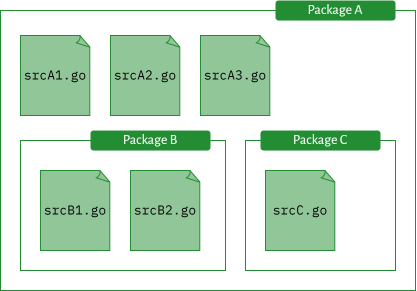</p>

Если положить в каталог пакета `C` файл принадлежащий пакету `A`, то получим ошибку, т.к. файлы пакета `А` будут раскиданы по разным каталогам, так же и с точки зрения пакета `C`, т.к. в его каталоге будет лежать файл не принадлежащий пакету.

В *Go* нет файловой области видимости, поэтому, любой символ (переменная/функция/тип) объявленный в **пределах пакета** может быть использован в любом его файле. Чтобы получить доступ к символам из другого пакета, пакет нужно импортировать при помощи ключевого слова `import`.

#### Режим GOPATH

До версии 1.11 компилятор и остальные инструменты выполняли поиск импортируемого пакета либо в каталоге `GOROOT`, либо в каталоге `GOPATH`.

121. Наберите в терминале команду:

     ```bash
     go env
     ```

     В результате вы получите список переменных окружения используемых *Go*.

122. Найдите переменные `GOROOT`, `GOPATH` и `GO111MODULE`.

     - В `GOROOT` указан путь к каталогу с компилятором *Go*. Если в системе установлено несколько разных версий компилятора, то можно выбрать нужный, сохранив путь к нему в эту переменную. Здесь же расположены **стандартные** пакеты поставляемые с компилятором (например `fmt`). Это первый в списке каталог в котором компилятор будет искать импортируемый пакет;

     - В `GOPATH` перечислены пути к рабочим каталогам (*workspace*). В большинстве случаев тут указан только один путь, но если нужно больше, то можно перечислить их через двоеточие. Как правило `GOPATH` будет указывать на каталог `"go"` в домашнем каталоге пользователя (например у меня на *Windows*: *"C:\\Users\\Professional\\go"*), но в контейнере он указывает на *"\go"*.

       До версии *Go 1.11* предполагалось, что программист будет создавать **все** свои программы/пакеты именно **в этом каталоге** и здесь же будут размещаться сторонние пакеты.  Поэтому, это второй в списке каталог в котором компилятор будет искать импортируемый пакет. Если пакета нет ни в `GOROOT` ни в `GOPATH`, то вы получите ошибку импорта.

       На практике же оказалось, что работать над несколькими проектами в пределах одного рабочего каталога не очень удобно и часто приводит к конфликтам зависимостей, т.к в режиме *GOPATH* нет возможности иметь несколько версий одного пакета одновременно. По этой причине, часто для каждого нового проекта создавали отдельный рабочий каталог и устанавливали значение переменной `GOPATH` то на один, то на другой, по мере необходимости.

       Чтобы решить проблему управления зависимостями и позволить программистам работать за пределами `GOPATH` начиная с версии *Go* 1.11 было добавлено понятие модулей;

     - Переменная `GO111MODULE` определяет включена или отключена поддержка модулей. Пусто или `on`  - включена; `off` - отключена. По умолчанию, *Go* работает в режиме модулей, но если установить значение `off` он перейдёт в старый режим, который обычно называют *GOPATH mode*.

123. В корневой папке `"lab2/manual_build"` создайте каталог `"gopathmode"` и перейдите в него в терминале;

124. Выполните последовательность действий:

     - Создайте каталог `"mypkg"`;

     - В каталоге `"mypkg"` создайте файл `"sum.go"` содержащий:

       ```go
       package mypkg
       
       func Sum(a, b int) int {
       	return a + b
       }
       ```

       Здесь название каталога `"mypkg"` и название пакета совпадают, но стандарт языка позволяет называть их по разному. Это считается очень плохой практикой, т.к. в строке импорта должно быть указано название каталога, а в коде нужно указывать название пакета.

       В файле `"sum.go"` указано название пакета и присутствует функция. Обратите внимание, что в *Go* имена начинающиеся с заглавной буквы считаются экспортируемыми, а со строчной - внутренними для пакета. К экспортируемым именам можно обращаться из других пакетов, к внутренним - нет (тоже касается и полей структуры).

     - В каталоге `"gopathmode"` создайте файл `"main.go"` содержащий:

       ```go
       package main
       
       import (
       	"fmt"
       	"mypkg"
       )
       
       func main() {
       	fmt.Println(mypkg.Sum(2, 2))
       }
       ```

       Импортируем пакет по имени каталога, а обращаемся в коде по имени пакета. Т.к они совпадают, то понятно откуда появилась функция `Sum`.

125. Выполните команду (текущей каталог должен быть `lab2/gopathmode`):

     ```bash
     GO111MODULE=off go run main.go
     ```

     В результате вы должны получить ошибку, которая говорит, что `mypkg` не найден ни в `GOROOT`, ни в `GOPATH`.

     Такой способ запуска команды мы уже встречали ранее, это значит, что для текущего запуска будет установлено значение `GO111MODULE=off`, т.е. мы переключимся в старый режим работы.

126. Выполните команду:

     ```bash
     cp -r mypkg `go env GOPATH`/src/mypkg
     ```

     Здесь, при помощи команды [`cp`](https://manpages.ubuntu.com/manpages/bionic/en/man1/cp.1.html) мы копируем каталог `mypkg` из текущего каталога в каталог `GOPATH` в подкаталог `"src"` (тут *Go* ищет пакеты работая в *GOPATH mode*).

     Конструкция `go env GOPATH` в обратных кавычках говорит, что нужно выполнить указанную команду и подставить её вывод в текущее место как строку. А опция `-r`, говорит `cp`, что нужно рекурсивно скопировать сам каталог и всё что в нём, в том числе в его подкаталогах.

127. Повторно запустите:

     ```bash
     GO111MODULE=off go run main.go
     ```

     На этот раз запуск должен пройти без проблем.

#### Режим Go Modules

Начиная с версии 1.11 компилятор и остальные инструменты по умолчанию работают в режиме поддержки модулей и будут требовать наличия в каталоге файла `"go.mod"`. Модуль должен содержать файл `"go.mod"` в корне каталога и может иметь произвольное количество пакетов. Модуль можно создать где угодно, независимо от `GOPATH` и кроме того, модуль позволяет указывать точные версии **внешних** пакетов от которых он зависит. Все пакеты входящие в состав модуля (т.е. внутренние пакеты) нумеруются одной и той же версией (версией модуля). Чтобы исключить подмену внешних пакетов в модуле присутствует файл `"go.sum"` фиксирующий их хэш-суммы.

<p align="center">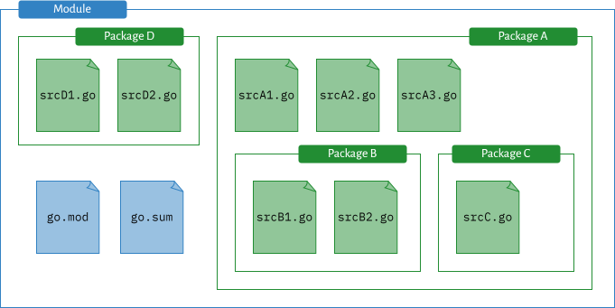</p>

В настоящее время, модули используются не просто для группировки пакетов, а как рабочее пространство для проекта, т.е. под новый проект создаётся новый модуль, который дополнительно содержит тесты, документацию и т.д. Существует рекомендованная структура каталогов в go-проектах, с которой можно ознакомится [тут](https://github.com/golang-standards/project-layout/blob/master/README_ru.md).

128. В корневой папке `"lab2/manual_build"` создайте каталог `"gomodule"` и перейдите в него в терминале;

129. Выполните команду:

     ```bash
     go mod init banacl
     ```
     
     В результате в текущем каталоге будет создан файл `"go.mod"` и он станет корнем модуля. Название модуля *"banacl"*.
     
     Как правило, код находится под системой контроля версий, и выкладывается на удалённый репозиторий, поэтому модули часто называют по названию репозитория, например: `github.com/user_mane/repo_name`. Такое имя не обязывает вас заводить репозиторий, да и вообще можно назвать репозиторий по-другому, но если имя репозитория и название модуля совпадут, то вы легко сможете понять откуда был взят тот или иной пакет просто по его импорту.
     
     Изучите содержимое файла `"go.mod"`;
     
130. Создайте каталог `"calc"` и в нём файл `"sum.go"` содержащий:

     ```go
     package calc
     
     func Sum(a, b int) int{
         return a + b
     }
     ```
     
131. В корне модуля (там где лежит `"go.mod"`) создайте файл `"main.go"` содержащий:

     ```go
     package main
     
     import (
     	"banacl/calc"
     	"fmt"
     
     	"github.com/dimiro1/banner"
     	"github.com/mattn/go-colorable"
     )
     
     func main() {
     	templ := fmt.Sprintf(`{{ .Title "%d" "" 4 }}`, calc.Sum(20, 22))
     	banner.InitString(colorable.NewColorableStdout(), true, true, templ)
     }
     ```
     
     Здесь мы импортируем свой пакет `calc` при этом имена локальных пакетов модуля должны импортироваться в формате: `"имя_модуля/путь/к/пакету"`. По соглашению, имя пакета должно совпадать с названием последнего каталога в пути, но как мы говорили выше, может и не совпадать. В данном примере каталог называется `"go-colorable"`, а пакет `colorable`.
     
132. Выполните команду:

     ```bash
     go mod tidy
     ```
     
     Эта команда запустит процесс анализа импортов и если в вашем коде есть импорты, которые не указаны в файле `go.mod`, команда `go mod tidy` добавит их (и запустит процесс скачивания), а если в файле `go.mod` есть зависимости, которые не используются в коде, `go mod tidy` удалит их (точнее отметит, как не используемые).
     
     Обратите внимание, что в каталоге появился файл `go.sum`.
     
133. Изучите файлов `go.mod` и `go.sum`.

     Пакеты отмеченные как *require*, требуются для работы модуля. Пакеты отмеченные комментарием *indirect* (не прямой) являются транзитивными зависимостями модуля, т.е. сам модуль от них не зависит, но они нужны для работы прямых зависимостей. Кроме того, каждый пакет сопровождается номером версии, что гарантирует, стабильность сборки, т.к. теперь мы зафиксированы на указанных версиях и скачиваться будут именно они, даже если автор какого-нибудь пакета выпустит обновление.
     
     Сами пакеты были автоматически скачаны по пути указанном в `GOMODCACHE`. Эта переменная автоматически меняет свое значение в зависимости от `GOPATH` и равна `GOPATH/pkg/mod`.
     
134. Выполните команду:

     ```bash
     go run .
     ```
     
     Программа должна запуститься и вывести на экран сообщение.

#### Multi-module workspace

Начиная с версии 1.18 в *Go* было добавлено понятие многомодульного рабочего пространства.

<p align="center">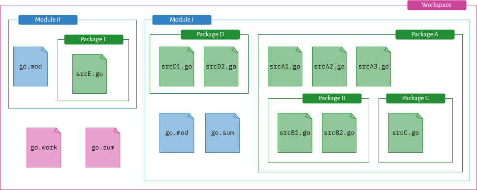</p>

Монолитное приложение или **независимый** сервис можно целиком разместить в одном модуле, но если приложение состоит из нескольких **связанных** сервисов, то их удобно сгруппировать вместе. В принципе, никто не запрещает по прежнему использовать отдельные модули, но если модуль `A` может быть использован только в модуле `B`, а модуль `B` не может работать без модуля `A`, то в любом случае придётся скачивать оба модуля и разделение их по разным репозиториям становится бесполезным.

135. В корневой папке `"lab2/manual_build"` создайте каталог `"goworkspace"` и перейдите в него в терминале.

136. Создайте каталог `"app"` и перейдите в него в терминале.

137. Выполните команду:

     ```bash
     go mod init app
     ```

     В результате в текущем каталоге будет создан файл `"go.mod"` и он станет корнем модуля `app`.

138. Создайте здесь файл `"main.go"` содержащий:

     ```go
     package main
     
     import (
     	"fmt"
     
     	"bender.com/kill/all/humans"
     )
     
     func main() {
     	fmt.Println(humans.Count())
     }
     ```

     Здесь мы импортируем не существующий пакет `bender.com/kill/all/humans`. Попытка его скачать или найти локально в `GOPATH` или `GOMODCACHE` не даст результатов.

139. В каталоге `"goworkspace"` создайте каталог `"earth"` и перейдите в него в терминале;

140. Выполните команду:

     ```bash
     go mod init bender.com/kill/all
     ```

     В результате в текущем каталоге будет создан файл `"go.mod"` и он станет корнем модуля `bender.com/kill/all`.

141. В каталоге `"goworkspace/earth"` создайте каталог `"humans"` и в нём создайте файл `"count.go"` содержащий:

     ```go
     package humans
     
     func Count() int {
     	return 42
     }
     ```

     На данный момент структура каталогов должна быть такой:

     ```bash
     goworkspace
     ├── app
     │   ├── go.mod
     │   └── main.go
     └── earth
         ├── go.mod
         └── humans
             └── count.go
     ```

142. Перейдите в терминале в каталог `"app"` и выполните команду:

     ```bash
     go run .
     ```

     В результате вы ожидаемо получите ошибку, сообщающую, что необходимого пакета `bender.com/kill/all/humans` нет. Т.к. пакет `humans` не находится в модуле `app`, то *Go* попробует найти его в в `GOPATH` и в `GOMODCACHE`, что разумеется не даст результатов.

     Как вариант, можно руками перенести пакет в `GOMODCACHE` и всё заработает. Но в этом случае код проекта будет "размазан" по системе и это не очень удобно для работы, но главная проблема возникнет при совместной работе над таким проектом, т.к. каждый раз при необходимости передать программу напарнику, придётся вручную собирать его по кусочкам, а напарнику наоборот раскладывать.

143. Выполните команду:

     ```
     go mod tidy
     ```

     В результате вы тоже получите ошибку, т.к. команда обнаружит, что пакет отсутствует локально и попробует скачать его из интернета. Но, т.к. такого пакета не существует, то у неё это не получится. Как вариант, можно выложить пакет по указанному адресу и тогда он будет успешно скачан (здесь в качестве адреса может быть любой другой, например github).

     Но пакет `humans` не настолько хорош, чтобы его можно было использовать где-то ещё, поэтому заводить для него отдельный репозиторий - это перебор, но в то же время он реализует отдельную логику и мы не хотим переносить его в модуль `app`.

144. Перейдите в терминале в каталог в каталог `"goworkspace"` и выполните команду:

     ```bash
     go work init
     go work use ./app
     go work use ./earth
     ```

     В результате, здесь появится файл `"go.work"`. Изучите его содержимое.

145. Выполните команду:

     ```
     go run ./app
     ```

     Теперь программа была запущена без проблем и пакет `humans`  взят из каталога `earth/humans`. Т.е. в процессе импорта, сначала просматриваются пакеты из текущего модуля, затем все модули из текущего рабочего пространства которые были добавлены при помощи `use`, а затем уже `GOPATH` и в `GOMODCACHE`. В нашем случае в каталоге `earth` есть модуль `bender.com/kill/all` который и был использован для импорта в `"main.go"` из модуля `app`.

Таким образом обе проблемы описанные выше решены. Модуль `humans` изолирован от основной логики приложения, и для него не нужно создавать отдельный репозиторий, т.к. он "живёт" в основном репозитории проекта и автоматически прилетает вместе с ним.

### Сборка

В отличие от *С++*, *Go* поставляется со стандартной сборочной системой `go build`. `go build` самостоятельно строит граф зависимостей пакетов, выполняет их поиск, компиляцию и линковку в исполняемый файл.

146. В корневой папке `"lab2/manual_build"` создайте каталог `"gobuild"` и перейдите в него в терминале.

147. Инициализируйте модуль с названием *simple*, затем создайте файл `"main.go"` содержащий:

     ```go
     package main
     
     import "fmt"
     
     func main() {
     	fmt.Println("Hello, World!")
     }
     ```

148. Выполните команду и изучите вывод:

     ```bash
     go build -x .
     ```

     В результате, в текущем каталоге появится исполняемый файл `"simple"` по названию модуля.

     Опция `-x` позволяет посмотреть команды которые выполняются в процессе сборки, а точка `.` говорит, что нужно выполнить сборку текущего пакета.

149. Выполните команду:

     ```bash
     go build -gcflags="-S" .
     ```

     Через опцию `-gcflags` (*gc* - это *go compiler*) можно передать компилятору дополнительные опции, например здесь мы просим показать ассемблерный вывод.

150. Выполните команды:

     ```bash
     go tool nm simple
     go tool objdump simple
     ```

     Это команды, работают аналогично линуксовым аналогам, но используют ассемблер *Go*. Ассемблер *Go* это промежуточное представление go кода, который затем будет преобразован в ассемблер подходящий под конкретную архитектуру процессора.

151. Выполните команды:

     ```bash
     du -h simple
     go build -ldflags="-s -w" .
     du -h simple
     ```

     Как видно, размер исполняемого файла во втором измерении оказался гораздо меньше первого.

     Через опцию `-ldflags` можно передать **линкеру** дополнительные опции, например здесь мы просим не включать в файл таблицу символов и отладочную информацию. Если теперь воспользоваться утилитой `go tool nm` вы получите сообщение, что символов нет.

По умолчанию, режим сборки установлен в `exe` (*executable* - исполняемый), но есть и другие режимы. Подробный список можно получить выполнив команду `go help buildmode`. В качестве примера рассмотрим сборку динамической библиотеки для C.

152. Измените код в файле `"main.go"` на следующий:

     ```go
     package main
     
     import "C"
     
     //export Sum
     func Sum(a, b int) int {
     	return a + b
     }
     
     func main() {}
     ```

     Прежде чем компилировать код в библиотеку, нужно соблюсти четыре условия:

     - Компилируемый пакет должен называться `main`, другие пакеты игнорируются. В этом случае компилятор соберёт пакет и все его зависимости в один бинарный файл;
     - Нужно импортировать псевдопакет `"C"`;
     - Экспортируемые функции должны быть отмечены комментарием `//export`;
     - Должна быть объявлена пустая функция `main`.

153. Выполните команду:

     ```bash
     go build -o sum.so -buildmode=c-shared main.go
     ```

     Здесь мы собираем файл `"main.go"` в динамическую С-библиотеку `"sum.so"`. В результате в текущем каталоге будут созданы два файла `"sum.so"` и `"sum.h"`.

154. Выполните команду:

     ```bash
     nm --extern-only sum.so
     ```

     Найдите в списке символов имя *Sum*. Здесь так много имён, т.к. кроме самой функции в библиотеку была добавлена вся *runtime* библиотека *Go* (сборщик мусора, менеджер памяти и прочая подкапотная машинерия).

155. Создайте файл `"main.cpp"` содержащий:

     ```cpp
     #include <iostream>
     #include "sum.h"
     
     int main() {
         std::cout << Sum(40, 2) << std::endl; 
     }
     ```

156. Выполните команду:

     ```bash
     g++ main.cpp sum.so -Wl,-rpath,"\$ORIGIN" -o sum
     ```

     И убедитесь, что исполняемый файл `"sum"` запускается.
     
     Как видно мы линкуемся с библиотекой стандартным для *C++* способом и не важно, что она написана на *Go*.

В *Go* существует механизм тегов сборки и ограничений сборки, это чем-то похоже на условную компиляцию в *C++*. Используя теги и ограничения, можно добавлять или исключать часть кода из процесса сборки.

157. Удалите файл `"main.cpp"`, чтобы он не мешал дальнейшей работе.

158. Измените код в файле `"main.go"` на следующий:

     ```go
     package main
     
     import "fmt"
     
     func main() {
         fmt.Println(Sum(22, 20))
     }
     ```

159. Создайте файл `"sum.go"` содержащий:

     ```go
     //go:build release
     
     package main
     
     func Sum(a, b int) int {
     	return a + b
     }
     ```

     Здесь добавлено ограничение сборки (*build constraint*) по наличию тега `release`, таким образом если сборка будет выполнена без этого тега, то файл будет проигнорирован. Ограничение сборки должно размещаться в начале файла, над ним могут быть размещены только пустые строки или другие комментарии, а под ним пустые строки и название пакета.

160. Создайте файл `"sum_debug.go"` содержащий:

     ```go
     //go:build !release
     
     package main
     import "fmt"
     
     func Sum(a, b int) int {
         fmt.Println("--- debug ---")
     	return a + b
     }
     ```

     Этот файл будет добавлен в сборку, только, если тег `release` не будет задан.

161. Выполните команды:

     ```bash
     go build .
     ./simple
     go build -tags "release" .
     ./simple
     ```

     Как видно, в первом случае, мы получили вывод содержащий отладочную информацию, а во втором нет.

     Выражение ограничения сборки вычисляется как логическое выражение и может содержать `||`, `&&`, и `!` и круглые скобки. Операторы имеют то же значение, что и в Go, например: `//go:build (linux || 386) && (darwin || !cgo)`.

Одной из основных фишек *Go* является встроенная возможность кроссплатформенной сборки, т.е. работая на *linux* можно собрать исполняемый файл, который будет работать под *windows* или другой ОС. Как правило, для решения этой задачи приходится выполнять сборку именно на той платформе, на которой код должен работать, но если приложение полностью написано на *Go* такой необходимости нет. На данный момент список доступных платформ и архитектур можно посмотреть [тут](https://go.dev/doc/install/source#environment).

162. Выполните команду:

     ```bash
     GOOS=windows GOARCH=amd64 go build -o sum.exe .
     ```

     Здесь мы запускаем сборку с установленными значениями переменных `GOOS` и `GOARCH`, при помощи которых задаём требуемую ОС  и архитектуру.

163. Попробуйте запустить `"sum.exe"` в терминале.

     Вы должны получить сообщение об ошибке, но на *windows* файл запуститься без проблем. Сборка для других платформ происходит также легко, но возможно понадобиться установить некоторые дополнительные инструменты.

## Источники и ссылки

- Объясняет значение консольных команд: https://explainshell.com/;

