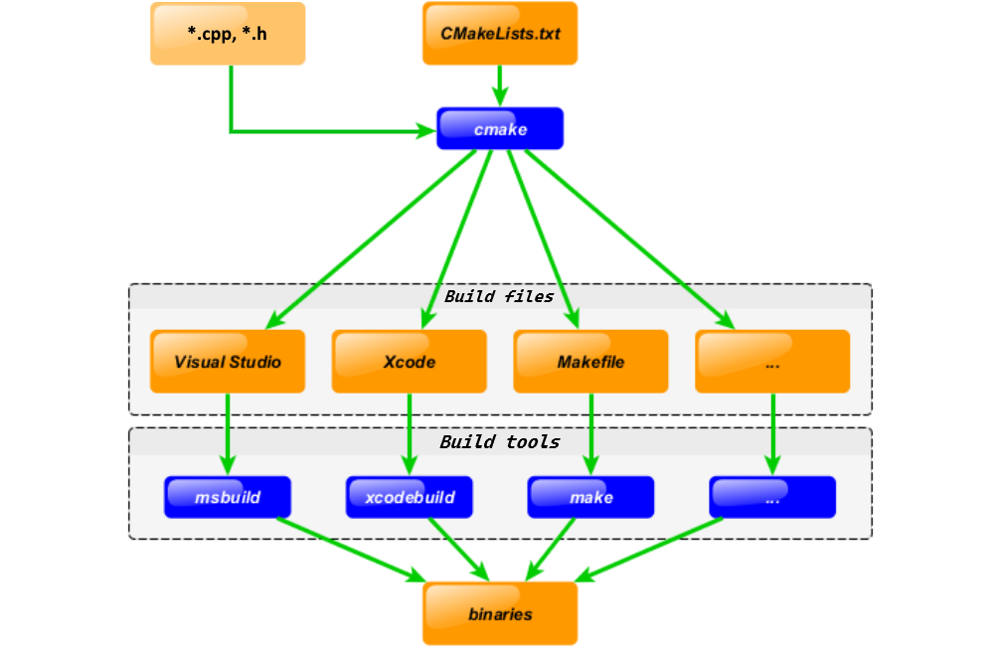
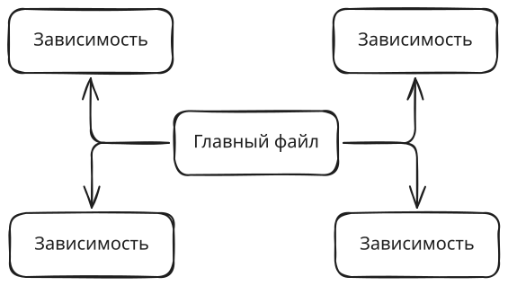
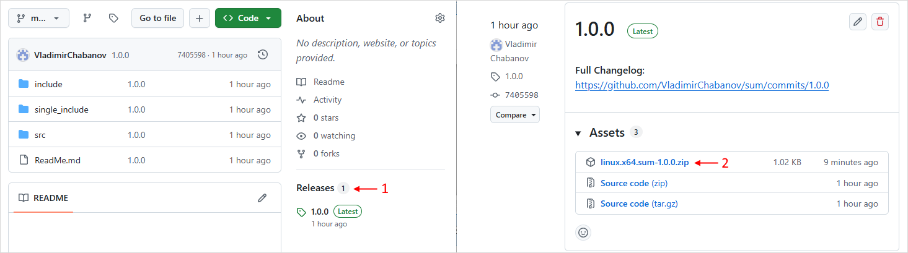

# Часть 3. Системы автоматической сборки

## C++ Linux Make

> [!WARNING]
>
> Если вы выполняли предыдущую часть в Docker контейнере можно выполнить сброс Docker Desktop к начальным настройкам, чтобы удалить всё ненужные артефакты и освободить место на диске:
>
> 1. Запустите Docker Desktop;
> 2. На нижней панели окна Docker Desktop нажмите на три вертикальные точки и выберите пункт меню *Troubleshoot*. То же самое можно получить нажав на символ вопросительного знака  на верхней панели (раньше был символ жука).
> 3. В открывшемся окне нажмите на кнопку *Reset to factory defaults* и подождите некоторое время.
>    В результате Docker Desktop перезапуститься и покажет такое же окно как и сразу после установки.

> [!WARNING]
>
> Если у вас основная операционная система Windows, то этот раздел выполняйте в Docker контейнере. Для этого:
> 4. Запустите Docker Desktop;
> 5. В каталоге `"projects/lab2"` создайте каталог `"make"`;
> 6. Откройте каталог `"make"` в VScode;
> 7. Переключитесь в профиль Remote. Если профиль Remote вы не создавали, то установите набор плагинов Remote Development;
> 8. Добавьте конфигурацию Dev Container:
>    - Нажмите на значок в левом нижнем углу  и выберите _Add Dev Container Configuration Files..._;
>    - На вопрос, где сохранить конфигурацию контейнера выберите _Add configuration to workspace_. В этом случае, конфигурация контейнера будет храниться в папке проекта. Альтернативный вариант создаст конфигурацию в другом месте, но она тоже будет действовать только на этот проект. Разница в том, хотите ли вы, чтобы конфигурация контейнера могла отслеживаться системой контроля версий или нет;
>    - В поле поиска шаблона введите _C++_ и выберите одноимённый шаблон;
>    - Шаблон _С++_ доступен на основе нескольких ОС. Выберите контейнер на основе _ubuntu-24.04_;
>    - Затем будет несколько вопросов касающихся установки в контейнер дополнительного софта. Нажмите: _none_, _ОК_ и _ОК_;
>    В папке проекта появится каталог `".devcontainer"` с файлом `"devcontainer.json"` и другими.
> 9. Запустите контейнер, например нажмите на значок  и в выпадающем выберите *Reopen in Container*.
> 10. Дождитесь пока загрузится образ и запустится контейнер. При успешном запуске контейнера значок в левом углу изменится на .

Ручная сборка простой программы выполняется за одну, две команды и не представляет особой сложности. Когда программа становится больше, то держать в памяти все необходимые ключи, пути к библиотекам и т.д. становится проблематично. В этом случае можно записать всё в файл и оформить как скрипт командной оболочки `.sh`, `.bat`, `.ps1`  и другие, в зависимости от оболочки. До некоторых пор такой подход позволяет решить проблему. При дальнейшем усложнении программы, обычный скрипт перестаёт справляться и становится трудночитаемым. В этом случае можно воспользоваться одной из существующих систем сборки, например `make`.

Утилита `make` выполняет 2 задачи:

- строит граф зависимостей файлов (ну почти) друг от друга, чтобы понять что нужно пересобрать, а что можно не трогать;
- запускает команды, выполняющие сборку (на самом деле какие угодно).

В контейнере `make` уже установлен, поэтому мы сразу начнём работать. Найти способ установки его почти под любую ОС не проблема.

1. Откройте терминал и выполните команду:

   ```bash
   make
   ```

   Вы получите сообщение о том, что в текущем каталоге отсутствует файл с целями для сборки. Утилита `make` запущенная без параметров ищет в текущем каталоге файлы в следующем порядке: `"GNUmakefile"`, `"makefile"` и `"Makefile"`.

2. Создайте пустой файл `"Makefile"` (именно с большой буквы и без расширения) и выполните в терминале команду:

   ```bash
   make
   ```

   Теперь `make` обнаружил файл, но говорит, что в нём отсутствуют цели для сборки.

   > Разработчики `make` рекомендуют использовать большую букву в названии `"Makefile"` чисто для удобства, т.к. в списке файлов он будет ближе к другим важным файлам, которые обычно тоже называют с большой буквы.

3. Добавьте в `"Makefile"` следующий текст и снова запустите `make`:

   ```makefile
   hello:
   	echo "Hello"
   ```

   Вы получите вывод из двух строк: первая соответствует команде которая будет выполнена, вторая - результат выполнения команды.

   По умолчанию `make` запущенный без параметров ищет в текущем `"Makefile"` первую попавшуюся **цель** (*target*) и запускает её **рецепт** (*recipe*). Не зависимо от результата `"make"` завершает работу.

   В нашем случае: цель - это *hello*, а рецепт: *echo "Hello"*. Рецепт может состоять более чем из одной строки, но перед каждой обязательно должна быть табуляция (НЕ пробелы). Здесь рецепт состоит их одной команды [`echo`](https://manpages.ubuntu.com/manpages/trusty/man1/echo.1posix.html), которая выведет на экран сообщение: *Hello*.

   Команды указанные в рецепте выполняет не сам `make`, он передаёт их командной оболочке (для *Linux* по умолчанию *bash*).

4. Добавьте в `"Makefile"` цель `by` следующим образом:

   ```makefile
   hello:
   	echo "Hello"
   
   by:
   	echo "By"
   ```

   И выполните команды:

   ```bash
   make
   make by
   ```

   Как видно, вызов без параметров выполнит только первую цель в файле, но чтобы запустить другую, нужно указать её имя.

### Сборка простой программы I

5. В текущем каталоге создайте каталог `"simple"` и перейдите в него в терминале.

6. Создайте файл `"main.cpp"`:

   ```cpp
   #include <iostream>
   
   int main(){
       std::cout << "Hello, world!" << std::endl;
   }
   ```

7. Создайте `"Makefile"` содержащий:

   ```makefile
   build:
   	@echo Build project
   	g++ main.cpp -o main
   ```

   Здесь рецепт состоит из двух шагов, первый выводит сообщение на экран, а второй - это запуск компилятора `g++`.

   > По умолчанию, прежде чем выполнить шаг рецепта, `make` выводит текст команды на экран. Символ `@` в начале строки подавляет вывод команды, она просто исполняется.

8. И выполните команду:

   ```bash
   make
   ```

   В результате, в текущем каталоге появится исполняемый файл `"main"`.

9. Измените `"Makefile"` следующим образом:

   ```makefile
   build:
   	@echo Build project
   	g++ main.cpp -o main
   
   clean:
   	rm -f main
   ```

   И выполните команду:

   ```bash
   make clean
   ```

   Здесь добавлена цель `clean` которая предназначена, чтобы удалить все артефакты сборки и вернуть каталог в чистое состояние.

   При помощи команды [`rm`](https://manpages.ubuntu.com/manpages/noble/en/man1/rm.1.html) мы удаляем файл `"main"`. Ключ `-f` (удалить усиленно) здесь используется, чтобы не выводилось сообщение об ошибке, если файл `"main"` не существует.

10. Создайте в текущем каталоге файл с именем `"clean"` и выполните в терминале команды:

    ```bash
    make build
    make clean
    ```

    В результате, для команды `make clean` вы должны получить сообщение `"make: 'clean' is up to date."`, которое говорит, что цель `clean` находится в актуальном состоянии и не нуждается в повторном построении. Т.е. рецепт не был исполнен и как следствие, файл `"main"` не был удалён.

    На самом деле, название цели является не просто меткой, а воспринимается `make` как название файла или каталога (далее, для простоты, будет просто файла). При этом рецепт - это не просто последовательность команд, а инструкция, как создать целевой файл. При запуске, `make` проверяет текущий каталог и если целевой файл существует, то `make` делает вывод, что рецепт уже исполнялся и цель находится в актуальном состоянии, если нужного файла нет, то `make` исполняет рецепт.

11. Добавьте в начало `"Makefile"` строку:

    ```makefile
    .PHONY: build clean
    ```

    При помощи специальной цели `.PHONY` мы отметили цели `build` и `clean` как ложные.  Этот механизм, служит чтобы защитить "служебные" цели от случайного совпадения с именем файла/каталога.

12. Выполните команду:

    ```bash
    make clean
    rm clean # удаляем файл "clean"
    ```
    
    В результате рецепт будет исполнен, даже несмотря на наличие файла `clean` в каталоге.

По итогу дерево проекта должно выглядеть так (команда `tree`):

```bash
.
├── main.cpp
└── Makefile
```

### Сборка простой программы II

13. В корневом каталоге `"make"` создайте каталог `"cowsay"` и перейдите в него в терминале.

14. В каталоге `"cowsay"` создайте:

    - Файл `"main.cpp"` содержащий:

      ```cpp
      #include "cowsay.h"
      
      int main(){
          cowsay("Hello, world!");
      }
      ```

    - Файл `"cowsay.h"` содержащий:

      ```cpp
      #pragma once
      #include <iostream>
      
      const char COW[] =
          "        \\    ^__^\n"
          "         \\   (oo)\\_______\n"
          "             (__)\\       )\\/\\\n"
          "                 ||----w |\n"
          "                 ||     ||\n";
      
      void cowsay(std::string msg){
          std::string line(msg.size() + 2, '-');
      
          std::cout << " " << line << " \n"
                    << "< " << msg << " >\n"
                    << " " << line << " \n"
                    << COW << std::endl;
      }
      ```

    - Файл `"Makefile"` скопируйте из каталога `"simple"`.

15. Выполните команды:

    ```bash
    make build
    ./main
    ```

    Несмотря на то, что программа состоит из двух файлов и `make` ничего не знает про `"cowsay.h"` сборка всё равно прошла успешно, т.к. на этапе препроцессирования `"cowsay.h"` был полностью вставлен в `"main.cpp"` благодаря `#include`.

16. Измените `"Makefile"` следующим образом:

    ```makefile
    .PHONY: build clean
    
    build: main
    	@echo Build project complete
    
    main:
    	g++ main.cpp -o main
    
    clean:
    	rm -f main
    ```

    Здесь добавлена цель `main` - которая отвечает за сборку исполняемого файла `"main"` и в качестве рецепта его создания, указана команда компиляции.

    Цель `build` теперь просто печатает сообщение на экран, но при этом она зависит от цели `main`. Список целей от которых зависит текущая указан в той же строке, что и название цели, после двоеточия.

    Зависимости цели можно поделить на 2 вида:

    - зависимости-файлы. Как понятно, не имеют своих зависимостей и являются просто именами файлов;
    - зависимости-цели. Это просто другие цели, поэтому они могут иметь свои зависимости, а те свои и т.д.

    Наличие зависимости у цели предполагает, что без неё рецепт текущей цели исполнять нельзя, поэтому `make` сначала запускается для всех зависимостей (в порядке их перечисления), а затем возвращается к рецепту текущей цели.

17. Выполните команды:

    ```bash
    make clean
    make build
    ```

    Как видно, перед выводом сообщения `"Build project complete"` на экран, отработала команда сборки цели `main`.

18. Повторно выполните команду:

    ```bash
    make build
    ```

    Теперь команда сборки цели `main` не отработала, т.к. файл `"main"` уже присутствует в каталоге и цель `main` находится в актуальном состоянии. Цель `build` отмечена как ложная, поэтому её рецепт  будет исполнятся каждый раз.

19. Внесите изменения в файл `"main.cpp"` заменив строку `Hello, world!` на `By by, world!`.

20. Выполните команды:

    ```bash
    make build
    ./main
    ```

    Как видно, программа НЕ была пересобрана и на экране по прежнему старое сообщение. Т.к. `make` видит в каталоге файл `"main"`, он считает, что пересобирать цель не нужно.

    > Для ложных целей рецепт исполняется всегда. Для НЕ ложных целей без зависимостей рецепт исполнен не будет, если присутствует файл совпадающий с названием цели.

21. Измените `"Makefile"` добавив для цели `main` файл `"main.cpp"` как зависимость:

    ```makefile
    main: main.cpp
    ```

    и снова выполните команды:

    ```bash
    make build
    ./main
    ```

    Как видно, теперь программа была успешно пересобрана и выводит новое сообщение.

    Когда в качестве зависимости указан файл, то `make` сравнивает время создания файла текущей цели и файлов-зависимостей и если хоть одна зависимость была создана позже, то текущая цель считается устаревшей и `make` исполняет рецепт.

22. Внесите изменения в файл `"cowsay.h"` заменив:

    ```cpp
    std::string line(msg.size()+2, '-');
    ```

    на

    ```cpp
    std::string line(msg.size()+2, '=');
    ```

23. Выполните команды:

    ```bash
    make build
    ./main
    ```

    Как видно, программа не была пересобрана, т.к. файл `"main"` был создан после `"main.cpp"` и с точки зрения `make` цель `main` находится в актуальном состоянии. `make` ничего не знает о `"cowsay.h"` и следовательно не отслеживает изменения в нем.

24. Исправим это, добавив для цели `main` файл `"cowsay.h"` как зависимость:

    ```makefile
    main: main.cpp cowsay.h
    ```

    и снова выполните команды:

    ```bash
    make build
    ./main
    make clean # чистим каталог от артефактов
    ```
    
    Как видно, теперь программа была успешно пересобрана и выводит новое сообщение.

По итогу дерево проекта должно выглядеть так:

```bash
.
├── cowsay.h
├── main.cpp
└── Makefile
```

### Шаблоны

25. В корневом каталоге `"make"` создайте каталог `"template"` и перейдите в него в терминале.

26. В каталоге `"template"` создайте `"Makefile"` содержащий:

    ```makefile
    one:
    	@echo Used user-defined recipe for $@ target
    
    %:
    	@echo Used template for $@ target
    ```

    Символ `%` в названии цели используются для создания шаблонов. Шаблоны применяются в самую последнюю очередь, если название цели не совпадает с заданными явно. В данном случае шаблон будет совпадать с любым именем, но можно написать и более ограниченный вариант.

    `make` предоставляет ряд [автоматических переменных](https://www.gnu.org/software/make/manual/make.html#Automatic-Variables), которые доступны внутри рецепта. Здесь мы использовали переменную `$@`, которая содержит название текущей цели.

27. Выполните команду:

    ```bash
    make one path/to/one two
    ```

    Здесь мы запрашиваем у `make` выполнить три цели `one`, `path/to/one` и  `two`. Для первой будет выбран рецепт заданный явно, а для остальных `make` создаст правило на основе шаблона.

28. Добавьте в `"Makefile"` ещё шаблон:

    ```bash
    c%t:
    	@echo Used second template for $@ target
    ```

29. Выполните команду:

    ```bash
    make cat caat ca_at path/to/cat path/to/cbbt ca/at
    ```

    Шаблон `c%t` совпадёт с целями, которые начинаются на `c` и заканчиваются на `t`: `cat`, `caat`, `ca_at` и т.д. Кроме того цели: `path/cat`, `/path/to/file/cbbt` и т.д. тоже являются подходящими. Идея заключается в том, что имя цели должно представлять из себя имя файла, к которому может быть добавлен путь. 

    Цель `ca/at` не совпадёт с шаблоном `c%t`, т.к. `/` в имени файла не допускается, поэтому отработал более общий шаблон: `%`.

30. Добавьте в `"Makefile"` ещё шаблон:

    ```bash
    d%g.txt: c%t
    	@echo Used third template for $@ target
    ```

    Здесь у шаблона появилась зависимость и она тоже является шаблоном.

31. Выполните команду:

    ```bash
    make dog.txt path/to/doog.txt
    ```

    Как видно, в имени зависимости символ `%` был заменён на соответствующий фрагмент из имени цели. При этом путь к зависимости соответствует пути к цели.

32. Уберите из `"Makefile"` шаблон `c%t` (вместе с рецептом) и снова выполните:

    ```bash
    make dog.txt path/to/doog.txt
    ```

    Теперь вы долины получить ошибку *"No rule to make target"*.

    Для выполнения целей, как и раньше был выбран шаблон `d%g.txt`. Но у него есть зависимость-шаблон `c%t`, который мы только что удалили. Несмотря на то, что в файле присутствует более общий шаблон `%` он будет проигнорирован.

    Т.е. шаблон `%` не может быть использован для генерации правил для зависимостей-шаблонов. Любой другой, например `%t` будет работать как положено.

В именах целей также можно использовать подстановочные символы (*[wildcard](https://www.gnu.org/software/make/manual/make.html#Wildcard-Examples)*) `*`, `?`, `[]`. Их действие чем-то похоже на работу шаблонов, но такие цели отработают только для существующих файлов. Например: если в текущем каталоге есть файл `cat` и `cit` и заданы цели `c?t` и `c%t`, то для `make cat` и `make cit` будет выбрана цель `c?t`, а для `make cot` - шаблон `c%t`. Если закинуть все три файла в каталог `cats` и вызывать `make cats/cat`, `make cats/cit`,  `make cats/cot`, то трижды отработает шаблон.

### Сборка простой программы III

33. В корневом каталоге `"make"` создайте каталог `"cowmath"` и перейдите в него в терминале.

34. В каталоге `"cowmath"` создайте:

    - Файл `"main.cpp"` содержащий:

      ```cpp
      #include "cowsay.h"
      #include "sum.h"
      
      int main(){
          cowsay(sum(13, 37));
      }
      ```

    - Файл `"cowsay.h"` содержащий:

      ```cpp
      #pragma once
      #include <iostream>
      #include <string>
      
      void cowsay(std::string msg);
      void cowsay(int msg);
      ```

    - Файл `"cowsay.cpp"` содержащий:

      ```cpp
      #include "cowsay.h"
      
      const char COW[] =
          "        \\    ^__^\n"
          "         \\   (oo)\\_______\n"
          "             (__)\\       )\\/\\\n"
          "                 ||----w |\n"
          "                 ||     ||\n";
      
      void cowsay(std::string msg){
          std::string line(msg.size() + 2, '-');
      
          std::cout << " " << line << " \n"
                    << "< " << msg << " >\n"
                    << " " << line << " \n"
                    << COW << std::endl;
      }
      
      void cowsay(int msg){
          cowsay(std::to_string(msg));
      }
      ```

    - Создайте файл `"sum.h"` содержащий:

      ```cpp
      #pragma once
      
      int sum(int, int);
      ```

    - Создайте файл `"sum.cpp"` содержащий:

      ```cpp
      #include "sum.h"
      
      int sum(int a, int b){
          return a + b;
      }
      ```

    - Файл `"Makefile"` содержащий:

      ```makefile
      .PHONY: build clean
      
      build: main
      	@echo Build project complete
      
      main: main.cpp cowsay.cpp cowsay.h sum.cpp sum.h
      	g++ main.cpp cowsay.cpp sum.cpp -o main
      
      clean:
      	rm -f main
      ```

    Теперь у нас в проекте три `.cpp` файла, поэтому в команде компиляции нужно перечислить их все. Дополнительно указываем все `.cpp` и `.h` файлы как зависимости цели `main`, чтобы изменение любого из них привело к переборке исполняемого файла.

35. Соберите проект, убедитесь, что файл `"main"` рабочий, затем выполните очистку каталога при помощи `make clean`.

36. Измените содержимое `"Makefile"` на следующее:

    ```makefile
    .PHONY: build clean
    
    build: main
    	@echo Build project complete
    
    main: main.o cowsay.o sum.o
    	g++ main.o cowsay.o sum.o -o main
    
    main.o: main.cpp cowsay.h sum.h
    	g++ -c main.cpp
    
    cowsay.o: cowsay.cpp cowsay.h
    	g++ -c cowsay.cpp
    
    sum.o: sum.cpp sum.h
    	g++ -c sum.cpp
    
    clean:
    	rm -f main main.o cowsay.o sum.o
    ```

    Теперь цель `main` зависит от объектных файлов `"main.o"` `"cowsay.o"` `"sum.o"` и выполняет только их **линковку** в исполняемый файл. Для создания объектных файлов было добавлено три одноимённые цели, которые выполняют только **компиляцию** исходного кода в объектный файл и зависят каждый от своих исходников.

    Такой подход позволит перекомпилировать только требующий этого объектный файл и затем выполнять линковку, без необходимости перекомпилировать остальные объектные файлы.

    Цель `clean` изменена, чтобы удалять все артефакты сборки, в том числе и объектные файлы.

37. Соберите проект и убедитесь, что:

    - файл `"main"` был создан и он рабочий;
    - кроме `"main"` появились и объектные файлы.

38. Выполните очистку каталога при помощи `make clean` и убедитесь, что остались только исходники.

39. Измените содержимое `"Makefile"` на следующее:

    ```makefile
    .PHONY: build clean
    
    build: main
    	@echo Build project complete
    
    main: main.o cowsay.o sum.o 
    	g++ $^ -o $@
    
    main.o: main.cpp cowsay.h sum.h
    	g++ -c $<
    
    cowsay.o: cowsay.cpp cowsay.h
    	g++ -c $<
    
    sum.o: sum.cpp sum.h
    	g++ -c $<
    
    clean:
    	rm -f main main.o cowsay.o sum.o
    ```

    Соберите проект, убедитесь, что файл `"main"` рабочий, затем выполните очистку каталога при помощи `make clean`.

    Сам скрипт не изменился, просто выполнена замена конкретных значений имён файлов на равнозначные им автоматические переменные. Переменная `$@` означает имя текущей цели; переменная `$^` равна списку **всех** зависимостей текущей цели указанных один раз (вообще зависимости могут быть указаны несколько раз) через пробел; переменная `$<` равна первому имени в списке зависимостей.

40. Измените содержимое `"Makefile"` на следующее:

    ```makefile
    .PHONY: build clean
    
    build: main
    	@echo Build project complete
    
    main: main.o cowsay.o sum.o 
    	g++ $^ -o $@
    
    main.o: main.cpp
    	g++ -c $<
    
    cowsay.o: cowsay.cpp
    	g++ -c $<
    
    sum.o: sum.cpp
    	g++ -c $<
    
    main.o cowsay.o: cowsay.h
    main.o sum.o: sum.h
    
    clean:
    	rm -f main main.o cowsay.o sum.o
    ```

    Соберите проект, убедитесь, что файл `"main"` рабочий, затем выполните очистку каталога при помощи `make clean`.

    Как видно, здесь добавлены 2 строки в формате: `цель1 цель2: зависимость`. На самом деле количество целей и количество зависимостей может быть сколько угодно. Данная запись добавит к списку зависимостей каждой цели все зависимости перечисленные после двоеточия. Таких записей может быть сколько угодно, главное, чтобы в них не было рецепта, иначе он переопределит предыдущий. Т.к. мы вынесли часть зависимостей отдельно, мы смогли убрать их из правил, которые были выше и сделать правила более похожими.

    > **Переопределение правил**
    >
    > Если в наш `"Makefile"` после `build` добавить новое правило:
    >
    > ```makefile
    > build:
    > 	@echo Build project - step II
    > ```
    >
    > И запустить `make build`, то вы получили предупреждение, о том, что новое правило переопределило предыдущее и теперь, для `build` отработает только второй рецепт.
    >
    > Если заменить `build:` на `build::` (во всех правилах) и снова запустить `make build`, то отработаю оба рецепта.

41. Измените содержимое `"Makefile"` на следующее:

    ```makefile
    .PHONY: build clean
    
    build: main
    	@echo Build project complete
    
    main: main.o cowsay.o sum.o 
    	g++ $^ -o $@
    
    $.o: $.cpp
    	g++ -c $<
    
    main.o cowsay.o: cowsay.h
    main.o sum.o: sum.h
    
    clean:
    	rm -f main main.o cowsay.o sum.o
    ```

    Соберите проект, убедитесь, что файл `"main"` рабочий, затем выполните очистку каталога при помощи `make clean`.

    Т.к. три правила для `"main.o"`, `"cowsay.o"` и `"sum.o"` получились по сути идентичны с точностью до имени файла, мы можем заменить их шаблоном. Шаблон автоматически развернётся в требуемое правило.

    Здесь фрагмент:

    ```makefile
    $.o: $.cpp
    	g++ -c $<
    ```

    это шаблон.

42. Измените содержимое `"Makefile"` на следующее:

    ```makefile
    APP = main
    OBJECTS = main.o cowsay.o sum.o
    
    .PHONY: build clean
    
    build: $(APP)
    	@echo Build project complete
    
    $(APP): $(OBJECTS) 
    	g++ $^ -o $@
    
    $.o: $.cpp
    	g++ -c $<
    
    main.o cowsay.o: cowsay.h
    main.o sum.o: sum.h
    
    clean:
    	rm -f $(APP) $(OBJECTS)
    ```

    Соберите проект, убедитесь, что файл `"main"` рабочий, затем выполните очистку каталога при помощи `make clean`.

    Кроме автоматических переменных `make` позволяет создавать [свои](https://www.gnu.org/software/make/manual/make.html#Flavors). В нашем случае были созданы переменные `APP` и `OBJECTS`. Чтобы получить значение переменной нужно взять её имя в скобки и вначале поставить знак доллара: `$(VAR_NAME)`.

    Переменные можно использовать практически где угодно и на самом деле так обычно и делают, старясь заменить как можно больше всего переменными. Например в нашем случае, можно было бы вынести в переменную ещё и название компилятора `g++` (да хоть и двоеточие). `make` подставляет значение переменных перед тем, как обработать выражение и то, что получится выполняет как команду.

По итогу дерево проекта должно выглядеть так:

```bash
.
├── cowsay.cpp
├── cowsay.h
├── sum.cpp
├── sum.h
├── main.cpp
└── Makefile
```

### Сборка простой программы IV

43. В корневом каталоге `"make"` создайте каталог `"outofsrc"` и перейдите в него в терминале.

44. В `"outofsrc"` создайте три каталога:

    - `"src"` - здесь будут все `.cpp` файлы;
    - `"include"` - здесь будут все `.h` файлы;
    - `"build"` - здесь будут все артефакты сборки.

    До этого момента артефакты сборки попадали в тот же каталог, что и исходники. Такой метод называется *in-source build*. Далее мы будем использовать *out-of-source build* т.е. сборку в отдельном каталоге, чтобы оставлять дерево исходного кода в чистоте. Это даёт дополнительное преимущество, в виде возможности выполнять сборку с разными конфигурациями одновременно и запускать `make` в режиме параллельной работы.

45. В каталоге `"src"` создайте два каталога:

    - `"libsum"` - здесь будут все `.cpp` файлы относящиеся к библиотеке `sum` и отдельный `"Makefile"` для сборки;
    - `"libcowsay"` - здесь будут все `.cpp` файлы относящиеся к библиотеке `cowsay` и отдельный `"Makefile"` для сборки.

46. Скопируйте файлы из каталога `"cowmath"` в `"outofsrc"` и разложите их по соответствующим каталогам. `"Makefile"` оставьте в `"outofsrc"`.

47. В каталога `"libsum"` и `"libcowsay"` создайте по пустому `"Makefile"`-у. 

    На текущий момент дерево проекта должно выглядеть так:

    ```bash
    .
    ├── Makefile              # Главный Makefile
    ├── include
    │   ├── cowsay.h
    │   └── sum.h
    ├── src
    │   ├── main.cpp
    │   ├── libsum
    │   │   ├── sum.cpp
    │   │   └── Makefile     # Makefile для библиотеки sum
    │   └── libcowsay
    │       ├── cowsay.cpp
    │       └── Makefile     # Makefile для библиотеки cowsay
    └── build
    ```

48. Измените содержимое `"Makefile"` в каталоге `"libsum"` на следующее:

    ```makefile
    # Пути
    BUILD_DIR = ../../build
    INCLUDE_DIR = ../../include
    
    # Исходные файлы
    SRC = sum.cpp
    OBJ = $(BUILD_DIR)/sum.o
    TARGET = libsum.a
    
    # Цель по умолчанию
    all: $(BUILD_DIR)/$(TARGET)
    
    # Компиляция объектного файла
    $(OBJ): $(SRC)
    	g++ -I $(INCLUDE_DIR) -c $< -o $@ 
    
    # Создание статической библиотеки
    $(BUILD_DIR)/$(TARGET): $(OBJ)
    	@mkdir -p $(BUILD_DIR)
    	ar rcs $@ $^
    
    # Очистка
    clean:
    	rm -f $(OBJ) $(BUILD_DIR)/$(TARGET)
    
    .PHONY: all clean
    ```

    Здесь и далее была добавлена ложная цель `all` у которой есть только зависимость, но нет рецепта. Таким образом сборка цели `all` - это просто сборка её зависимостей. Это стандартная практика, чтобы не завесить от порядка целей в файле. Теперь можно запустить `make all` и гарантировано запуститься сборка проекта, при этом не важно как называется проект.

    Также напомню, что ключ `-I` в команде компиляции, позволяет задать дополнительные каталоги для поиска заголовочных файлов подключаемых через `#include`; команда `ar` с ключами `rcs` позволяет создавать статические библиотеки; команда `mkdir` с ключом `-p` позволяет создавать каталог и все подкаталоги на пути, если они не существуют.

49. Измените содержимое `"Makefile"` в каталоге `"libcowsay"` на следующее:

    ```makefile
    # Пути
    BUILD_DIR = ../../build
    INCLUDE_DIR = ../../include
    
    # Исходные файлы
    SRC = cowsay.cpp
    OBJ = $(BUILD_DIR)/cowsay.o
    TARGET = libcowsay.a
    
    # Цель по умолчанию
    all: $(BUILD_DIR)/$(TARGET)
    
    # Компиляция объектного файла
    $(OBJ): $(SRC)
    	g++ -I $(INCLUDE_DIR) -c $< -o $@ 
    
    # Создание статической библиотеки
    $(BUILD_DIR)/$(TARGET): $(OBJ)
    	@mkdir -p $(BUILD_DIR)
    	ar rcs $@ $^
    
    # Очистка
    clean:
    	rm -f $(OBJ) $(BUILD_DIR)/$(TARGET)
    
    .PHONY: all clean
    ```

    Здесь всё аналогично изменены имена исходных файлов и название библиотеки.

50. Измените содержимое корневого `"Makefile"` на следующее:

    ```makefile
    # Пути
    BUILD_DIR = ./build
    INCLUDE_DIR = ./include
    
    # Цели по умолчанию
    all: libs main
    
    # Сборка всех библиотек
    libs:
    	@mkdir -p $(BUILD_DIR)
    	make -C src/libsum
    	make -C src/libcowsay
    
    # Сборка основного исполняемого файла
    main: libs
    	g++ -I ${INCLUDE_DIR} -c src/main.cpp -o $(BUILD_DIR)/main.o
    	g++ -I ${INCLUDE_DIR} $(BUILD_DIR)/main.o \
    		-L$(BUILD_DIR) -lsum -lcowsay \
    		-o $(BUILD_DIR)/main
    
    run:
    	$(BUILD_DIR)/main
    
    # Очистка
    clean:
    	make -C src/libsum clean
    	make -C src/libcowsay clean
    	rm -rf $(BUILD_DIR)
    
    .PHONY: all libs main clean
    ```

    Здесь вызывается команда `make` с ключом `-С`, который указывает путь к каталогу в котором нужно искать `Makefile`. В цели `libs` мы последовательно запускаем сборку библиотек, а в цели `clean` вызываем одноимённые цели из этих `Makefile`-ов, которые удалят созданные ими артефакты.

    Так же здесь добавлена цель `run`, которая предназначена для запуска собранного исполняемого файла. Просто чтобы не искать его в каталоге сборки и не думать о его названии.

51. Выполните команды:

    ```bash
    make     # Запустит цель all главного Makefile
    make run # Запустит собранную программу
    ```

    Убедитесь, что все артефакты сборки находятся в каталоге `"build"` и затем удалите их командой:

    ```bash
    make clean
    ```

Кроме рассмотренных возможностей в `make` встроено ещё множество возможностей, например: [функции](https://www.gnu.org/software/make/manual/make.html#Functions) для работы с текстом, файлами и тд., возможность [условной](https://www.gnu.org/software/make/manual/make.html#Conditionals) сборки, готовые встроенные рецепты и т.д.

## C++ Linux CMake

В отличие от `make`, который непосредственно занимается сборкой проектов по сценарию, `Cmake` служит для генерации этого сценария. `Cmake` предоставляет независимый от конкретной платформы, компилятора и системы сборки синтаксис описания проекта и на основании этого описания генерирует конкретный сценарий, например для `make`, `ninja`, `Visual Studio` и т.д. Затем конкретный сборщик выполняет построение проекта. 



> [!WARNING]
>
> 1. Если у вас на текущей момент запущен контейнер из предыдущего раздела отключитесь от него и закройте VS Code;
> 2. Если у вас мало места на диске, можно выполнить сброс Docker Desktop к начальным настройкам, чтобы удалить всё ненужные артефакты из прошлого раздела;
> 3. Если у вас не запущен Docker Desktop, запустите его;
> 4. В каталоге `"projects/lab2"` создайте каталог `"cmake"`;
> 5. Откройте каталог `"cmake"` в VS Code;
> 6. Переключитесь в профиль Remote. Если профиль Remote вы не создавали, то установите набор плагинов Remote Development;
> 7. Добавьте конфигурацию Dev Container:
>    - Нажмите на значок в левом нижнем углу  и выберите _Add Dev Container Configuration Files..._;
>    - На вопрос, где сохранить конфигурацию контейнера выберите _Add configuration to workspace_. В этом случае, конфигурация контейнера будет храниться в папке проекта. Альтернативный вариант создаст конфигурацию в другом месте, но она тоже будет действовать только на этот проект. Разница в том, хотите ли вы, чтобы конфигурация контейнера могла отслеживаться системой контроля версий или нет;
>    - В поле поиска шаблона введите _C++_ и выберите одноимённый шаблон;
>    - Шаблон _С++_ доступен на основе нескольких ОС. Выберите контейнер на основе _ubuntu-24.04_;
>    - Затем будет несколько вопросов касающихся установки в контейнер дополнительного софта. Нажмите: _none_, _ОК_ и _ОК_;
>      В папке проекта появится каталог `".devcontainer"` с файлом `"devcontainer.json"` и другими.
> 8. Запустите контейнер, например нажмите на значок  и в выпадающем выберите *Reopen in Container*.
> 9. Дождитесь пока загрузится образ и запустится контейнер. При успешном запуске контейнера значок в левом углу изменится на .

В контейнере `cmake` уже установлен, поэтому мы сразу начнём работать. Найти способ установки его почти под любую ОС не проблема.

52. Откройте терминал и выполните команду:

    ```bash
    cmake --version
    ```

    И посмотрите версию утилиты. В моём случае это *3.28.3*.

### Сборка программы без зависимостей

Базовая структура программы/библиотеки может быт представлена так:



Зависимости условно можно разделить на:

- Внутренние приватные - собственный код, предназначенный для использования только в этой программе или библиотеке и не предназначенный для использования за её пределами;
- Внутренние публичные - собственный код, который используется как в этой библиотеке, там может быть использован и отдельно от неё. В программах обычно нет публичных зависимостей, т.к. программа - это конечный продукт. Библиотека же предназначена быть частью другой библиотеки или программы, поэтому она может быть включена в них как вся целиком, так и частями, поэтому в библиотеке могут быть как приватные, так и публичные зависимости;
- Внешние - код созданный другими разработчиками.

53. В корневом каталоге `"cmake"` создайте каталог `"simple"` и перейдите туда в терминале.

54. В нём создайте файл `"main.cpp"` содержащий:

    ```cpp
    #include <iostream>
    
    int main(){
        std::cout << "Hello, World!" << std::endl;
    }
    ```

55. Создайте файл `"CMakeLists.txt"` содержащий:

    ```cmake
    cmake_minimum_required(VERSION 3.28.3)
    project(hello_world)
    add_executable(main main.cpp)
    ```

    На текущий момент дерево проекта должно выглядеть так:

    ```bash
    .
    ├── CMakeLists.txt
    └── main.cpp
    ```

    Этого скрипта достаточно для сборки простого проекта. Разберём построчно:

    - Первая строка указывает минимальную версию `cmake` которая нам нужна для сборки. Если текущая версия утилиты меньше, то процесс будет остановлен с ошибкой. Как правило, при написании скрипта следует указывать актуальную версию;
    - Вторая строка указывает имя текущего проекта. В данном случае оно ни на что не повлияет;
    - Третья строка **добавляет в проект** цель для сборки (`target`) с именем `main`. Имена целей должны быть уникальны. В данном случае это цель-исполняемый файл. Далее перечисляются все `.cpp` файлы, которые должны учувствовать в процессе компиляции. Название исполняемого файла будет совпадать с названием цели. Эта конструкция чем-то похода на правила, которые мы писали для `make`.

    В контейнере установлен плагин VS Code для работы с `Cmake`, поэтому вам доступно автодополнение и встроенная справочная информация по командам. Если нет, то установите плагин "CMake Tools" (может потребоваться VPN).

56. В терминале выполните команду:

    ```bash
    cmake -S . -B build
    ```

    В результате `cmake` создаст каталог `"build"` (опция `-B`) и в нём, проект для сборки на основании файла `"CMakeLists.txt"` который расположен в текущем каталоге (опция `-S`). Т.е. `cmake` сам напишет `"Makefile"` и создаст дополнительные файлы и каталоги для сборки проекта. Это ещё не готовая программа, а только `make` проект при помощи которого проект можно собрать.

    Для *Linux* систем `cmake` по умолчанию создаёт `make` проекты, для *Windows* - проекты для `Visual Studio`, но это не все доступные варианты. Чтобы посмотреть список доступных генераторов для текущей праформы вызовите справку `cmake --help` и посмотрите раздел "Generators". Чтобы указать нужный генератор используется опция `-G` с названием генератора.

57. Перейдите в каталог `"build"` и выполните команду:

    ```bash
    make
    ```

    Т.к. `cmake` создал `Makefile` в каталоге `"build"`, в результате сборки здесь появится исполняемый файл `"main"`. Запустите его, чтобы убедиться в его работоспособности.

    `cmake` тоже позволяет запустить сборку командой `cmake --build .`, точнее он под капотом сам запустит `make` или другой сборщик в зависимости от типа сгенерированного проекта, поэтому в дальнейшем мы будем использовать этот способ.

58. Удалите каталог сборки `"build"` командой:

    ```bash
    cd ..         # Выходим на уровень назад
    rm -rf build  # Удаляем каталог и всё его содержимое
    ```
    
    Здесь мы сразу используем out-of-source сборку, поэтому все артефакты сборки легко удаляются простым удалением каталога `"build"`.

### Сборка программы с внутренней приватной зависимостью

59. В корневом каталоге `"cmake"` создайте каталог `"cowsay"` и перейдите в него в терминале.

60. В каталоге `"cowsay"` создайте:

    - Файл `"main.cpp"` содержащий:

      ```cpp
      #include "cowsay.h"
      
      int main(){
          cowsay("Hello, world!");
      }
      ```

      Файл `"cowsay.h"` содержащий:

      ```cpp
      #pragma once
      #include <iostream>
      
      void cowsay(std::string msg);
      ```

    - Файл `"cowsay.cpp"` содержащий:

      ```cpp
      #include "cowsay.h"
      
      const char COW[] =
          "        \\    ^__^\n"
          "         \\   (oo)\\_______\n"
          "             (__)\\       )\\/\\\n"
          "                 ||----w |\n"
          "                 ||     ||\n";
      
      void cowsay(std::string msg){
          std::string line(msg.size() + 2, '-');
      
          std::cout << " " << line << " \n"
                    << "< " << msg << " >\n"
                    << " " << line << " \n"
                    << COW << std::endl;
      }
      ```

      Обратите внимание, что здесь и в `"main.cpp"` файл `"cowsay.h"` подключается через кавычки, а не угловые скобки. Т.к. все файлы проекта будут лежать в одном каталоге (плоская структура проекта), и мы просим компилятор начинать поиск `"cowsay.h"` с текущего каталога, то нам нет необходимости передавать компилятору дополнительные пути поиска заголовочных файлов.

    - Файл `"CMakeLists.txt"` содержащий:

      ```cmake
      cmake_minimum_required(VERSION 3.28.3)
      project(cowsay VERSION 1.0.0 LANGUAGES CXX)
      add_executable(${PROJECT_NAME} main.cpp cowsay.cpp cowsay.h)
      ```

      Здесь в команде [`project`](https://cmake.org/cmake/help/latest/command/project.html) добавлена:
      
      - информация о версии, при помощи ключа `VERSION`. Версия проекта задаётся в формате `<major>[.<minor>[.<patch>[.<tweak>]]]` (т.е. обязательна только мажорная часть). Это опциональный параметр, и нужен только если вы сами собираетесь его использовать;
      - и информация о языках программирования используемых в проекте, при помощи ключа `LANGUAGES`. Это опциональный параметр, и его добавление приводит к тому, что `cmake`, перед сборкой, проверит присутствие на машине инструментов сборки для указанных языков. Языки C и С++ включены по умолчанию.
      
      Дополнительно, для указания имени цели сборки (вместо `main`) используется переменная `PROJECT_NAME`. Эта переменная автоматически установлена в значение `cowsay` командой `project`. Синтаксис `${ИМЯ_ПЕРЕМЕННОЙ}` заставляет `cmake` заменить это выражение на значение переменной. Если переменная не существует, то будет подставлена пустая строка.
      
      В команде `add_executable` так же указан главный файл программы и все её внутренние зависимости.

    На текущий момент дерево проекта должно выглядеть так:

    ```bash
    .
    ├── CMakeLists.txt
    ├── cowsay.cpp
    ├── cowsay.h
    └── main.cpp
    ```

61. В терминале выполните команды:

    ```bash
    cmake -S . -B build  # Генерируем проект для make
    cmake --build build  # Вызываем make для сборки
    ./build/cowsay         # Запускаем программу
    ```

    Как видно, исполняемый файл теперь называется в соответствии с названием проекта. Использование `${PROJECT_NAME}` в качестве имени главной цели сборки - это распространённая практика.

62. Измените в файле `"cowsay.cpp"` строку:

    ```cpp
    std::string line(msg.size() + 2, '-');
    ```

    на

    ```cpp
    std::string line(msg.size() + 2, '+');
    ```

63. В терминале выполните команды:

    ```bash
    cmake --build build  # Вызываем make для сборки
    ./build/cowsay         # Запускаем программу
    ```

    Т.к. мы изменили только содержимое исходных файлов, то повторно генерировать проект не нужно и в выводе вы увидите только процесс сборки программы.

64. Переименуйте файл `"cowsay.cpp"` в `"new_cowsay.cpp` и исправьте имя в `"CMakeLists.txt"`;

65. В терминале выполните команды:

    ```bash
    cmake --build build  # Вызываем make для сборки
    ./build/cowsay       # Запускаем программу
    rm -rf build         # Удаляем каталог сборки
    ```
    
    Т.к. мы изменили структуру самого проекта, то перед сборкой вы увидите сообщения о повторном конфигурировании и генерации проекта, а затем выполнится сборка.
    
    > В более сложных проектах, при внесении изменений в `"CMakeLists.txt"` вы можете получить сообщение об ошибке. В этом случае удалите папку сборки и запустить повторное конфигурирование вручную.

### Собираем приватную зависимость как библиотеку

66. Выполните последовательность действий:

    - В каталоге `cmake` создайте копию каталога `"cowsay"`, переименуйте его в `"cowsay_as_lib"` и перейдите туда в терминале;

    - В фалах `"new_cowsay.cpp"` и `"main.cpp"` замените:

      ```cpp
      #include "cowsay.h"
      ```

      на

      ```cpp
      #include <cowsay.h>
      ```

      Теперь компилятор будет искать `"cowsay.h"` только в системных каталогах, но НЕ в текущем.

    - Измените содержимое `"CMakeLists.txt"` на следующее:

      ```cmake
      cmake_minimum_required(VERSION 3.28.3)
      project(main VERSION 1.0.0)
      
      # Собираем статическую библиотеку
      add_library(cowsay STATIC new_cowsay.cpp cowsay.h)
      # - Добавляем текущий каталог . в пути поиска заголовочных файлов
      target_include_directories(cowsay PRIVATE .)
      
      # Собираем исполняемый файл
      add_executable(${PROJECT_NAME} main.cpp)
      # - Линкуем исполняемый файл с библиотекой cowsay
      target_link_libraries(${PROJECT_NAME} PRIVATE cowsay)
      ```

      Здесь `"CMakeLists.txt"` описывает сразу две цели сборки: статическая библиотека `cowsay` и исполняемый файл `main`.

      Команда [`add_library`](https://cmake.org/cmake/help/latest/command/add_library.html) **добавляет** в проект цель `cowsay`, которая является статической библиотекой. Без явного указания `STATIC` будет создана динамическая библиотека. Файлы `"new_cowsay.cpp"` и `"cowsay.h` относятся к исходникам библиотеки `cowsay`, поэтому они теперь указаны в `add_library` и убраны из `add_executable`.

      Команда [`target_include_directories`](https://cmake.org/cmake/help/latest/command/target_include_directories.html) добавляет перечисленные каталоги (у нас только один текущий каталог `.`) к путям поиска заголовочных файлов на этапе компиляции цели `cowsay`. Данную команду можно назвать аналогом ключа `-I` для компилятора `g++`.

      Команда [`target_link_libraries`](https://cmake.org/cmake/help/latest/command/target_link_libraries.html) указывает, что на стадии линковки цели `main`, компилятору нужно передать информацию о библиотеке `cowsay`. Данную команду можно назвать аналогом ключа `-L` для компилятора `g++`.

67. В терминале выполните команды:

    ```bash
    cmake -S . -B build  # Генерируем проект для make
    cmake --build build --target cowsay  # Вызываем make для сборки только цели cowsay
    ```

    Эти две команды должны исполниться без ошибок.

    > Ранее мы писали `cmake --build build`, без указания цели. Это приводило к сборке цели `all`, которая неявно присутствует в скрипте сборки. По умолчанию, все цели, которые вы создаёте автоматически добавляются в список заливистостей `all` и соответственно они тоже собираются при её сборке. Если добавить в команду создания цели параметр `EXCLUDE_FROM_ALL`, то при вызове `cmake --build build` она собираться не будет.

68. Откройте каталог `"build"` и убедитесь, что там присутствует файл `"libcowsay.a"`. Как понятно из названия, это наша статическая библиотека.

69. В терминале выполните команду:

    ```bash
    cmake --build build --target main  # Вызываем make для сборки только цели main
    ```

    При сборке исполняемого файла вы должны получить ошибку "No such file or directory" для файла `"cowsay.h"`. Так произошло, потому-что в команде `target_include_directories(cowsay PRIVATE .)`, текущий каталог `.` был добавлен к путям поиска заголовочных файлов **только** библиотеки `cowsay`, о чём говорит параметр `PRIVATE` перед точкой. Чтобы решить данную проблему, можно руками добавить аналогичную команду, но уже для цели `main`, но обычно поступают по другому.

70. Измените в `"CMakeLists.txt"` строку:

    ```cmake
    target_include_directories(cowsay PRIVATE .)
    ```

    на

    ```cmake
    target_include_directories(cowsay PUBLIC .)
    ```

    Изменив здесь `PRIVATE` на `PUBLIC` мы сообщили `cmake`, что текущий каталог `.` должен быть добавлен к путям поиска заголовочных файлов как цели `cowsay`, так и других целей, которые будут её использовать. Цель `main` использует `cowsay` через вызов `target_link_libraries`, поэтому теперь текущий каталог `.` будет добавлен и на этапе компиляции цели `main`.

71. Повторите команду:

    ```bash
    cmake --build build --target main  # Вызываем make для сборки только цели main
    ```

    Теперь компилятор найдёт файл `"cowsay.h"` и сборка завершится успешно.

72. Запустите созданный файл `"main"`, чтобы убедиться в его работоспособности, затем удалите каталог сборки.

### Сборка программы с внешней зависимостью I

Если изучить репозитории **программ** написанных на C++, то можно заметить, что для внутренних приватных зависимостей, как правило не создают какую-то структуру каталогов, они все просто лежат в одной папке с главным файлом. Эту папку обычно размещают в корне репозитория и называют `src`.

Внешние зависимости, часто размещаются в отдельном каталоге `"external"`, `"third_party"`, `"vendor"` или `"lib"`, который тоже размещается в корне репозитория.

73. Выполните последовательность действий:

    - В каталоге `cmake` создайте копию каталога `"cowsay_as_lib"`, переименуйте его в `"sum_as_dep"` и перейдите туда в терминале;

    - Создайте каталог `"src"` и перенесите туда все файлы;

    - Файл `main.cpp` измените следующим образом:

      ```cpp
      #include <string>
      #include <sum.h>
      #include <cowsay.h>
      
      int main(){
          cowsay(std::to_string(sum(20, 22)));
      }
      ```

    - Создайте в `"sum_as_dep"` каталог `"external"` и в нём каталог `"sum"`;

    - В каталоге `"sum"` создайте файл `"sum.h"` содержащий:

      ```cpp
      #pragma once
      
      int sum(int a, int b){
          return a + b;
      }
      ```
      
      Считаем это нашей внешней зависимостью.

73. Выполните последовательность действий:

    - В каталоге `"sum"` создайте `"CMakeLists.txt"` содержащий:

      ```cmake
      add_library(sum INTERFACE)
      target_include_directories(sum INTERFACE .)
      ```

      Здесь, в команде `add_library` не перечислены исходные файлы и указано `INTERFACE`. Это означает, что библиотека не требует компиляции, т.к. состоит только из заголовочных файлов и является **header-only библиотекой**.

      В команде `target_include_directories` также указано добавление пути к текущему каталогу `.` с модификатором `INTERFACE`. Данный модификатор означает тоже, что и `PRIVATE`, но дополнительно, запрещает добавлять этот путь в команду компиляции текущей цели (если команда компиляции есть).

    - В каталоге `"src"` измените содержимое `"CMakeLists.txt"` на следующее:

      ```cmake
      # Собираем библиотеку cowsay
      add_library(cowsay STATIC new_cowsay.cpp cowsay.h)
      target_include_directories(cowsay PUBLIC .)
      
      # Собираем исполняемый файл
      add_executable(${PROJECT_NAME} main.cpp)
      # - Линкуем библиотеки
      target_link_libraries(${PROJECT_NAME} PRIVATE cowsay)
      target_link_libraries(${PROJECT_NAME} PRIVATE sum)
      ```

    - В каталоге `"sum_as_dep"` создайте корневой `"CMakeLists.txt"` содержащий:

      ```cmake
      cmake_minimum_required(VERSION 3.28.3)
      project(main VERSION 1.0.0)
      
      # Добавляем поддиректории
      add_subdirectory(external/sum)
      add_subdirectory(src)
      ```
      
      Команда [`add_subdirectory`](https://cmake.org/cmake/help/latest/command/add_subdirectory.html) добавляет указанный каталог к процессу сборки и немедленно переходит в него. Ожидается, что там присутствует собственный `"CMakeLists.txt"`.

    На текущий момент дерево проекта должно выглядеть так:

    ```bash
    ├── CMakeLists.txt                   # Корневой
    ├── external/
    │   └── sum/
    │       ├── CMakeLists.txt           # Для библиотеки sum
    │       └── sum.h
    └── src/
        ├── CMakeLists.txt               # Для основного приложения
        ├── cowsay.h
        ├── main.cpp
        └── new_cowsay.cpp
    ```

75. В терминале выполните команды:

    ```bash
    cmake -S . -B build  # Генерируем проект для make
    cmake --build build  # Вызываем make для сборки
    ./build/src/main     # Запускаем программу
    rm -rf build         # Удаляем каталог сборки
    ```
    
    Т.к. `cmake` в дереве сборки (build tree) повторяет структуру дерева исходных файлов (source tree), то исполняемый файл теперь находится в подкаталоге `"src"`, там же, где и цель соответствующая исполняемому файлу в дереве исходных файлов.

### Сборка программы с внешней зависимостью II

Предположим, что наша внутренняя зависимость `cowsay` может быть полезна и за пределами текущего проекта, поэтому мы планируем, в будущем, создать для неё отдельный репозиторий, например на github. В этом случае `cowsay` становится внешней зависимостью, поэтому вынесем её в каталог `"external"`.

76. Выполните последовательность действий:

    - В каталоге `cmake` создайте копию каталога `"sum_as_dep"`, переименуйте его в `"cowsay_as_dep"` и перейдите туда в терминале;

    - В каталоге `"external"` создайте каталог `"cowsay"` и переместите туда файлы `"new_cowsay.cpp"` и `"cowsay.h"`  из `"src"`;

    - В каталоге `"external/cowsay"` Создайте файл `"CMakeLists.txt"` содержащий:

      ```cmake
      add_library(cowsay STATIC new_cowsay.cpp cowsay.h)
      target_include_directories(cowsay PUBLIC .)
      ```

    - В каталоге `"src"` измените содержимое `"CMakeLists.txt"` на следующее:

      ```cmake
      # Собираем исполняемый файл
      add_executable(${PROJECT_NAME} main.cpp)
      # - Линкуем библиотеки
      target_link_libraries(${PROJECT_NAME} PRIVATE cowsay)
      target_link_libraries(${PROJECT_NAME} PRIVATE sum)
      ```
      
    - В каталоге `"extdepsum"` создайте корневой `"CMakeLists.txt"` содержащий:

      ```cmake
      cmake_minimum_required(VERSION 3.28.3)
      project(main VERSION 1.0.0)
      
      # Добавляем поддиректории
      add_subdirectory(external/cowsay)
      add_subdirectory(external/sum)
      add_subdirectory(src)
      ```

    На текущий момент дерево проекта должно выглядеть так:

    ```bash
    .
    ├── CMakeLists.txt                   # Корневой
    ├── external
    │   ├── cowsay
    │   │   ├── CMakeLists.txt           # Для библиотеки cowsay
    │   │   ├── cowsay.h
    │   │   └── new_cowsay.cpp
    │   └── sum
    │       ├── CMakeLists.txt           # Для библиотеки sum
    │       └── sum.h
    └── src
        ├── CMakeLists.txt               # Для основного приложения
        └── main.cpp
    ```

77. В терминале выполните команды:

    ```bash
    cmake -S . -B build  # Генерируем проект для make
    cmake --build build  # Вызываем make для сборки
    ./build/src/main     # Запускаем программу
    rm -rf build         # Удаляем каталог сборки
    ```

### Вендоринг зависимостей

Вендоринг — это практика включения сторонних зависимостей (библиотек, фреймворков) **непосредственно в репозиторий вашего проекта** или в процесс сборки в виде локальных копий, вместо того чтобы полагаться на их установку в системе или из внешних источников. Идея в том, чтобы "привязать" (vendor) конкретные версии всех зависимостей к вашему проекту, сделав сборку полностью воспроизводимой и независимой.

Вендоринг - это один из способов управления зависимостями, который мы применяли до сих пор (для `sum` и `cowsay`) и продолжим применять в данном пункте работы.

78. В каталоге `cmake` создайте копию каталога `"cowsay_as_dep"`, переименуйте его в `"vendor_fmt"` и перейдите туда в терминале;

79. Выполните последовательность действий:

    - В терминале перейдите в каталог `"external"` и клонируйте туда библиотеку [`fmt`](https://github.com/fmtlib/fmt) командой:

      ```bash
      git clone https://github.com/fmtlib/fmt.git
      ```

      Эта библиотека уже содержит файл `"CMakeLists.txt"`, как и множество других C++ библиотек; 

    - Измените содержимое `"src/main.cpp"` на следующее:

      ```cpp
      #include <iostream>
      #include <fmt/color.h>
      #include <cowsay.h>
      #include <sum.h>
      
      int main(){
          std::string str = fmt::format(fg(fmt::color::crimson), "Answer, {}!", sum(40, 2));
          cowsay(str);
      }
      ```

    - В каталоге `"src"` измените содержимое `"CMakeLists.txt"` на следующее:

      ```cmake
      # Собираем исполняемый файл
      add_executable(${PROJECT_NAME} main.cpp)
      # - Линкуем библиотеки
      target_link_libraries(${PROJECT_NAME} PRIVATE fmt)
      target_link_libraries(${PROJECT_NAME} PRIVATE cowsay)
      target_link_libraries(${PROJECT_NAME} PRIVATE sum)
      ```
      
    - В каталоге `"vendor_fmt"` измените корневой `"CMakeLists.txt"` на следующий:

      ```cmake
      cmake_minimum_required(VERSION 3.28.3)
      project(main VERSION 1.0.0)
      
      # Добавляем поддиректории
      add_subdirectory(external/fmt)
      add_subdirectory(external/cowsay)
      add_subdirectory(external/sum)
      add_subdirectory(src)
      ```

    На текущий момент дерево проекта должно выглядеть так:

    ```bash
    .
    ├── CMakeLists.txt                   # Корневой
    ├── external
    │   ├── cowsay
    │   │   ├── CMakeLists.txt           # Для библиотеки cowsay
    │   │   ├── cowsay.h
    │   │   └── new_cowsay.cpp
    │   ├── fmt
    │   │   ├── CMakeLists.txt           # Для библиотеки fmt
    │   │   ├── include
    │   │   ├── src
    │   │   └── ...                      # Остальные файлы fmt
    │   └── sum
    │       ├── CMakeLists.txt           # Для библиотеки sum
    │       └── sum.h
    └── src
      ├── CMakeLists.txt                 # Для основного приложения
      └── main.cpp
    ```

80. В терминале вернитесь в каталог `"vendor_fmt"` и выполните команды:

    ```bash
    cmake -S . -B build  # Генерируем проект для make
    cmake --build build  # Вызываем make для сборки
    ./build/src/main     # Запускаем программу
    rm -rf build         # Удаляем каталог сборки
    ```


### Автоматическая загрузка зависимости с github

Кроме вендоринга, зависимость можно подключить к своему проекту как подмодуль git. В этом случае зависимость не храниться в вашем репозитории, а хранится ссылка на внешний репозиторий в котором находится зависимость. Клонируя свой репозиторий можно попросить git выполнить автоматическое клонирование и зависимостей. Этот подход рассматривать не будем.

Другой подход - это загрузка зависимости средствами `cmake` при помощи `FetchContent`.

81. В каталоге `cmake` создайте копию каталога `"vendor_fmt"`, переименуйте его в `"fetch_fmt"` и перейдите туда в терминале.

82. Удалите из каталога `"external"` каталог `"fmt"`. Мы больше не будем вендорить `"fmt"`, а поручим управлять ею `cmake`.

83. Измените корневой `"CMakeLists.txt"` следующим образом:

    ```cmake
    cmake_minimum_required(VERSION 3.28.3)
    project(main VERSION 1.0.0)
    
    # Подключаем модуль cmake FetchContent
    include(FetchContent)
    
    # Загружаем библиотеку с GitHub
    FetchContent_Declare(
      fmt             # Имя зависимости
      GIT_REPOSITORY https://github.com/fmtlib/fmt.git
      GIT_TAG 12.1.0  # Имя ветки, тега или хэш коммита
    )
    FetchContent_MakeAvailable(fmt)
    
    # Добавляем поддиректории
    add_subdirectory(external/cowsay)
    add_subdirectory(external/sum)
    add_subdirectory(src)
    ```

    Команда [`FetchContent_Declare`](https://cmake.org/cmake/help/latest/module/FetchContent.html) объявляет откуда и что качать ([git](https://cmake.org/cmake/help/latest/module/ExternalProject.html#id6), [subversion](https://cmake.org/cmake/help/latest/module/ExternalProject.html#id7), [mercurial](https://cmake.org/cmake/help/latest/module/ExternalProject.html#id8), [CVS](https://cmake.org/cmake/help/latest/module/ExternalProject.html#id9) или просто по [URL](https://cmake.org/cmake/help/latest/module/ExternalProject.html#id5)) , а команда `FetchContent_MakeAvailable` гарантирует, что каждая из указанных зависимостей будет доступна проекту к моменту его возврата.

    Имя зависимости может быть любым, оно будет использоваться только в командах модуля `FetchContent`. Цели которые будут добавлены к проекту определяются `"CMakeLists.txt"`-ом, который находится внутри репозитория.

84. Выполните в терминале команду:

    ```bash
    cmake -S . -B build
    ```

    Посмотрите содержимое каталога `"build"`. Там вы должны найти каталог `"_deps"` в который `cmake` скачал репозиторий `fmt`. Внутри, каталог с суффиксом `-src` - это данные из репозитория, а `-build` - это собственный каталог сборки для этой зависимости.

85. В терминале, в каталоге `"fetch_fmt"` выполните команды:

    ```bash
    cmake --build build
    ```

    Убедитесь, что исполняемый файл `"main"` работает, а зaтем удалите  каталог `"build"`.

### Автоматическая загрузка header-only зависимости без CMakeLists.txt

Не все библиотеки на С++ идут в комплекте с `"CMakeLists.txt"`, в этом случае можно написать собственный. Начнём с простого варианта - header-only библиотеки.

86. В каталоге `cmake` создайте копию каталога `"fetch_fmt"`, переименуйте его в `"own_cml_header_only"` и перейдите туда в терминале.

87. Измените корневой `"CMakeLists.txt"` следующим образом:

    ```cmake
    cmake_minimum_required(VERSION 3.28.3)
    project(main VERSION 1.0.0)
    
    # Подключаем модуль cmake FetchContent
    include(FetchContent)
    
    # Загружаем библиотеки с GitHub
    FetchContent_Declare(
      fmt             # Имя зависимости
      GIT_REPOSITORY https://github.com/fmtlib/fmt.git
      GIT_TAG 12.1.0
    )
    
    FetchContent_Declare(
      sum             # Имя зависимости
      GIT_REPOSITORY https://github.com/VladimirChabanov/sum.git
      GIT_TAG 1.0.0
    )
    FetchContent_MakeAvailable(fmt sum) # + sum
    
    # Добавляем поддиректории
    add_subdirectory(external/cowsay)
    add_subdirectory(external/sum)
    add_subdirectory(src)
    ```

    Здесь мы добавили загрузку библиотеки `sum` с GitHub, но т.к. в нём нет своего `"CMakeLists.txt"`, каталог `"external/sum"` остался. В нём будет наш собственный `"CMakeLists.txt"` для этой библиотеки.

    Имя зависимости важно, оно будет использоваться далее.

    > Команда `FetchContent_MakeAvailable` должна быть вызвана один раз после всех блоков `FetchContent_Declare` и в ней нужно перечислить все загруженные зависимости.

88. Изучите репозиторий с библиотекой [`sum`](https://github.com/VladimirChabanov/sum.git). Сейчас нас интересует каталог `"single_include"`.

89. Удалите из каталога `"external/sum"` файл `"sum.h"`;

90. В каталоге `"external/sum"` измените `"CMakeLists.txt"` следующим образом:

    ```cmake
    add_library(sum INTERFACE)
    target_include_directories(sum INTERFACE ${sum_SOURCE_DIR}/single_include)
    ```

    Когда `cmake` загружает зависимость через `FetchContent` он автоматически добавляет ряд переменных. Здесь нас интересует переменная `имя_зависимости_SOURCE_DIR`, которая хранит путь к скачанным файлам ( в нашем случае `build/_deps/sum-src`). Имя зависимости было нами указано в `FetchContent_Declare`, но при создании переменной оно будет переведено в **нижний регистр**.

    Имя цели можно выбрать какое угодно, в общем случае оно не обязано совпадать с именем зависимости.

91. Выполните в терминале команды:

    ```bash
    cmake -S . -B build  # Генерируем проект для make
    cmake --build build  # Вызываем make для сборки
    ./build/src/main     # Запускаем программу
    rm -rf build         # Удаляем каталог сборки
    ```


### Использование предварительно собранной зависимости

Для некоторых библиотек на С++ бывают написаны инструкции/скрипты сборки при помощи других систем (не через `cmake`) и написать для них свои `"CMakeLists.txt"` бывает довольно трудно/долго/лень. В этом случае можно собрать библиотеку другой системой сборки и в своём проекте использовать готовые артефакты (статические/динамические библиотеки, заголовочные файлы). При этом написать свой `"CMakeLists.txt"` становится значительно проще.

92. В каталоге `cmake` создайте копию каталога `"own_cml_header_only"`, переименуйте его в `"own_cml_binary"` и перейдите туда в терминале.

93. Измените корневой `"CMakeLists.txt"` следующим образом:

    ```cmake
    cmake_minimum_required(VERSION 3.28.3)
    project(main VERSION 1.0.0)
    
    # Подключаем модуль cmake FetchContent
    include(FetchContent)
    
    # Загружаем библиотеки с GitHub
    FetchContent_Declare(
      fmt             # Имя зависимости
      GIT_REPOSITORY https://github.com/fmtlib/fmt.git
      GIT_TAG 12.1.0
    )
    
    FetchContent_Declare(
      sum             # Имя зависимости
      URL https://github.com/VladimirChabanov/sum/releases/download/1.0.0/linux.x64.sum-1.0.0.zip
    )
    FetchContent_MakeAvailable(fmt sum) # + sum
    
    # Добавляем поддиректории
    add_subdirectory(external/cowsay)
    add_subdirectory(external/sum)
    add_subdirectory(src)
    ```

    Здесь мы добавили загрузку библиотеки `sum` с GitHub по прямой ссылке. Таким же образом можно загружать с любого другого места.

    

    Библиотека упакована в архив и будет автоматически распакована после загрузки. Структура библиотеки:

    ```bash
    .
    |-- include
    |   └── sum.h
    └── lib
        └── libsum.a
    ```

94. В каталоге `"external/sum"` измените `"CMakeLists.txt"` следующим образом:

    ```cmake
    add_library(sum STATIC IMPORTED GLOBAL)
    set_target_properties(sum PROPERTIES
      IMPORTED_LOCATION "${sum_SOURCE_DIR}/lib/libsum.a" # Собранная библиотека
    )
    
    target_include_directories(sum INTERFACE "${sum_SOURCE_DIR}/include/")
    ```

    Здесь цель-библиотека добавлена как `IMPORTED`, чтобы показать, что она уже скомпилирована и требуется только выполнить линковку. Пусть к скомпилированным файлам указывается при помощи свойства цели `IMPORTED_LOCATION`. Путь к каталогу с заголовочным файлам можно тоже указать через свойство `INTERFACE_INCLUDE_DIRECTORIES`, но мы добавим его как обычно.

95. Выполните в терминале команды:

    ```bash
    cmake -S . -B build  # Генерируем проект для make
    cmake --build build  # Вызываем make для сборки
    ./build/src/main     # Запускаем программу
    rm -rf build         # Удаляем каталог сборки
    ```

### Release и Debug сборка

В зависимости от настроек компилятора и линкера программа/библиотека может быть собрана по разному. Как было показано в предыдущей части работы на примере опций `-O0`, `-O3` (уровень оптимизации кода) и опции `-g` (добавить отладочную информацию).

Популярные наборы таких опций обычно называют каким-либо образом. Самые известные: *Release*, *Debug*, *RelWithDebInfo* и *MinSizeRel*, но можно определить и собственные типы сборки. Для простоты мы будем рассматривать только:

- Debug — профиль для разработки и отладки. **Оптимизация:** отключена (`-O0` или аналоги) или установлена на минимальный уровень. **Отладочная информация:** добавляется в полном объёме (`-g` или `-g3`). **Определения макросов:** часто добавляется макрос `DEBUG`. **Библиотеки времени выполнения:** могут линковаться *отладочные* версии библиотек, собранные тоже в режиме Debug;
- Release — профиль для развёртывания и использования. **Оптимизация:** включена на высоком уровне (например, `-O3`, `-O2` или `-Os` для размера). **Отладочная информация:** обычно не добавляется. **Определения макросов:** часто добавляется макрос `NDEBUG`. **Библиотеки времени выполнения:** линкуются оптимизированные версии библиотек.

При ручной сборке или сборке через `make` опции компилятора нужно устанавливать самостоятельно. В `cmake` можно просто установить нужный тип сборки и `cmake` сам добавит все нужные опции.

Есть 2 вида систем сборки (генераторов в терминах `cmake`):

- Одноконфигурационные (Make, Ninja). На этапе конфигурации фиксируется только один тип сборки. Каждый тип сборки нужно конфигурировать отдельно:

  ```bash
  cmake -S . -B build/release -D CMAKE_BUILD_TYPE=Release # Только Release
  cmake -S . -B build/debug -D CMAKE_BUILD_TYPE=Debug     # Только Debug
  ```

  Если не указать значение для переменной [`CMAKE_BUILD_TYPE`](https://cmake.org/cmake/help/latest/variable/CMAKE_BUILD_TYPE.html), то оно будет пустым и `cmake` сгенерирует нечто среднее по опциям компилятора, непригодное ни для нормальной отладки, ни для выпуска.

- Многоконфигурационные (MS Visual Studio, Ninja Multi-Config). На этапе конфигурации генерируют параметры сборки, которые изначально содержат все конфигурации (например, Debug и Release) в одном наборе проектных файлов:

  ```bash
  cmake -S . -B build  # Сразу все типы сборки
  ```

  Доступные конфигурации будут перечислены в переменной [`CMAKE_CONFIGURATION_TYPES`](https://cmake.org/cmake/help/latest/variable/CMAKE_CONFIGURATION_TYPES.html) в виде списка, разделённого точкой с запятой. Для одноконфигурационных генераторов эта переменная не создаётся вообще.

  На **многоконфигурационные** генераторы `CMAKE_BUILD_TYPE` НЕ оказывает эффекта и просто игнорируется.

На этапе сборки и установки:

- Одноконфигурационные (Make, Ninja). Тип сборки уже выбран, поэтому соберётся/установится то, что было указано в момент конфигурирования.

  ```bash
  cmake --build build   # Release или Debug определяется конфигурацией
  cmake --install build # Release или Debug определяется конфигурацией
  ```

- Многоконфигурационные (MS Visual Studio, Ninja Multi-Config). Тип сборки определяется на этапе сборки и установки.

  ```bash
  cmake --build build --config Debug
  cmake --install build --config Debug
  ```

  На **одноконфигурационные** генераторы `--config Debug` НЕ оказывает эффекта и просто игнорируется.

По умолчанию на Linux системах `cmake` генерирует проекты для сборочной системы `make`, поэтому они одноконфигурационные.

96. В терминале перейдите в каталог `"fetch_fmt"`.

97. Выполните команды:

    ```bash
    cmake -S . -B build/debug -DCMAKE_BUILD_TYPE=Debug
    cmake --build build/debug
    du -h build/debug/src/main
    ```

    Команда `du` покажет размер, который программа занимает на диске.

98. Выполните команды:

    ```bash
    cmake -S . -B build/release -DCMAKE_BUILD_TYPE=Release
    cmake --build build/release
    du -h build/release/src/main
    ```

    Как видно, Release сборка получилась почти в 5 раз меньше Debug сборки.

Рассмотрим проект для многоконфигурационной системы сборки `Ninja Multi-Config`.

99. Выполните команды:

    ```bash
    cmake -G "Ninja Multi-Config" -S . -B build/multi
    cmake --build build/multi --config Debug
    cmake --build build/multi --config Release
    du -h build/multi/src/Debug/main
    du -h build/multi/src/Release/main 
    ```

    Здесь фаза генерации только одна, но на этапе сборки нужно явно указать тип сборки. Если этого не сделать, то будет выбрана какая-то, часто это Debug, но гарантии нет.

    > Обратите внимание, название генератор содержит пробел, поэтому оно указано в кавычках

100. Удалите каталог `build`.

По умолчанию на Linux системах `cmake` генерирует проекты для сборочной системы `make` (генератор `Unix Makefiles`). Для Windows систем используется `Visual Studio`. Полный список поддерживаемых генераторов можно посмотреть при помощи: `camake --help`. 

### Разрабатываем простую библиотеку

101. В каталоге `"cmake"` создайте каталог `"calculon"` и перейдите в него в терминале.

102. Создайте каталог `"src"` и в нём:

     - файл `"sum.cpp"`:

       ```cpp
       #include <calculon/sum.h>
       
       namespace calculon {
           int sum(int a, int b){
               return a + b;
           }
       }
       ```

     - файл `"sub.cpp"`:

       ```cpp
       #include <calculon/sub.h>
       
       namespace calculon {
           int sub(int a, int b){
               return a - b;
           }
       }
       ```

     - файл `"mult.cpp"`:

       ```cpp
       #include <calculon/mult.h>
       
       namespace calculon {
           int mult(int a, int b){
               return a * b;
           }
       }
       ```

     - файл `"div.cpp"`:

       ```cpp
       #include <calculon/div.h>
       
       namespace calculon {
           int div(int a, int b){
               return a / b;
           }
       }
       ```

       Это 4 базовые арифметические операции, каждая в отдельном файле. Все функции библиотеки помещены в пространство имен `calculon`. Это имитация отдельных компонентов сложной библиотеки.

103. Создайте каталог `"include"` и в нём каталог `"calculon"` содержащий:

     - файл `"export.h"`:

       ```cpp
       #pragma once
       
       #ifndef CALCULON_STATIC_DEFINE
       #  include <calculon/export_shared.h>
       #else
       #  include <calculon/export_static.h>
       #endif
       ```

     - файл `"sum.h"`:

       ```cpp
       #pragma once
       #include "export.h"
       
       namespace calculon {
           CALCULON_EXPORT int sum(int a, int b);
       }
       ```

     - файл `"sub.h"`:

       ```cpp
       #pragma once
       #include "export.h"
       
       namespace calculon {
           CALCULON_EXPORT int sub(int a, int b);
       }
       ```

     - файл `"mult.h"`:

       ```cpp
       #pragma once
       #include "export.h"
       
       namespace calculon {
           CALCULON_EXPORT int mult(int a, int b);
       }
       ```

     - файл `"div.h"`:

       ```cpp
       #pragma once
       #include "export.h"
       
       namespace calculon {
           CALCULON_EXPORT int div(int a, int b);
       }
       ```
       
       Это заголовочные файлы для каждой из наших "компонент" библиотеки.
       
       Т.к. правила экспорта имён для разных операционных систем отличаются, например в Windows, по умолчанию все имена скрыты, а в Linux экспортированы, то мы добавим ко всем именам, которые мы хотим экспортировать макрос `CALCULON_EXPORT`, который будет устанавливаться в правильное значение в зависимости от ОС. Макрос `CALCULON_EXPORT` будет приходить через специальный заголовочный файл `"export.h"`, который будет прилучать его из файлов `"export_shared.h"` или `"export_static.h"` в зависимости от типа создаваемой библиотеки.
       
       Вышеуказанные файлы будут генерировать средствами `cmake` автоматически.

104. В каталоге `"include"` создайте файл `"calculon.h"` содержащий:

     ```cpp
     #pragma once
     #include "calculon/sum.h"
     #include "calculon/sub.h"
     #include "calculon/mult.h"
     #include "calculon/div.h"
     ```

     Этот файл включает в себя все компоненты библиотеки. Таким образом, если пользователь хочет подключить всё, то он использует `"calculon.h"`, если нет, он подключает только те компоненты, которые нужны.

     На текущий момент дерево проекта должно выглядеть так:
     
     ```bash
     .
     ├── include
     │   ├── calculon
     │   │   ├── div.h
     │   │   ├── export.h
     │   │   ├── mult.h
     │   │   ├── sub.h
     │   │   └── sum.h
     │   └── calculon.h
     └── src
         ├── div.cpp
         ├── mult.cpp
         ├── sub.cpp
         └── sum.cpp
     ```

#### Настраиваем cmake

105. В **корневом** каталоге `"calculon"` создайте файл `"CMakeLists.txt"`:

     ```cmake
     cmake_minimum_required(VERSION 3.28.3)
     project(calculon
         VERSION 1.0.0
         DESCRIPTION "Simple calculation lib"
     )
     
     # Тип сборки Debug или Release
     if(NOT DEFINED CMAKE_CONFIGURATION_TYPES) # Значит одноконфигурационный генератор
         if(NOT DEFINED CMAKE_BUILD_TYPE OR CMAKE_BUILD_TYPE STREQUAL "")  # Тип сборки не указан
             set(CMAKE_BUILD_TYPE Release CACHE STRING "Build type" FORCE) # Выбираем Release
         endif()
         # Ограничивает допустимые значения CMAKE_BUILD_TYPE в GUI cmake. Нам не нужно, но пусть будет
         set_property(CACHE CMAKE_BUILD_TYPE PROPERTY STRINGS "Debug" "Release")
     endif()
     
     # Булево значение для выбора типа библиотеки. По умолчанию статическая. Будет видна в GUI cmake
     option(CALCULON_BUILD_SHARED_LIB "Is build shared lib" OFF)
     
     if(CALCULON_BUILD_SHARED_LIB)
         add_library(calculon SHARED)
     else()
         add_library(calculon STATIC)
     endif()
     
     add_library(calculon::calculon ALIAS calculon) # Псевдоним цели calculon. "Заворачиваем" цель в простанстро имён calculon
     
     set_target_properties(calculon PROPERTIES
         VERSION ${PROJECT_VERSION}          # Версия библиотеки. Добавляется к имени дин. библиотеки
         SOVERSION ${PROJECT_VERSION_MAJOR}  # Добавляется к имени ссылки на дин. библиотеку (.so)
         DEBUG_POSTFIX "d"     # Добавится в конец имени, если сборка в Debug
         RELEASE_POSTFIX ""    # Добавится в конец имени, если сборка в Release
     )
     
     set(sources  # Создаём переменную "sources" - список всех источников
         include/calculon/export.h
         include/calculon/div.h
         include/calculon/mult.h
         include/calculon/sub.h
         include/calculon/sum.h
         include/calculon.h
         src/div.cpp
         src/mult.cpp
         src/sub.cpp
         src/sum.cpp
     )
     # Привязываем исходники к цели. Раньше мы их указывали прямо в add_library
     target_sources(calculon PRIVATE ${sources})
     # Чтобы в MSVC были показаны источники. Не нужно, если не использовать Visual Studio
     source_group(TREE "${CMAKE_CURRENT_SOURCE_DIR}" FILES ${sources})
     
     target_include_directories(calculon
         PUBLIC
             "$<BUILD_INTERFACE:${CMAKE_CURRENT_SOURCE_DIR}/include>"  # Наши .h файлы
             "$<BUILD_INTERFACE:${CMAKE_CURRENT_BINARY_DIR}/include>"  # Будут сгененрированы далее
     )
     
     # Автоматически генерируем специальный заголовочный файл для правильного экспорта функций из библиотек
     include(GenerateExportHeader)
     set(export_file_name "export_shared.h")
     
     if(NOT CALCULON_BUILD_SHARED_LIB)
         set(export_file_name "export_static.h")
     endif()
     
     generate_export_header(calculon EXPORT_FILE_NAME include/calculon/${export_file_name})
     
     # Если CALCULON_BUILD_SHARED_LIB не ON, то препроцессору С++ будет передан макрос CALCULON_STATIC_DEFINE
     # этот макрос используется в файле, который был сгенерирован выше
     target_compile_definitions(calculon PUBLIC "$<$<NOT:$<BOOL:${CALCULON_BUILD_SHARED_LIB}>>:CALCULON_STATIC_DEFINE>")
     ```

     Здесь мы настраиваем проект, выбираем тип сборки (Debug/Release), выбираем тип библиотеки static/shared), перечисляем исходные файлы и генерируем файлы для правильного экспорта имён. Более подробно описано в комментариях.

106. Добавьте в конец `"CMakeLists.txt"` следующий фрагмент:

     ```cmake
     # is_top_level будет True, если проект собирается сам по себе и False, если в составе другого проекта
     string(COMPARE EQUAL "${CMAKE_SOURCE_DIR}" "${CMAKE_CURRENT_SOURCE_DIR}" is_top_level)
     
     # Булево значение - будет ли создана ЦЕЛЬ install. Будет видна в GUI cmake
     # Если проект собирается сам по себе, то по умолчанию - Да, если в составе другого, то - Нет 
     option(CALCULON_INSTALL "Generate target for installing calculon" ${is_top_level})
     
     if(CALCULON_INSTALL AND NOT CMAKE_SKIP_INSTALL_RULES) # Отвечает за установку
         include(GNUInstallDirs) # Набор стандартных путей установки для Linux
         include(CMakePackageConfigHelpers) # Функции для генерации конфигов для find_package
     
         set(CALCULON_INSTALL_CMAKEDIR "${CMAKE_INSTALL_LIBDIR}/cmake/calculon" CACHE STRING
             "Install path for calculon package-related CMake files")
     
         configure_package_config_file(cmake/calculon-config.cmake.in calculon-config.cmake
             INSTALL_DESTINATION "${CALCULON_INSTALL_CMAKEDIR}")
         
         # Генерируем файл с версией библиотеки
         write_basic_package_version_file(calculon-config-version.cmake
             COMPATIBILITY SameMajorVersion)
     
         install(TARGETS calculon EXPORT calculon_export
             RUNTIME COMPONENT calculon
             LIBRARY COMPONENT calculon NAMELINK_COMPONENT calculon-dev
             ARCHIVE COMPONENT calculon-dev
             INCLUDES DESTINATION "${CMAKE_INSTALL_INCLUDEDIR}")
     
         install(DIRECTORY include/
             TYPE INCLUDE
             COMPONENT calculon-dev)
             
         install(FILES "${CMAKE_CURRENT_BINARY_DIR}/include/calculon/${export_file_name}"
             COMPONENT calculon-dev
             DESTINATION "${CMAKE_INSTALL_INCLUDEDIR}/calculon")
     
         set(targets_file "calculon-shared-targets.cmake")
     
         if(NOT CALCULON_BUILD_SHARED_LIB)
             set(targets_file "calculon-static-targets.cmake")
         endif()
     
         install(EXPORT calculon_export
             COMPONENT calculon-dev
             FILE "${targets_file}"
             DESTINATION "${CALCULON_INSTALL_CMAKEDIR}"
             NAMESPACE calculon::)
     
         install(FILES
             "${CMAKE_CURRENT_BINARY_DIR}/calculon-config.cmake"
             "${CMAKE_CURRENT_BINARY_DIR}/calculon-config-version.cmake"
             COMPONENT calculon-dev
             DESTINATION "${CALCULON_INSTALL_CMAKEDIR}")
     
         if(MSVC)
             set(pdb_file "")
             set(pdb_file_destination "")
     
             if(CALCULON_BUILD_SHARED_LIB)
                 set(pdb_file "$<TARGET_PDB_FILE:calculon>")
                 set(pdb_file_destination "${CMAKE_INSTALL_BINDIR}")
             else()
                 # TARGET_PDB_FILE does not work for pdb file generated for static library build, determining it manually
                 set(pdb_file "$<TARGET_FILE_DIR:calculon>/$<TARGET_FILE_PREFIX:calculon>$<TARGET_FILE_BASE_NAME:calculon>.pdb")
                 set(pdb_file_destination "${CMAKE_INSTALL_LIBDIR}")
             endif()
     
             install(FILES "${pdb_file}"
                 COMPONENT calculon-dev
                 CONFIGURATIONS Debug
                 DESTINATION "${pdb_file_destination}"
                 OPTIONAL)
         endif()
     endif()
     ```

     Этот фрагмент отвечает за установку файлов библиотеки. По сути весь процесс установки сводится к копированию артефактов сборки (исполняемых файлов, статических библиотек, динамических библиотек, заголовочных файлов) по определённым каталогам в системе, в зависимости от ОС.

     Дополнительно здесь генерируется ряд `.cmake` файлов, которые не нужны для работы библиотеки, но обеспечивают возможность работы команды `camke` - `find_package`. Эта команда позволяет другим проектам автоматически находить вашу библиотеку и получать информацию о ней.

     Команда `find_package` сможет автоматически найти вашу библиотеку, только, если она лежит по системным путям. Можно подсказать `find_package` где искать, если добавить нужный путь в список `CMAKE_PREFIX_PATH`.

107. В **корневом** каталоге `"calculon"` создайте каталог `"cmake"` и в нём файл `"calculon-config.cmake.in"`:

     ```cmake
     # CMake package config file for calculon library.
     #
     # The following target is imported:
     #
     #   calculon::calculon
     #
     # Type of target to import (static or shared) is determined by the following algorithm:
     #
     #   1. if CALCULON_SHARED_LIBS is defined and:
     #     1.1 is true, then import shared library target or issue error
     #     1.2 is false, then import static library target or issue error
     #
     #   2. if BUILD_SHARED_LIBS is true and file containing shared library target definition exists,
     #      then import shared library target
     #
     #   3. if file containing static library target definition exists, then import static library target
     #
     #   4. import shared library target or issue error
     
     @PACKAGE_INIT@
     
     macro(import_targets type)
         if(NOT EXISTS "${CMAKE_CURRENT_LIST_DIR}/calculon-${type}-targets.cmake")
             set(${CMAKE_FIND_PACKAGE_NAME}_NOT_FOUND_MESSAGE "calculon ${type} libraries were requested but not found")
             set(${CMAKE_FIND_PACKAGE_NAME}_FOUND OFF)
             return()
         endif()
     
         include("${CMAKE_CURRENT_LIST_DIR}/calculon-${type}-targets.cmake")
     endmacro()
     
     if(NOT TARGET calculon::calculon)
         set(type "")
     
         if(DEFINED CALCULON_SHARED_LIBS)
             if(CALCULON_SHARED_LIBS)
                 set(type "shared")
             else()
                 set(type "static")
             endif()
         elseif(BUILD_SHARED_LIBS AND EXISTS "${CMAKE_CURRENT_LIST_DIR}/calculon-shared-targets.cmake")
             set(type "shared")
         elseif(EXISTS "${CMAKE_CURRENT_LIST_DIR}/calculon-static-targets.cmake")
             set(type "static")
         else()
             set(type "shared")
         endif()
     
         import_targets(${type})
         check_required_components(calculon)
         message("-- Found ${type} calculon (version ${${CMAKE_FIND_PACKAGE_NAME}_VERSION})")
     endif()
     ```
     
     Это шаблон файла, который `cmake` будет использовать для генерации конфигов для `find_package`. В принципе здесь нет ничего сложного, просто в зависимости от типа библиотеки будет сгенерирована `static` или `shared` версия конфиг-файла.

Весть код, который был в этом пункте по сути является шаблонным. Для простой библиотеки его можно использовать почти как есть, заменив список файлов с исходным кодом и название библиотеки на свои.

### Используем библиотеку calculon как подпроект

108. В **корневом** каталоге `cmake` создайте каталог `"use_calculon_as_fetch_dep"` и перейдите туда в терминале.

109. Создайте файл `"main.cpp"` содержащий:

     ```cpp
     #include <iostream>
     #include <calculon.h>
     
     int main(){
         std::cout << calculon::sum(1300, 37) << std::endl;
     }
     ```

110. Создайте файл  `"CMakeLists.txt"` содержащий:

     ```cmake
     cmake_minimum_required(VERSION 3.28.3)
     project(main)
     
     include(FetchContent)
     FetchContent_Declare(
       calculon     # Имя зависимости
       GIT_REPOSITORY https://github.com/VladimirChabanov/calculon.git
       GIT_TAG main # Ветка
     )
     
     # Нужно загрузить пути здесь, т.к. в следующей команде они используются
     include(GNUInstallDirs)
     
     # Если используем динаическую библиотеку на Linux
     if(CALCULON_BUILD_SHARED_LIB AND UNIX)
         # то зашиваем путь к ней в исполняемый файл в rpath
         set(CMAKE_INSTALL_RPATH "$ORIGIN/../${CMAKE_INSTALL_LIBDIR}")
     endif()
     
     FetchContent_MakeAvailable(calculon)
     
     add_executable(main main.cpp)
     target_link_libraries(main PRIVATE calculon::calculon)
     
     # Устанавливаем программу
     install(TARGETS main
         RUNTIME DESTINATION ${CMAKE_INSTALL_BINDIR}
     )
     
     # Если используем динаическую библиотеку
     if(CALCULON_BUILD_SHARED_LIB)
         # устанавливаем её в папку к программе
         install(TARGETS calculon
             EXPORT calculonTargets
             RUNTIME DESTINATION ${CMAKE_INSTALL_BINDIR}      # DLL на Windows
             LIBRARY DESTINATION ${CMAKE_INSTALL_LIBDIR}      # .so на Unix
             ARCHIVE DESTINATION ${CMAKE_INSTALL_LIBDIR}      # .lib на Windows
         )
     endif()
     ```

     Библиотека `calculon` уже загружена на github (если хотите, можете создать собственный репозиторий). И здесь мы скачиваем её, как и раньше через `FetchContent` как зависимость нашего проекта.

     В процессе сборки программы, будет собрана и библиотека, в зависимости от типа указанного при помощи `CALCULON_BUILD_SHARED_LIB` и с конфигурацией соответствующей конфигурации текущего проекта.

     На этапе установки, в зависимости от ОС, и типа библиотеки будет установлен либо только сам исполнимый файл (`static`), либо вместе с исполняемым файлом будет установлена и динамическая библиотека (на Linux в папку `"lib"`, на Windows в папку с программой).

111. Выполните команды:

     ```bash
     cmake -S . -B build/ -DCMAKE_BUILD_TYPE=Release -DCALCULON_BUILD_SHARED_LIB=ON
     cmake --build build/  # Сборка
     cmake --install build/ --prefix reldyn  # Установка программы
     ./reldyn/bin/main  # Запуск
     ```

     Здесь мы устанавливаем тип сборки `Release` и выбираем сборку динамической библиотеки (`ON`). В команде установки, выбираем установку НЕ по стандартному пути, а в каталог `"reldyn"`, который будет автоматически создан в текущей каталоге.

112. Изучите содержимое каталога `"reldyn"`. Найдите там исполняемый файл и динамическую библиотеку.

113. Выполните команды:

     ```bash
     cmake -S . -B build2/ -DCMAKE_BUILD_TYPE=Debug -DCALCULON_BUILD_SHARED_LIB=OFF
     cmake --build build2/  # Сборка
     cmake --install build2/ --prefix debstat  # Установка программы
     ./debstat/bin/main  # Запуск
     ```

     Здесь мы устанавливаем тип сборки `Debug` (для разнообразия) и выбираем сборку статической библиотеки (`OFF`). В команде установки, выбираем установку НЕ по стандартному пути, а в каталог `"debstat"`, который будет автоматически создан в текущей каталоге.

     > Заметьте, что в логах сборки показана библиотека `libcalculond.a`, с буквой `d` в конце. Этот суффикс был установлен для дебажных версий библиотек в сборочном скрипте библиотеки `calculon`.

114. Изучите содержимое каталога `"debstat"`. Т.к. статическая библиотека объединилась с исполняемым файлом, был установлен только он.

### Используем библиотеку calculon как отдельный проект

115. В **корневом** каталоге `cmake` создайте каталог `"use_calculon_as_extern_dep"` и перейдите туда в терминале.

116. Создайте файл `"main.cpp"` содержащий:

     ```cpp
     #include <iostream>
     #include <calculon.h>
     
     int main(){
         std::cout << calculon::sum(1300, 37) << std::endl;
     }
     ```

117. Создайте файл  `"CMakeLists.txt"` содержащий:

     ```cmake
     cmake_minimum_required(VERSION 3.28.3)
     project(main)
     
     # Пользователь указывает корневой путь установки библиотеки calculon
     set(CALCULON_BASE "" CACHE PATH "Root directory of the calculon lib installation")
     if(NOT CALCULON_BASE STREQUAL "")
         # Добавляем к стандартным путям поиска find_package
         list(APPEND CMAKE_PREFIX_PATH "${CALCULON_BASE}")
     endif()
     
     find_package(calculon REQUIRED)
     
     add_executable(main main.cpp)
     target_link_libraries(main PRIVATE calculon::calculon)
     
     include(GNUInstallDirs)
     
     # Установка программы
     install(TARGETS main)
     
     # Если библиотека calculon собрана как shared и не лежит по стандартным путям
     if(CALCULON_BUILD_SHARED_LIB AND NOT CALCULON_BASE STREQUAL "")
         if(UNIX)
             # Добавляем абсалютный путь к библиотеке в RPATH
             set_target_properties(main PROPERTIES
                 INSTALL_RPATH "$<TARGET_FILE_DIR:calculon::calculon>"
                 BUILD_WITH_INSTALL_RPATH TRUE
             )
         endif()
     
         if(WIN32)
             # В Windwos нет RPATH, поэтому устанавливаем DLL для обеих конфигураций
             # в каталог с программой
             get_target_property(RELEASE_DLL calculon::calculon IMPORTED_LOCATION_RELEASE)
             get_target_property(DEBUG_DLL calculon::calculon IMPORTED_LOCATION_DEBUG)
             
             if(RELEASE_DLL)
                 install(FILES "${RELEASE_DLL}" 
                     DESTINATION ${CMAKE_INSTALL_BINDIR} 
                     CONFIGURATIONS Release)
             endif()
             
             if(DEBUG_DLL)
                 install(FILES "${DEBUG_DLL}" 
                     DESTINATION ${CMAKE_INSTALL_BINDIR} 
                     CONFIGURATIONS Debug)
             endif()
         endif()
     endif()
     ```

118. Перейдите в свой каталог `"calculon"` и выполните команды:

     ```bash
     cmake -S . -B build/ -DCMAKE_BUILD_TYPE=Release -DCALCULON_BUILD_SHARED_LIB=ON
     cmake --build build/  # Сборка
     cmake --install build/ --prefix reldyn  # Установка библиотеки
     ```

     Здесь мы устанавливаем тип сборки `Release` и выбираем сборку динамической библиотеки (`ON`). В команде установки, выбираем установку НЕ по стандартному пути, а в каталог `"reldyn"`, который будет автоматически создан в текущей каталоге.

     На этот раз туда устанавливается библиотека, а не программа.

119. Изучите содержимое каталога `"reldyn"`.

105. Перейдите в каталог `"use_calculon_as_extern_dep"` и выполните команды:

     ```bash
     cmake -S . -B build/ -DCMAKE_BUILD_TYPE=Release -DCALCULON_BUILD_SHARED_LIB=ON -DCALCULON_BASE="../calculon/reldyn"
     cmake --build build/  # Сборка
     cmake --install build/ --prefix reldyn_app  # Установка программы
     ./reldyn_app/bin/main # Запуск
     ```

120. Перейдите в свой каталог `"calculon"` и выполните команды:

     ```bash
     cmake -S . -B build2/ -DCMAKE_BUILD_TYPE=Debug -DCALCULON_BUILD_SHARED_LIB=OFF
     cmake --build build2/  # Сборка
     cmake --install build2/ --prefix debstat  # Установка библиотеки
     ```

121. Изучите содержимое каталога `"debstat"`.

122. Перейдите в каталог `"use_calculon_as_extern_dep"` и выполните команды:

     ```bash
     cmake -S . -B build2/ -DCMAKE_BUILD_TYPE=Debug -DCALCULON_BUILD_SHARED_LIB=OFF -DCALCULON_BASE="../calculon/debstat"
     cmake --build build2/  # Сборка
     cmake --install build2/ --prefix debstat_app  # Установка программы
     ./debstat_app/bin/main # Запуск
     ```

При сборке под Windows команды почти ни чем не отличаются. Единственное, что для Windows лучше установить MS Visual Studio с компонентом для С++ (или только сам компонент, как это было в работе №1) и нужно учитывать, что MS Visual Studio - это многоконфигурационный генератор, поэтому тип сборки указывается не на этапе конфигурирования (как выше), а на этапах сборки и установки через `--config`.

Мы рассмотрели крохотную часть возможностей `CMake` и частично мы будем расширять свой опыт в следующих работах. Дополнительные сведения можно получить в официальной [документации](https://cmake.org/cmake/help/latest/).

## Источники

1. CMake: Настройка проекта, подключение библиотек и мучения с Vulkan: https://habr.com/ru/articles/873798/;

2. Руководство по CMake для разработчиков C++ библиотек: https://habr.com/ru/articles/683204/.

