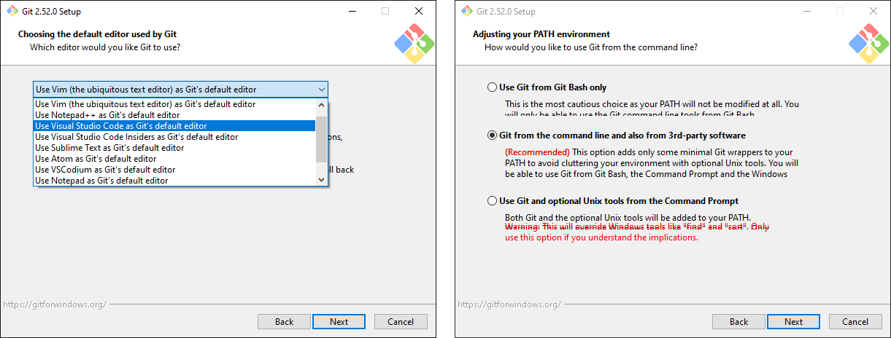
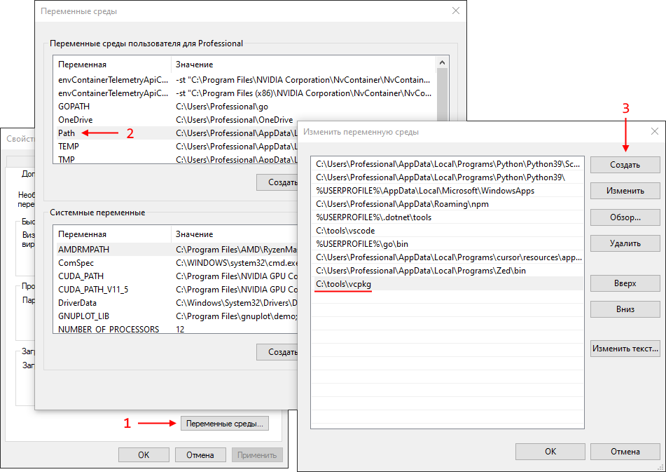
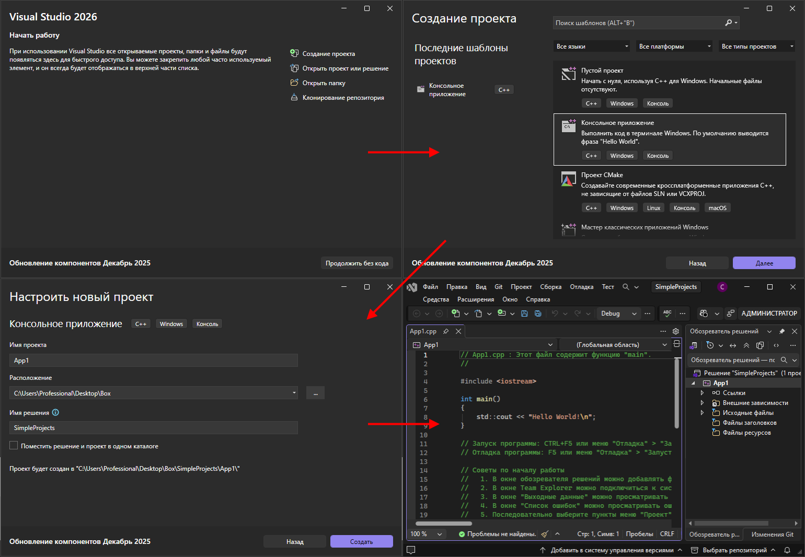
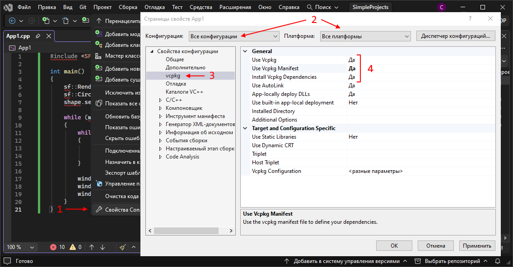
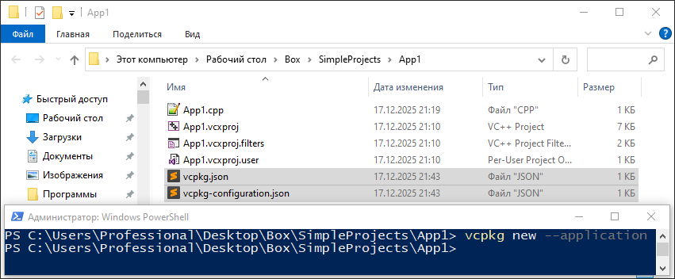
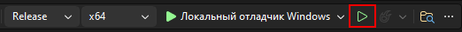
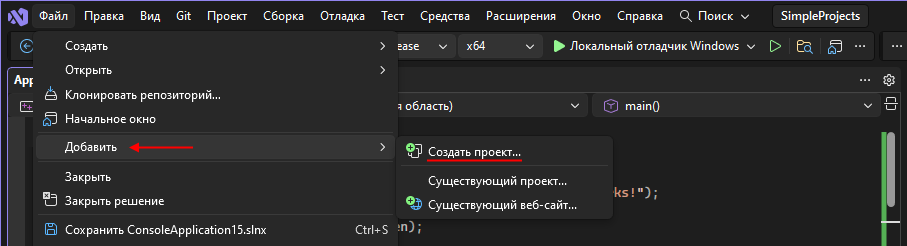
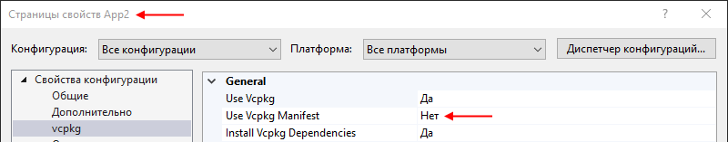
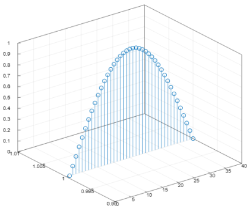

# Часть 4. Управление зависимостями при помощи менеджера пакетов

Менеджер пакетов (или менеджер зависимостей) - это специализированное программное обеспечение, предназначенное для автоматизации ключевых операций с пакетами: загрузки, установки, обновления, и т.д.

Пакет - это структурированный набор компонентов, включающий: исполняемые файлы, библиотеки, документацию, конфиг. файлы и т.д. либо что-то одно из этого.

Большинство современных языков предоставляют стандартный способ управления внешними зависимостями (python - `pip`, node.js - `npm` и т.д.). В C++, как обычно, отсутствует единый общепринятый стандарт управления пакетами.

<p align="center"></p><br><p align="center">Комитет по стандартизации языка работает над развитием С++.</p>

Несмотря на отсутствие стандарта, сообщество C++ разработало несколько решений для управления пакетами. Большинство ранних инициатив прекратили развитие, однако сегодня активно поддерживаются два ключевых инструмента:

- *vcpkg* — менеджер пакетов от Microsoft, оптимизированный для работы с MSVC (основной IDE для Windows);
- *Conan* — кроссплатформенный менеджер, широко распространённый в промышленной разработке (часто упоминается в вакансиях).

Здесь будет рассмотрен *vcpkg*, т.к. он простой, из коробки работает с MSVC и в целом содержит обширную базу готовых пакетов (более 2 000 на момент 2025 г.).

## C++ vcpkg Windows


> [!WARNING]
>
> Для этой работы понадобится *IDE MS Visual Studio*. Если она у вас уже есть, то эти пункты можете не выполнять:
>
> 1. Перейдите на официальный сайт: https://visualstudio.microsoft.com/ru/free-developer-offers/;
>
> 2. Выберите скачать *Visual Studio Community* (*community* - бесплатная версия). В результате скачается программа-инсталлятор.
>
>    Не путайте *Visual Studio*, с *Visual Studio Code*. Первое - это полноценная IDE, в конторой уже встроены все инструменты необходимые для разработки. Второе - это текстовый редактор с возможностью настройки через плагины;
>
> 3. Запустите инсталлятор и, в списке комплектов для разработки, поставить галочку напротив "Разработка классических приложений на С++".
>
>    Установка потребует ~12 ГБ свободного места на диске и ~20 минут времени (зависит от скорости интернета);
>
> 4. После установки, войдите при помощи учётной записи *Microsoft* (почта на гугле) или учётной записи на *Github*.

> [!WARNING]
>
> Для этой работы понадобится любой *Git*-клиент способный клонировать репозиторий. Если он у вас уже есть, то эти пункты можете не выполнять:
>
> 1. Перейдите на официальный сайт утилиты *git* в раздел "Insatll": https://git-scm.com/instal/;
> 2. Выберите версию для совей ОС и скачайте установочный пакет;
> 3. В процессе установки обратите внимание на эти шаги:
>
>    <p align="center"></p>
>
>    Первый предлагает выбрать текстовый редактор, который будет использоваться *git* для некоторых действий (например для написания развёрнутых пояснений к коммитам и др.). По умолчанию указан `vim`, но можно выбрать и другой.
>    
>    Второй связан с переменной среды `PATH`. Стандартный вариант предпочтителен, т.к. позволяет использовать *git* как в оболочке идущей в комплекте с утилитой "Git Bash", так и в других стандартных оболочках. В некоторых версиях инсталлятора бывает просто галочка: "Добавить в PATH".

### Установка и начальная настройка vcpkg

1. Выберите каталог для установки `vcpkg` (в моём случае это будет `"C:\tools\"`) и перейдите туда в терминале (используйте оболочку *cmd* или *PowerShell*).

2. Клонируйте репозиторий `vcpkg` в этот каталог:

   ```bash
   git clone https://github.com/microsoft/vcpkg.git
   ```

   В результате должен появится каталог `"vcpkg"`.

3. Перейдите в каталог `"vcpkg"` и выполните действия:

   - Выполните команду:

     ```bash
     .\bootstrap-vcpkg.bat
     ```

     Скрипт загрузит исполняемый файл `"vcpkg.exe"` и выполнит проверку системы.

   - Удалите каталог `".git"`. Он занимает порядка 100МБ и может понадобится только в случае, обновления `vcpkg` или списка пакетов.  
     Этот каталог может быть скрыт. Чтобы отобразить скрытые элементы, в настройках папки, на вкладке "Вид", в блоке "Показать или скрыть" установите галочку "Скрытые элементы".

4. Добавьте путь к `"vcpkg.exe"` в список путей переменной среды `PATH`, чтобы можно было обращаться к нему в терминале просто по имени, а не по полному пути.

   <p align="center"></p>

5. Там же создайте новую переменную среды `VCPKG_ROOT` и в качестве значения тоже укажите путь к каталогу `"vcpkg"`.

   В принципе всё будет работать и без этой переменной, но обычно рекомендуют её создавать, чтобы инструменты использующие `vcpkg` и он сам, знали где находится основной каталог менеджера.

   После изменения переменных среды, нужно перезапустить открытые программы (в том числе терминалы), чтобы они подхватили изменения.

6. Проверьте, что `vcpkg` доступен в терминале просто по имени и изучите справочную информацию, которая будет выведена на экран:

   ```bash
   vcpkg
   ```

7. Выполните команду:

   ```bash
   vcpkg integrate install
   ```

   Это приведёт к тому, что *Visual Studio* "узнает" о существовании и расположении `vcpkg` в системе. И в меню *Visual Studio* появятся дополнительные пункты для работы с `vcpkg`.

Менеджер `vcpkg` поддерживает два режима работы:

- **Классический (глобальный) режим**.
   - Работает через глобальное хранилище пакетов (по умолчанию в `vcpkg/installed`);
   - Пакеты устанавливаются один раз и доступны для всех проектов на машине;
   - Команды типа `vcpkg install <пакет>` или `vcpkg install --classic <пакет>` напрямую добавляют библиотеки в глобальное хранилище;
   - Возможен конфликтов версий, если разным проектам нужны разные версии одной библиотеки.
- **Режим манифеста (manifest mode)**.
   - Работает через локальное хранилище пакетов в директории проекта (обычно `vcpkg_installed/` внутри проекта).
   - Каждый проект имеет собственный файл манифеста `vcpkg.json`, где явно указаны зависимости и их версии. Один и тот же `vcpkg.json` гарантирует одинаковые зависимости на любой машине.
   - Поддержка семантического версионирования и ограничений версий (например, `"dependencies": ["zlib>=1.2.11"]`).

### Работа с vcpkg в режиме манифеста

8. Запустите *Visual Studio*, например через меню Пуск;

9. Создайте пустое консольное приложение.

   В качестве "Имя проекта" укажите "App1", а в качестве "Имя решения" укажите "SimpleProjects".
   Одно решение (solution) может включать несколько проектов, также, как в один `CMakeLists.txt` мы добавляли множество целей сборки. Проект - это например конкретная программа или библиотека, а решение - это своего рода папка для проектов. 

   <p align="center"></p>

10. Замените содержимое файла открытого в редакторе на следующее:

    ```cpp
    #include <SFML/Graphics.hpp>
    
    int main()
    {
        sf::RenderWindow window(sf::VideoMode({200, 200}), "SFML works!");
        sf::CircleShape shape(100.f);
        shape.setFillColor(sf::Color::Green);
    
        while (window.isOpen())
        {
            while (const std::optional event = window.pollEvent())
            {
                if (event->is<sf::Event::Closed>())
                    window.close();
            }
    
            window.clear();
            window.draw(shape);
            window.display();
        }
    }
    ```

    Это своего рода "hello world" проект для библиотеки [SFML](https://www.sfml-dev.org/). Но, на текущий момент он не соберётся, т.к. требуемой библиотеки нет в системе и мы не выполнили настройку путей к файлам библиотеки в свойствах проекта.

    > SFML (Simple and Fast Multimedia Library) - это кроссплатформенная, простая и быстрая мультимедийная библиотека. Она предоставляет доступ к оконной системе, графике, аудио и сети.

11. Убедитесь, что нужная библиотека есть в списке пакетов `vcpkg`. Для этого выполните в терминале команду:

    ```bash
    vcpkg search sfml
    ```

    В результате вы получите список пакетов в названии которых встречается "sfml" полностью или частично, поэтому для поиска не обязательно указывать полное название пакета.

    > В качестве альтернативы, можно выполнить поиск в браузере, на сайте `vcpkg`: https://vcpkg.io/en/packages. Там представлена более полная информация: ссылка на репозиторий пакета, список доступных версий и др.

12. Настройте *Visual Studio* на работу с `vcpkg` в режиме манифеста:

    - В главном меню выберите пункт "Проект" -> "Свойства";

    - В открывшемся окне, в выпадающем списке "Конфигурации" выберите  "Все конфигурации", а в списке "Платформы" выберите "Все платформы".

      Т.к. *Visual Studio* позволяет работать в разных режимах *Release*/*Debug* и собирать приложения для 32/64 битных платформ, то для каждой целевой комбинации можно указать настройки проекта индивидуально. Это может привести к ситуации, в которой вы настраиваете проект для одной конфигурации, а пытаетесь собрать его в другой. Чтобы этого избежать, мы применяем настройки сразу ко всем;

    - В левом меню выберите раздел "vcpkg" и установите значение "Use Vcpkg Manifest" в "Да". Остальные значения тоже должны соответствовать значениям на скриншоте:

      <p align="center"></p>
      
    - В разделе "Общие" убедитесь, что стандарт языка С++ установлен в С++ 17 или выше (это нужно для SFML).

13. Щёлкните правой кнопкой мыши по названию проекта (App1) в "Обозревателе решений" справой стороны и выберите пункт меню "Открыть в проводнике".

    В результате откроется каталог с проектом.

14. Откройте/перейдите в этот каталог в терминале и выполните команду:

    ```bash
    vcpkg new --application
    ```

    В результате, здесь будет создано 2 файла: `"vcpkg.json"` и `"vcpkg-configuration.json"`.

    <p align="center"></p>

    > `vcpkg.json` - манифест проекта (обязательный). Это **основной конфигурационный файл** проекта, в котором указываются зависимости и метаданные. Располагается в корневой директории проекта.
    >
    > `vcpkg-configuration.json` - конфигурация реестров (опциональный). Если все пакеты берутся из официального реестра vcpkg, этот файл можно удалить.

15. Откройте `"vcpkg.json"` в текстовом редакторе и изучите его содержимое. Сейчас он должен быть пуст.

16. Введите команду:

    ```bash
    vcpkg add port sfml
    ```

    Вы должны получить сообщение, об успешном добавлении пакета в `"vcpkg.json"`.

17. Снова откройте `"vcpkg.json"` в текстовом редакторе и изучите его содержимое.

    Вы должны увидеть, что появился ключ "dependencies", значением у которого является список состоящий из одного элемента "sfml". Таким образом, можно добавлять/удалять зависимости напрямую редактируя файл `"vcpkg.json"`.

    > Полная схема `vcpkg.json` описана [тут](https://raw.githubusercontent.com/microsoft/vcpkg-tool/main/docs/vcpkg.schema.json). Как видно, кроме списка зависимостей можно указать и другую информацию о текущем проекте: имя, версию, пояснение и др.
    >
    > Зависимости можно указывать как просто по имени, тогда `vcpkg` скачает последнюю версию доступную в реестре (реестр тоже имеет свою версию). Так и с дополнительными параметрами, но в отдельном массиве `"overrides"`:
    >
    > ```json
    > [{
    >   "name": "openssl",                    // Обязательное: имя пакета
    >   "version>=": "3.2.0",                 // Минимальная версия (семантическое версионирование)
    >   "platform": "(windows & x64) | osx"   // Условие установки: Windows x64 ИЛИ macOS
    > }]
    > ```
    >
    > Версию реестра можно тоже зафиксировать при помощи ключа "builtin-baseline", тогда `vcpkg` будет брать пакеты и их версии зафиксированные на момент указанной версии реестра.

18. Откройте окно *Visual Studio* и запустите сборку программы нажав на зелёный треугольник на панели инструментов.

    <p align="center"></p>

    В результате вы должны увидеть окно с зелёным кругом по центру.

    Первый запуск будет довольно долгим, т.к. `vcpkg`-y нужно будет скачать сам пакет, инструменты для сборки и затем собрать его.

19. Откройте каталог с проектом и:

    - Убедитесь, что появился каталог `"vcpkg_installed"`. Сюда `vcpkg` размещает локальные зависимости добавленные в файл манифеста.

      В `"vcpkg_installed"` попадают только готовые/собранные пакеты, а исходный код, инструменты сборки и всякого рода кэши попадут в основную папку `vcpkg`. Это приводит к её довольно быстрому росту, поэтому периодические её желательно чистить.

    - Проверьте список установленных пакетов (текущая папка в терминале - **должна быть папка с манифестом**):

      ```bash
      vcpkg list
      ```

      В результате вы должны получить сообщение: "No packages are installed". Это такой глюк, при установке пакетов через *Visual Studio*.

    - Выполните команды:

      ```bash
      vcpkg install
      vcpkg list
      ```

      `vcpkg` ничего загружать не будет, а просто проверит присутствующие пакеты и добавит в `"vcpkg_installed"` метаинформацию о них, что поправит работу функции `list`. Команда `install` вполне может и установить пакеты, если их ещё нет.

### Работа с vcpkg в классическом режиме

20. Добавьте в текущее решение второй проект-консольное приложение с именем "App2".

    <p align="center"></p>

21. В обозревателе решений щёлкните по названию проекта "App2" правой кнопкой мыши и выбрать "Назначить в качестве запускаемого проекта". Теперь, кнопки на панели инструментов и сочетания клавиш (например <kbd>Ctrl</kbd>+<kbd>F5</kbd> для запуска) будут работать со вторым проектом.

22. Проверьте, что в новом проекте "Use Vcpkg Manifest" установлено в "Нет":

    <p align="center"></p>

23. Код в главном файле проекта замените на:

    ```cpp
    #include <cmath>
    #include <matplot/matplot.h>
    
    int main() {
        using namespace matplot;
        std::vector<double> x = linspace(-pi / 2, pi / 2, 40);
        auto z = transform(x, [](auto x) { return cos(x); });
        stem3(z);
    
        show();
    }
    ```

24. Перейдите в терминале в каталог (в любой) в котором нет файла манифеста и введите команду:

    ```bash
    vcpkg install matplotplusplus
    ```

    В результате `vcpkg` скачает и соберёт пакет [matplotplusplus](https://github.com/alandefreitas/matplotplusplus) в глобальной области видимости. Физически файлы будут расположены в главном каталоге `vcpkg`.

    В отличие от режима манифеста, в классическом режиме *Visual Studio* не сможет установить зависимости автоматически, т.к. не знает имена пакетов и требуемые версии.

25. Выполните команду:

    ```bash
    vcpkg list
    ```

    Т.к. в каталоге нет файла манифеста, то `vcpkg` покажет список пакетов из глобального хранилища.

26. Откройте окно *Visual Studio* и запустите сборку программы нажав на зелёный треугольник на панели инструментов.

    В результате вы должны увидеть окно с трёхмерным графиком косинуса (на рисунке он выглядит как синус, т.к. первая точка была рассчитана для $-\pi / 2$, а не для 0):

    <p align="center"></p>

27. Выполните команду:

    ```bash
    vcpkg remove matplotplusplus
    ```

    `vcpkg` удалит пакет, но он и инструменты необходимые для сборки останутся в кэше.

28. Попробуйте запустить сборку проекта "App2" ещё раз.

    Т.к. пакета "matplotplusplus" больше нет, вы должны получить сообщение об ошибке, с предложением запустить последнюю удачную сборку. Нам это не нужно.

29. Снова установите `"matplotplusplus"`.

    Как видно, повторная установка заняла гораздо меньше времени.

30. Перейдите в основной каталог `"vcpkg"` и (одновременной) выделите каталоги: `"buildtrees"`, `"downloads"`, `"packages"`. Затем посмотрите их свойства.

    Как видно, они занимают ~1 ГБ. В этих каталогах находится исходный код, инструменты для сборки и кэш сборки пакетов. После того, как пакет собран это всё можно удалить, для экономии места на диске.

31. Удалите каталоги: `"buildtrees"`, `"downloads"`, `"packages"`.

32. Посмотрите размер каталога `"installed"`.

    Как видно, он занимают ~150 МБ. В этом каталоге хранится готовая к использованию версия пакета и именно её использует *Visual Studio*.

33. Перейдите в *Visual Studio* и запустите сборку проекта "App2".

    Несмотря на то, что каталоги: `"buildtrees"`, `"downloads"`, `"packages"` были удалены, сборка должна закончится успешно.

34. Закройте *Visual Studio* и удалите решение "SimpleProjects" вместе с проектами "App1" и "App2". Для этого просто удалите папку "SimpleProjects".

    На текущий момент оно тоже занимает не мало места ~600 МБ.

## C++ vcpkg Linux

> [!WARNING]
>
> Если у вас основная операционная система Windows, то этот раздел выполняйте в Docker контейнере. Для этого:
> 1. Запустите Docker Desktop;
> 2. В каталоге `"projects/lab2"` создайте каталог `"рac_manager"`;
> 3. Откройте каталог `"рac_manager"` в VScode;
> 4. Переключитесь в профиль Remote. Если профиль Remote вы не создавали, то установите набор плагинов Remote Development;
> 5. Добавьте конфигурацию Dev Container:
>    - Нажмите на значок в левом нижнем углу  и выберите _Add Dev Container Configuration Files..._;
>    - На вопрос, где сохранить конфигурацию контейнера выберите _Add configuration to workspace_. В этом случае, конфигурация контейнера будет храниться в папке проекта. Альтернативный вариант создаст конфигурацию в другом месте, но она тоже будет действовать только на этот проект. Разница в том, хотите ли вы, чтобы конфигурация контейнера могла отслеживаться системой контроля версий или нет;
>    - В поле поиска шаблона введите _C++_ и выберите одноимённый шаблон;
>    - Шаблон _С++_ доступен на основе нескольких ОС. Выберите контейнер на основе _ubuntu-24.04_;
>    - Затем будет несколько вопросов касающихся установки в контейнер дополнительного софта. Нажмите: _none_, _ОК_ и _ОК_;
>    В папке проекта появится каталог `".devcontainer"` с файлом `"devcontainer.json"` и другими.
> 6. Запустите контейнер, например нажмите на значок  и в выпадающем выберите *Reopen in Container*.
> 7. Дождитесь пока загрузится образ и запустится контейнер. При успешном запуске контейнера значок в левом углу изменится на .

### Установка и начальная настройка vcpkg

35. В терминале наберите команду:

    ```bash
    whereis vcpkg
    ```

    В результате вы должны получить сообщение отображающее путь файлу `"vcpkg"`.

    Т.е. в контейнере уже предустановлен `vcpkg` и его корневой каталог `"/usr/local/vcpkg"`. Если вы работаете не в контейнере, то перейдите в каталог `"/usr/local/"` и клонируйте `vcpkg` с *github*: 

    ```bash
    git clone https://github.com/microsoft/vcpkg.git
    ```

36. В контейнере, путь к исполняемому файлу `vcpkg` уже добавлен в `PATH` и создана переменная `VCPKG_ROOT`, поэтому эти действия выполнять не требуется. Если вы работаете не в контейнере, то внесите изменения в ваш локальный `"~/.bashrc"` (если вы пользуетесь оболочкой `bash`) при помощи команд:

    ```bash
    echo 'export VCPKG_ROOT=/usr/local/vcpkg' >> ~/.bashrc  # Создать VCPKG_ROOT
    echo 'export PATH=$VCPKG_ROOT:$PATH' >> ~/.bashrc       # Добавить в PATH
    source ~/.bashrc  # Применить изменения в текущем сеансе
    ```

37. Выполните команду:

    ```bash
    bootstrap-vcpkg.sh
    ```

    Скрипт загрузит исполняемый файл `"vcpkg"` и выполнит проверку системы.

38. Проверьте, что `vcpkg` доступен в терминале просто по имени и изучите справочную информацию, которая будет выведена на экран:

    ```bash
    vcpkg
    ```

39. Если вы только что клонировали репозиторий `vcpkg`, то список пакетов у вас будет актуальный, но в контейнере он мог устареть, поэтому перейдите в каталог `vcpkg` и выполните команду `git pull`:

    ```bash
    cd $VCPKG_ROOT  # Переходим в каталог с vcpkg
    git pull        # Получаем все новые коммиты
    ```

    Список пакетов `vcpkg` хранит в виде обычного *git* репозитория.

    > В контейнере вы можете получить предупреждение от *git*, о неопределённом владении и предложение добавить репозиторий в списке безопасных. Выполните команду, которую он предлагает, а затем `pull`.

40. Выполните команду:

    ```bash
    vcpkg integrate install
    vcpkg integrate bash # Добавляет поддержку автодополнения в файл ~/.bashrc
    ```

    В отличие от Windows, на Linux команда `vcpkg integrate install` не выполняет автоматическую интеграцию с системой сборки, но она вам все равно пригодится. В выводе будет строка формата: `-DCMAKE_TOOLCHAIN_FILE=/path/to/vcpkg.cmake`, она нам пригодится для работы с `cmake`.

    Автодополнение команд в контейнере уже настроено.

### Работа с vcpkg в режиме манифеста

41. В корневом каталоге контейнера `"рac_manager"` создайте каталог `qr` и перейдите туда в терминале.

42. Мы будем использовать 2 пакета [`lodepng`](https://github.com/lvandeve/lodepng) и [`libqrencode`](https://github.com/fukuchi/libqrencode), убедитесь, что они есть в реестре `vcpkg`:

    ```bash
    vcpkg search lodepng
    vcpkg search libqrencode
    ```

43. Создайте файл манифеста и добавьте пакеты как зависимости:

    ```bash
    vcpkg new --application
    vcpkg add port lodepng
    vcpkg add port libqrencode
    ```

44. Зафиксируем версию пакета `libqrencode`. Для этого откройте файл манифеста `"vcpkg.json"` и добавьте после ключа `"dependencies"` ключ `"overrides"`:

    ```json
    {
      "dependencies": [
        "lodepng",
        "libqrencode"
      ],
      "overrides": [
        {
          "name": "libqrencode",
          "version": "4.1.1#3"
        }
      ]
    }
    ```

    На момент выполнения команды `vcpkg search libqrencode` это была последняя версия.

45. Выполните команду:

    ```bash
    vcpkg install
    ```

    В результате, как и на Windows, в текущем каталоге появится каталог с установленными зависимостями `"vcpkg_installed"`.

46. Проверьте список установленных пакетов:

    ```bash
    vcpkg list
    ```

47. Как правило, разработчики библиотек добавляют в свой пакет специальный файл, с командами, которые нужно написать в `CMakeLists.txt`, чтобы корректно подключить пакет к проекту использующему `cmake`. Этот файл автоматически отображается в конце установки пакета.

    Введите команду установки повторно:

    ```
    vcpkg install
    ```

    Т.к. пакеты установлены, то `vcpkg` просто выведет для каждой из наших зависимостей способ её подключения к `cmake`. Эту информацию мы будем использовать на этапе написания своего `CMakeLists.txt`.

48. Создайте файл `"main.cpp"` содержащий:

    ```cpp
    #include <string>
    #include <iostream>
    #include <lodepng.h>
    #include <qrencode.h>
    
    QRcode* NewQRcode(const std::string text){
        QRcode *qrCode = nullptr;
        qrCode = QRcode_encodeString(text.c_str(), // Данные
                                     2,            // Вторая версия 
                                     QR_ECLEVEL_H, // Высокая степень уст. к ошибкам
                                     QR_MODE_8,    // Данные должны быть ASCII
                                     1);
        return qrCode;
    }
    
    void saveToPng(const std::string filename, const QRcode* qrCode){
        int qrCode_Width = qrCode->width > 0 ? qrCode->width : 1;
        unsigned width = qrCode_Width;
        unsigned height = qrCode_Width; // Квадратный
        
        // 3 канала на пиксель в порядке RGB заполненные значением 255 (белый цвет)
        // Пиксели лежат подряд построчно в одномерном массиве
        std::vector<unsigned char> image(width * height * 3, 255);
    
        for(unsigned y = 0; y < height; y++)
            for(unsigned x = 0; x < width; x++) {
                auto i = y * width + x;
                // Пиксели лежат подряд построчно в одномерном массиве
                unsigned char character = qrCode->data[i];
                
                if(character & 1){
                    image[3 * i + 0] = 0; // R
                    image[3 * i + 1] = 0; // G
                    image[3 * i + 2] = 0; // B
                }
            }
        
        // Сохраняем в файл
        unsigned error = lodepng::encode(filename, image, width, height, LodePNGColorType::LCT_RGB);
    
        if(error) std::cout << "encoder error " << error << ": "<< lodepng_error_text(error) << std::endl;
    }
    
    int main(int argc, char *argv[]) {
        if (argc < 3) return 0;
        
        QRcode* qrCode = NewQRcode(argv[2]); // Выделяет память динамически
        saveToPng(argv[1], qrCode);
        QRcode_free(qrCode);                 // Нужно освободить
    }
    ```

49. Создайте файл `"CMakeLists.txt"`:

    ```cmake
    cmake_minimum_required(VERSION 3.22.1)
    
    project(main)
    
    # Ищем libqrencode
    find_path(QRENCODE_INCLUDE_DIR NAMES qrencode.h)
    find_library(QRENCODE_LIBRARY_RELEASE qrencode)
    find_library(QRENCODE_LIBRARY_DEBUG qrencoded)
    set(QRENCODE_LIBRARIES optimized ${QRENCODE_LIBRARY_RELEASE} debug ${QRENCODE_LIBRARY_DEBUG})
    
    # Ищем lodepng
    find_package(lodepng CONFIG REQUIRED)
    
    # Наш испольняемый файл
    add_executable(main main.cpp)
    
    # Линкуем libqrencode
    target_include_directories(main PRIVATE ${QRENCODE_INCLUDE_DIR})
    target_link_libraries(main PRIVATE ${QRENCODE_LIBRARIES})
    
    # Линкуем lodepng
    target_link_libraries(main PRIVATE lodepng)
    ```

    Здесь данные для поиска и линковки библиотек были скопированы из вывода `vcpkg install`.

50. Выполним конфигурирование проекта в режиме "Release" с указанием пути к тулчейну `vcpkg`:

    ```bash
    cmake -S . -B build -DCMAKE_BUILD_TYPE=Release -DCMAKE_TOOLCHAIN_FILE=/usr/local/vcpkg/scripts/buildsystems/vcpkg.cmake
    ```

    Здесь, значение `CMAKE_TOOLCHAIN_FILE` указывает `cmake`, что поиск пакетов нужно выполнять через `vcpkg`. Если забыли где взять `CMAKE_TOOLCHAIN_FILE`, введите команду `vcpkg integrate install`.

51. Выполните сборку программы:

    ```bash
    cmake --build build
    ```

52. Проверьте работоспособность программы:

    ```bash
    ./build/main hw.png "Hello, Wrold!"
    ./build/main 123.png 123
    ```

    В результате, в текущем каталоге должны появится 2 файла `"hw.png"` и `"123.png"`.

53. Проверьте, что QR-код (1 любой) распознаётся, например при помощи телефона.

    > Если вы используете темную тему, то в момент проверки лучше переключитесь на светлую. Если фон тёмный QR-коды распознаются хуже.

### Работа с vcpkg в классическом режиме

54. Удалите из каталога `"qr"`  файл манифеста `"vcpkg.json"`, каталог `"vcpkg_installed"` и каталог сборки `"build"`.

55. Выполните команды:

    ```bash
    vcpkg install lodepng
    vcpkg install libqrencode
    ```

    В результате, пакеты будут установлены в глобальное хранилище и каталог `"vcpkg_installed"` НЕ появится. Т.к. пакеты уже есть к кэше, установка пройдёт быстро.

56. Проверьте список установленных пакетов:

    ```bash
    vcpkg list
    ```

57. Выполним конфигурирование проекта в режиме "Release" с указанием пути к тулчейну `vcpkg`:

    ```bash
    cmake -S . -B build -DCMAKE_BUILD_TYPE=Release -DCMAKE_TOOLCHAIN_FILE=/usr/local/vcpkg/scripts/buildsystems/vcpkg.cmake
    ```

58. Выполните сборку программы:

    ```bash
    cmake --build build
    ```

59. Проверьте работоспособность программы:

    ```bash
    ./build/main cm.png "Classic mode"
    ```


При использовании `vcpkg` не забывайте периодически чистить каталоги `"buildtrees"`, `"downloads"`, `"packages"`.
